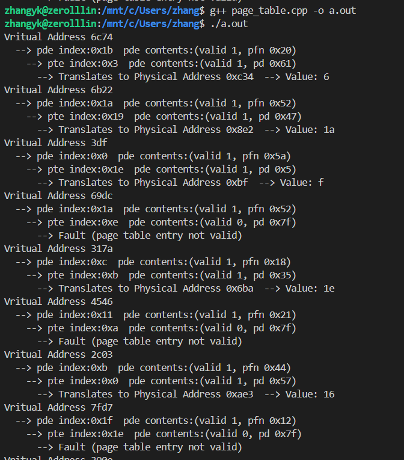

### 第5次课后练习

计15 张一可 2021010793

1. - Virtual Address 0x6c74

     ```
     Virtual Address 0x6c74:
       --> pde index:0x1b  pde contents:(valid 1, pfn 0x20)
         --> pte index:0x3  pte contents:(valid 1, pfn 0x61)
           --> Translates to Physical Address 0xc34 --> Value: 6
     ```
   
   - Virtual Address 0x6b22
     
     ```
     Virtual Address 0x6b22:
       --> pde index:0x1a  pde contents:(valid 1, pfn 0x52)
         --> pte index:0x19  pte contents:(valid 1, pfn 0x47)
           --> Translates to Physical Address 0x8e2 --> Value: 1a
     ```
     
   - Virtual Address 0x03df
     
     ```
     Virtual Address 0x03df:
       --> pde index:0x00  pde contents:(valid 1, pfn 0x5a)
         --> pte index:0x1e  pte contents:(valid 1, pfn 0x5)
           --> Translates to Physical Address 0xbf --> Value: f
     ```
     
   - Virtual Address 0x69dc
     
     ```
     Virtual Address 0x69dc:
       --> pde index:0x1a  pde contents:(valid 1, pfn 0x52)
         --> pte index:0x0e  pte contents:(valid 0, pfn 0x7f)
           --> Fault (page table entry not valid)
     ```
     
   - Virtual Address 0x317a
     
     ```
     Virtual Address 0x317a:
       --> pde index:0x0c  pde contents:(valid 1, pfn 0x18)
         --> pte index:0x0b  pte contents:(valid 1, pfn 0x35)
           --> Translates to Physical Address 0x6ba --> Value: 1e
     ```
     
   - Virtual Address 0x4546
     
     ```
     Virtual Address 0x4546:
       --> pde index:0x11  pde contents:(valid 1, pfn 0x21)
         --> pte index:0x0a  pte contents:(valid 0, pfn 0x7f)
           --> Fault (page table entry not valid)
     ```
     
   - Virtual Address 0x2c03
     
     ```
     Virtual Address 0x2c03:
       --> pde index:0x0b  pde contents:(valid 1, pfn 0x44)
         --> pte index:0x00  pte contents:(valid 1, pfn 0x57)
           --> Translates to Physical Address 0xae3 --> Value: 16
     ```
     
   - Virtual Address 0x7fd7
     
     ```
     Virtual Address 0x317a:
       --> pde index:0x1f  pde contents:(valid 1, pfn 0x12)
         --> pte index:0x1e  pte contents:(valid 0, pfn 0x7f)
           --> Fault (page table entry not valid)
     ```
     
   - Virtual Address 0x390e
     
     ```
     Virtual Address 0x390e:
       --> pde index:0x0e  pde contents:(valid 0, pfn 0x7f)
         --> Fault (page directory entry not valid)
     ```
     
   - Virtual Address 0x748b
   
     ```
     Virtual Address 0x748b:
       --> pde index:0x1  pde contents:(valid 1, pfn 0x00)
         --> pte index:0x04  pte contents:(valid 0, pfn 0x7f)
           --> Fault (page table entry not valid)
     ```
   
2. 使用 C++ 程序模拟二级页表，将给定的输入保存为 "memory.txt" 文件，通过程序读入后保存为数组。定义虚拟地址、页目录项 PDE、页表项 PTE 等数据结构，通过两次查页表的过程完成虚拟地址到物理地址的转换和获取物理地址中的数据：

   ```c++
   #include <iostream>
   #include <fstream>
   #include <sstream>
   
   int memory[128][32]; // 物理内存空间
   int pdbr = 0x220; // 页目录基地址
   int PAGE_SIZE = 32; // 页面大小
   std::string tab = "  ";
   
   // 从文件读入内存空间内容
   void init_memory_from_file(std::string file_path) {
       std::ifstream file(file_path);
       
       std::string line;
       int i = 0;
       while (std::getline(file, line)) {
           int j = 0;
           std::istringstream iss(line);
           std::string page_str, hex_str;
           iss >> page_str >> hex_str;
           while (iss >> hex_str) {
               int value = std::stoi(hex_str, nullptr, 16);
               memory[i][j++] = value;
           }
           i++;
       }
   }
   
   // 访问某物理页的某数据
   int read_page_data(uint8_t page, uint8_t offset) {
       return memory[page][offset];
   }
   
   // PDE 数据结构
   class PDE {
   private:
       int data;
   public:
       PDE(int data_): data(data_) {}
       bool is_valid() {
           return (data & 0x80) != 0;
       }
       int get_pfn() {
           return (data & 0x7f);
       }
   };
   
   // PTE 数据结构
   class PTE {
   private:
       int data;
   public:
       PTE(int data_): data(data_) {}
       bool is_valid() {
           return (data & 0x80) != 0;
       }
       int get_pd() {
           return (data & 0x7f);
       }
   };
   
   // 虚拟地址
   class VirtualAddress {
   private:
       int addr;
   public:
       VirtualAddress(int data): addr(data) {}
       int get_pden() {
           return (addr & 0x7c00) >> 10;
       }
       int get_pten() {
           return (addr & 0x3e0) >> 5;
       }
       int get_offset() {
           return addr & 0x1f;
       }
   };
   
   void translate(int addr) {
       VirtualAddress va(addr);
       std::cout << "Vritual Address " << std::hex << addr << "\n";
       PDE pde(read_page_data(pdbr/PAGE_SIZE, va.get_pden())); // 获取PDE
       std::cout << tab << "--> pde index:0x" << std::hex << va.get_pden() <<"  pde contents:(valid " << (pde.is_valid() ? 1 : 0) << ", pfn 0x"<< std::hex << pde.get_pfn() << ")\n";
       if (!pde.is_valid()) {
           std::cout << tab << tab << "--> Fault (page directory entry not valid)\n";
           return;
       }
       PTE pte(read_page_data(pde.get_pfn(), va.get_pten())); // 获取PTE
       std::cout << tab << tab << "--> pte index:0x" << std::hex << va.get_pten() <<"  pde contents:(valid " << (pte.is_valid() ? 1 : 0) << ", pd 0x"<< std::hex << pte.get_pd() << ")\n";
       if (!pte.is_valid()) {
           std::cout << tab << tab << tab << "--> Fault (page table entry not valid)\n";
           return;
       }
       std::cout << tab << tab << tab << "--> Translates to Physical Address 0x" << std::hex << va.get_offset() + PAGE_SIZE * pte.get_pd() << "  ";
       std::cout << "--> Value: " << std::hex << read_page_data(pte.get_pd(), va.get_offset()) << "\n"; // 获取PA存储数据
   }
   
   int main() {
       init_memory_from_file("memory.txt");
       translate(0x6c74);
       translate(0x6b22);
       translate(0x03df);
       translate(0x69dc);
       translate(0x317a);
       translate(0x4546);
       translate(0x2c03);
       translate(0x7fd7);
       translate(0x390e);
       translate(0x748b);
   }
   ```

   程序输出格式与题目给定一致，可以帮助我们验证手动计算过程中的错误：

   
