## Ch8 多处理器调度

#### 对称多处理器与多核架构

##### 处理器分类

- 单核处理器
- 超线程处理器（公用 ALU，各自有寄存器、程序计数器，适合 I/O 密集型任务，不适合计算密集型任务）
- 多核处理器
- 众核处理器

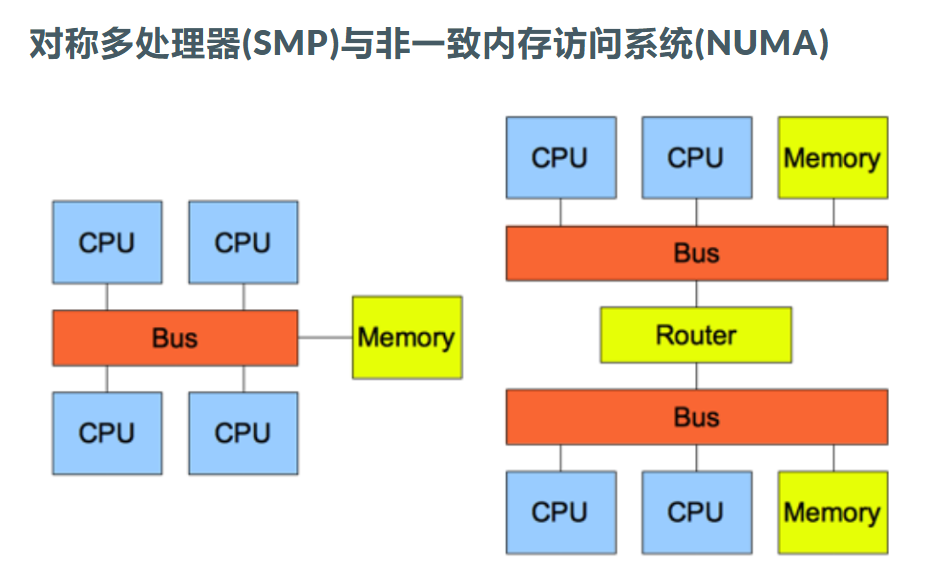

需要解决 Cache 一致性问题

#### 多处理器调度概述

##### 单队列多处理器调度 SQMS

实现

- 多个进程共享同一个调度队列

特征

- 缺乏**可扩展性**
- **缓存亲和性**弱
  - 应该尽可能让进程在同一个 CPU 上运行
  - 可能需要牺牲一些进程的亲和性，实现负载均衡

##### 多队列多处理器调度 MQMS

实现

- 包含多个调度队列，每个队列可用不同的调度规则
- 进程进入系统时，依照一些启发性规则，决定将其放入某个队列
- 每个 CPU 调度相互独立

特征

- 具有**可扩展性**
  - 队列数量会随着 CPU 增加而增加，锁和缓存征用的开销不是大问题
- 具有良好的**缓存亲和度**

解决**负载不均**问题

- **进程迁移**：**不断地迁移和切换**一个或多个进程
- **工作窃取**：进程量较少的队列从其他队列窃取一个或多个进程
  - 决定**检查时间间隔**：太短，开销大；太长，可能负载不均

##### Linux O(1) 调度

##### Linux CFS 调度

##### Linux/FreeBSD BFS 调度


## Ch9 文件系统

#### 文件和文件系统

##### 文件系统

- 存储设备上组织文件的**方法**和**数据结构**
- 操作系统中负责文件命名、存储和检索的**子系统**

##### 文件

- 具有符号名，由字节序列构成的**数据项集合**
- **文件头**：文件系统元数据中的文件信息

##### UNIX 设计哲学：一切都是文件

- 普通文件，目录文件
- 字符设备文件（鼠标，键盘）
- 块设备文件（硬盘，光驱）
- 网络文件（socket）

**用户**的文件视图：**字节序列**的集合

**操作系统**的文件视图：**数据块**的集合（逻辑存储单元）

##### 文件操作

进程对文件读写的基本操作单位是**数据块**

##### 文件的访问模式

顺序访问，随机访问，索引访问

##### 文件访问控制

- 文件访问控制列表 ACL：<文件实体，权限>
- < 用户|组|所有人，读|写|可执行 >
- 用户/组用 ID 标识

多用户需要通过读写锁等**同步互斥技术**实现对文件的互斥访问

##### 文件描述符

- 一个非负整数表示的索引值
- 指向内核为每个进程维护的进程打开文件的记录表

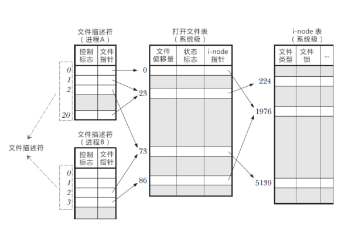

**打开文件表**：内核跟踪进程打开的所有文件，维护打开文件状态和信息

- 文件指针（每个进程分别维护）
- 文件打开计数（减为 0 时从表中移除）
- 文件磁盘位置（缓存数据访问信息）
- 访问权限

##### 文件系统组织

文件系统功能：文件命名、存储和检索

- 分配文件磁盘空间
- 管理文件集合
- 保证数据可靠和安全

文件系统组织形式：分层文件系统

- **目录**：文件索引表 < 文件名，指向文件的指针 >

  - 功能：文件的搜索、创建、删除等
  - 实现：列表/哈希表

- **文件别名**

  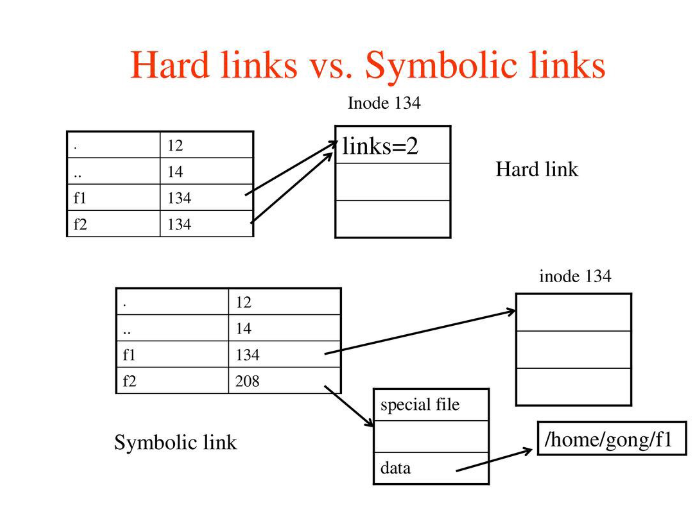

  - **硬链接**：对文件的引用
    - 多个文件项指向一个文件
    - 不能跨文件系统，也不能链接到目录（避免目录循环）
  - **软链接**：指向文件路径的指针
    - 以存储文件名称的方式来指向其他文件
    - 可以跨文件系统，也可以链接到目录
    - 如何避免循环
      - 只允许对文件的链接，不允许对子目录的链接
      - 增加链接时，用循环检测算法确定是否合理
      - 限制遍历文件目录的路径数量

- 文件系统挂载

  - 文件系统需要先挂载才能被访问

#### 文件系统设计与实现

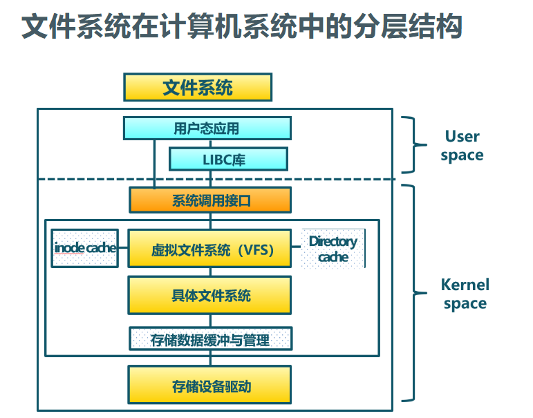

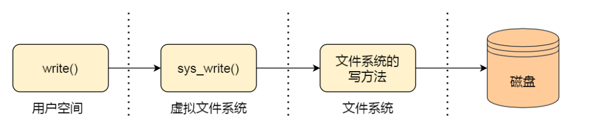

##### 虚拟文件系统 VFS

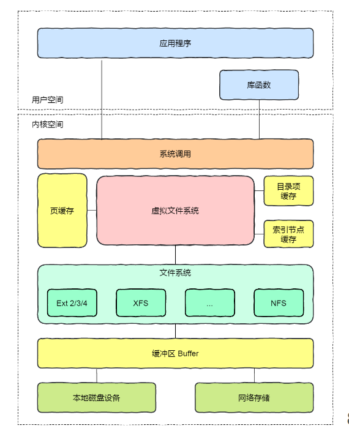

- 定义了一组所有文件系统都支持的**数据结构**和**标准接口**
- 对所有不同文件系统的抽象
  - 提供相同的文件和文件系统接口
  - 管理所有文件和文件系统关联的数据结构
  - 高效查询例程, 遍历文件系统
  - 与特定文件系统模块的交互

##### 文件系统的存储数据结构

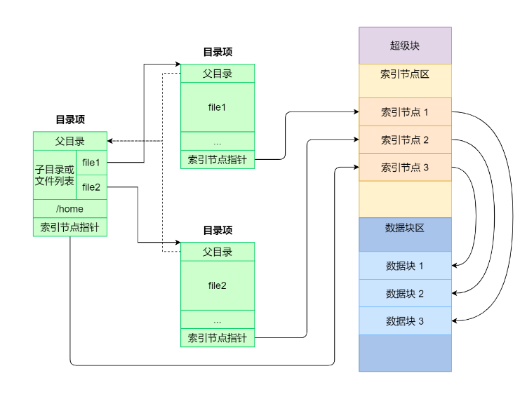

1. **Superblock 文件卷控制块**

   - 记录文件系统的详细信息（块大小，block 和 inode 总数，未使用与已使用的数量，filesystem 的挂载时间、最近一次写入时间、最近一次检验磁盘时间）

2. **文件控制块 inode**

   - 指向一个或多个 datablock
   - 记录指向的 datablock 大小、数据块位置
   - 访问模式，拥有者与群组，建立/最近读取/修改的时间信息，连接数，文件字节数等等

3. **bitmap 块**

   - inode 和 data node 分别有 bitmap 块，用于空间分配

4. **数据块 data node**

   - 目录的 datablock

     - **目录项 dir_entry**

       < 文件名，文件类型，文件 inode 号（指向文件的指针） >

   - 文件的 datablock

     - 存放数据

##### 数据块缓存

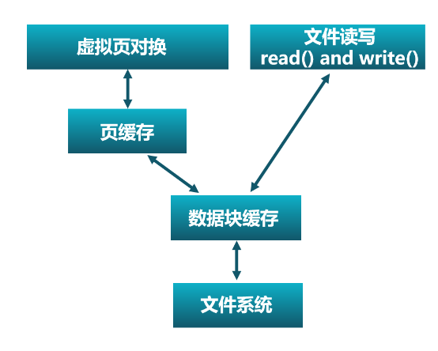

- 数据块按需读入，使用后被缓存
- 在虚拟内存中文件数据块被映射成页
- 页缓存：统一缓存数据块和内存页
- 在虚拟地址空间中虚拟页面可映射到本地外存文件中

##### 文件分配

- 场景

  - 大多数文件都很小：访问效率，存储空间
  - 一些文件非常大：对大文件的支持

- 评价指标

  - 存储效率：外部碎片等
  - 读写性能：访问速度

- 分配方式

  - **连续分配**

    - 优点：高效的顺序和随机读访问
    - 缺点：频繁分配带来外碎片；增加文件内容时开销很大

  - **链式分配**

    - 优点：创建、增大、缩小文件很容易；几乎没有碎片
    - 缺点：随机访问效率低；可靠性差
    - 实现方式
      - 显示连接：文件分配表
      - 隐式链接：每个块保存指向下一块的指针

  - **索引分配**

    - 优点：创建、增大、缩小文件很容易；几乎没有碎片；支持直接访问

    - 缺点：文件很小时，存储索引的开销相对大

    - 实现：索引数据块中的索引是文件数据块的指针

      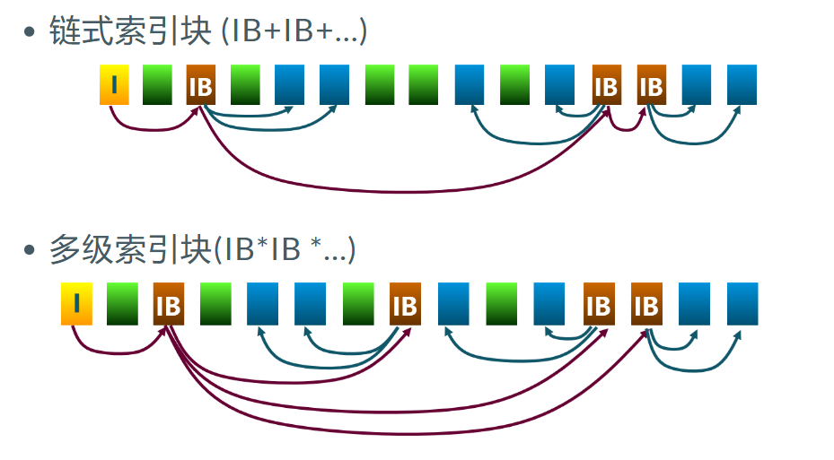

      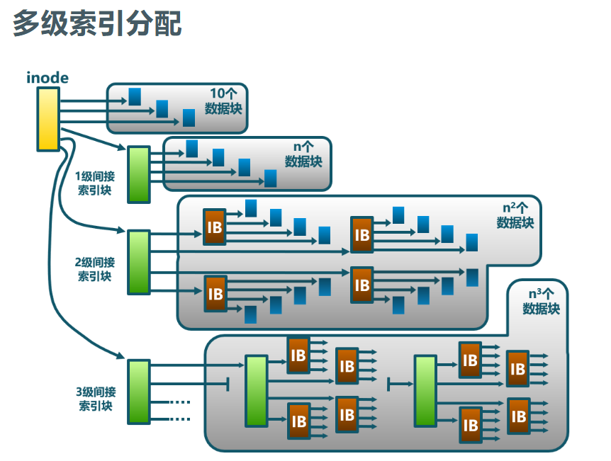

      - 直接索引 10 个
      - 1 级间接索引 $n$ 个 
      - 2 级间接索引 $n^2$ 个 
      - 3 级间接索引 $n^3$ 个 
      - 文件头包含 13 个指针
      - 大文件在访问数据块时需要大量查询

##### 空闲空间管理

1. **位图**
   - 假定空闲空间在磁盘中均匀分布
     - 找到 “0” 之前要扫描 $n/r$
       - $n$ = 磁盘上数据块的总数，$r$ = 空闲块的数目
2. **链表**
3. **索引**

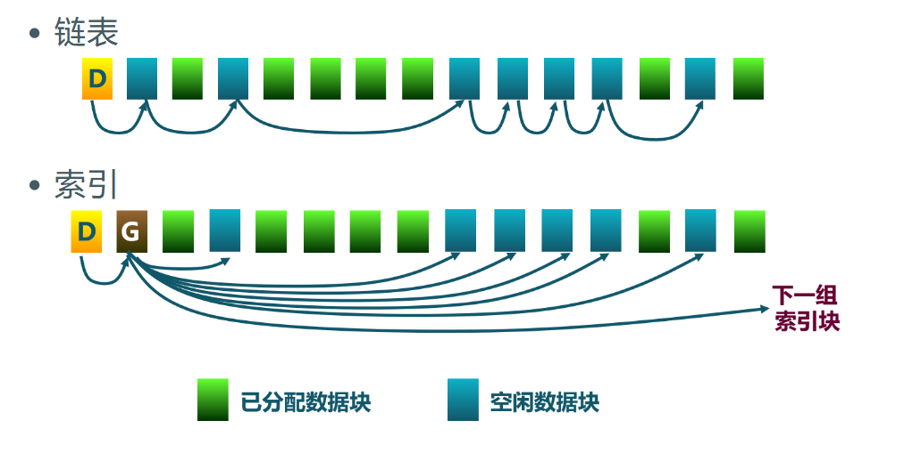

##### 文件读写操作过程

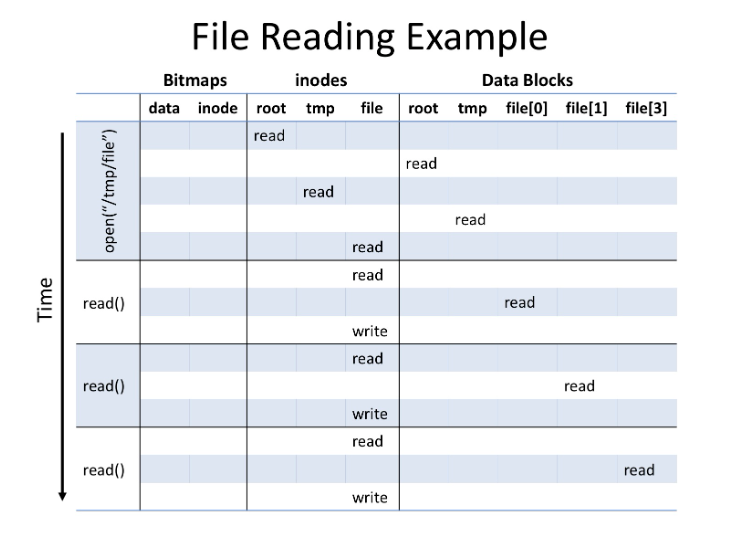

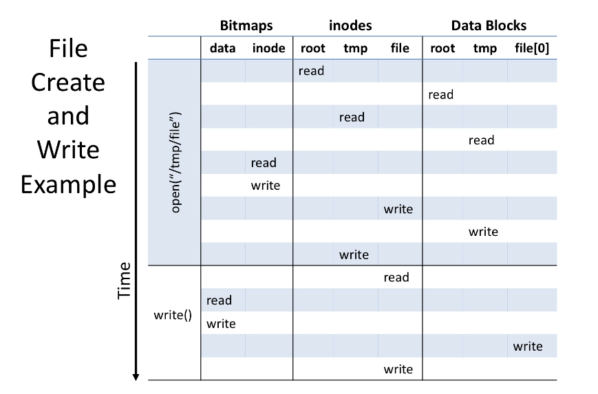

##### 文件系统分区

多数磁盘划分为一个或多个分区，每个分区有一个独立的文件系统

#### 支持崩溃一致性的文件系统

##### 崩溃一致性问题

- 磁盘文件系统映像中的**文件系统数据结构**出现不一致性
- 可能导致空间泄露，垃圾数据返回给用户等问题

例如：在文件中新增数据块，需要写入 inode，data bitmap 和 datablock

1. 只有数据块写入
2. 只有更新的 inode 写入：读取错误数据
3. 只有更新的 bitmap 写入：空间泄露
4. inode 和 bitmap 写入：读取垃圾数据
5. inode 和 datablock 写入：数据块可能被重新分配
6. bitmap 和 datablock 写入：没有 inode 指向数据块

##### 解决方案1：文件系统检查程序 fsck

- 让不一致的事情发生，然后再修复它们（重启时）
- 目标：确保文件系统**元数据内部一致**

**检查步骤**：（基于 vfs 的数据结构理解）

1. **超级块健全性检查**
2. **bitmap 与 inode 间一致性检查**
   - 存在不一致时，信任 inode 内的信息
   - 确保所有看起来在使用的 inode 都在 inode 位图中有标记
3. **inode 状态检查**
   - 检查每个inode是否存在损坏或其他问题
   - 如果 inode 字段存在问题，不易修复，则 inode 被认为是可疑的，并被 fsck 清除，inode 位图相应地更新
4. **链接计数检查**
   - 从根目录开始扫描整个目录树，并为文件系统中的每个文件和目录构建自己的链接计数
   - 如果新计算的计数与 inode 中找到的计数不匹配，则通常是修复 inode 中的计数
   - 如果发现已分配的 inode 但没有目录引用它，则会将其移动到 lost + found 目录
5. **重复指针检查**
   - 两个不同的 inode 引用同一个块的情况
   - 如果一个 inode 明显错误，可能会被清除或复制指向的块，从而为每个 inode 提供其自己的文件数据
   - inode 有很多错误可能性，比如其 inode 内的元数据不一致
     - 如 inode 有文件的长度记录，但其实际指向的数据块大小小于其文件长度
6. **坏块检查**
   - 在扫描所有指针列表时，检查坏块指针。如果指针显然指向超出其有效范围的某个指针，则该指针被认为是 “坏的”
     - 如地址指向大于分区大小的块
   - 从 inode 或间接块中删除（清除）该指针
7. **目录检查**
   - fsck 不了解用户文件的内容，但目录包含由文件系统本身创建的特定格式的信息。对每个目录的内容执行额外的完整性检查
   - 确保 “.” 和 “..” 是前面的条目，目录条目中引用的每个 inode 都已分配
   - 确保整个层次结构中没有目录的引用超过一次

**fsck 的不足**：

- 效率：对于非常大的磁盘卷，扫描整个磁盘，以查找所有已分配的块并读取整个目录树，可能需要几分钟或几小时
- 可能丢失数据

##### 解决方案2：日志文件系统

**预写日志**：

基于预写日志完成磁盘操作的 Redo

**数据日志**

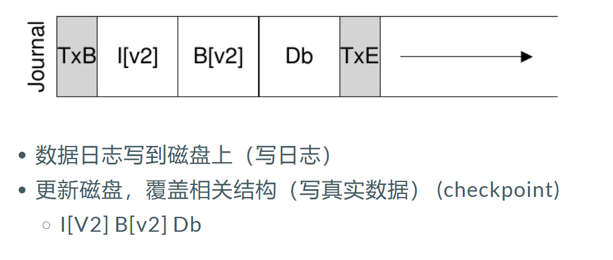

数据日志的更新流程：先写 TxB，I[v2]，B[v2]，Db（日志写入），最后写 TxE（日志提交），最后写入磁盘（加检查点）

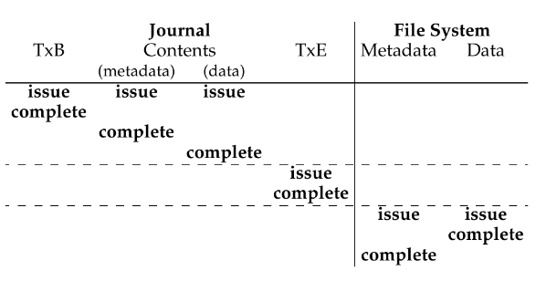

崩溃恢复：

1. 日志提交前崩溃：discard
2. 日志提交后崩溃：redo logging
3. Checkpoint 后崩溃：已经完成数据写入

问题：太多写入，速度慢

**元数据日志**

更新过程：

1. Data Write：写入数据到磁盘的对应位置
2. Journal metadata write：写入 TxB 及对应文件 metadata 操作
3. Journal commit：写入TxE
4. Checkpoint metadata：将事务 metadata 的操作相关数据写回磁盘
5. Free：日志超级块释放 journal 区域的 log 记录

通过强制首先写入数据，文件系统可保证指针永远不会指向垃圾数据

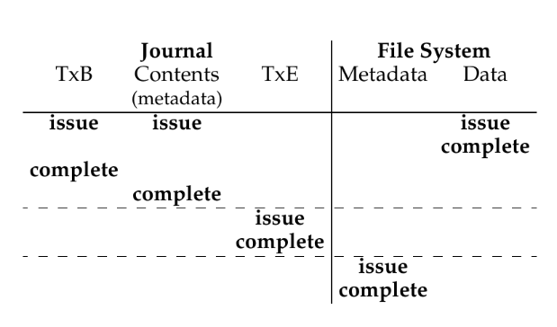

#### lab：支持文件的 OS

##### 实验目标

支持**数据持久保存**

- 以**文件**形式保存持久数据，并能进行文件数据读写
- **进程**成为文件资源的使用者
- 能够在应用层面发出 open/read/write/close 系统调用请求

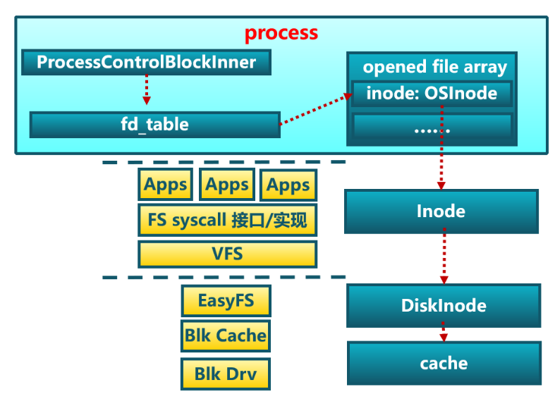

**OSInode**：内存中的 inode

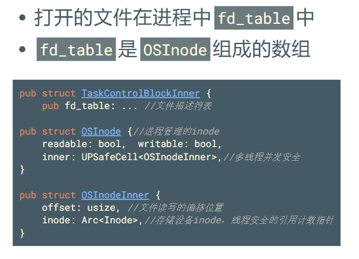

磁盘索引节点 **DiskInode**

- get_block_id 方法体现了 DiskInode 最重要的**数据块索引**功能


## Ch10 进程间通信

#### IPC 进程间通信概述

##### 进程间通信的需求

**定义**：进程间通过数据交换（共享或传递）进行**交互**的行为

**目标**：多进程协作完成复杂应用需求

- 功能模块化
- 程序之间相对隔离
- 多个程序合作可完成复杂任务

##### 进程通信方式

- 直接通信
- 间接通信

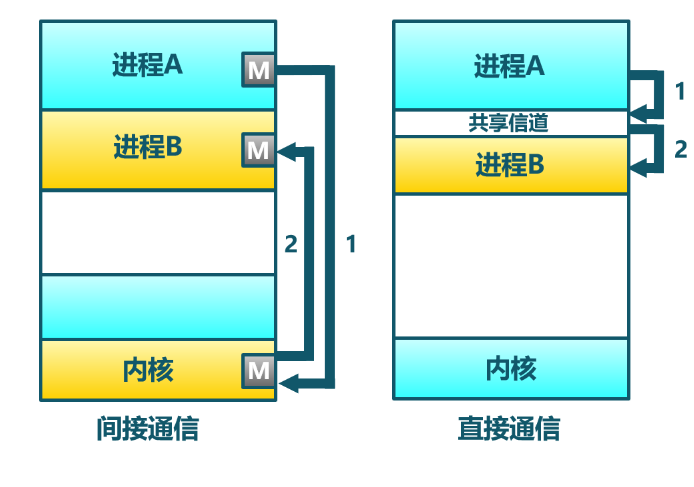

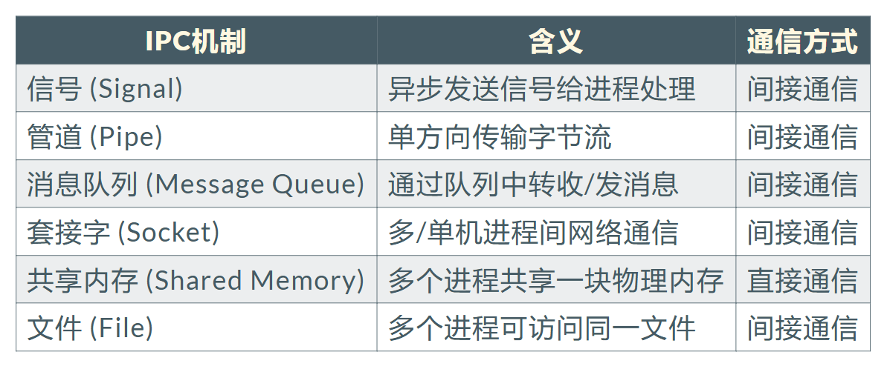

**消息传递的基本接口**：RPC（远程过程调用）= send + recv

- 阻塞通信
- 非阻塞通信

**IPC 的缓冲方式**：

- 无限容量
- 有限容量
- 0 容量

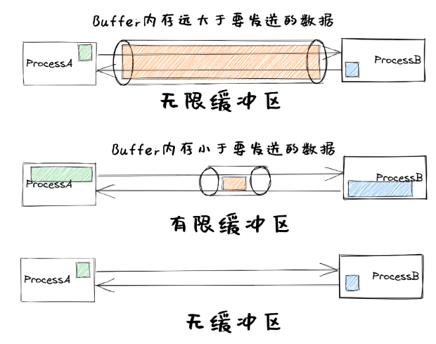

#### 管道 Pipe

- 有读写端的一定大小的**字节队列**

- 表示**为两个文件描述**符加**一段内核空间中的内存**
- sys_pipe 创建管道时，返回两个文件描述符
  - 读管道 fd[0]
  - 写管道 fd[1]

- 支持父子进程、兄弟进程之间通信
- 父进程创建管道（两个文件描述符）
  - 子进程会继承文件描述符，执行读写管道
  - 通过 sys_close 关闭读/写中另一端的文件描述符

##### Shell 中的管道

- 用一根竖线 "**|**" 连接两个命令

##### 命名管道

- shell 中通过 mkfifo 命令创建命名管道

- 命名管道可以支持任意两个进程间的通信

  匿名管道只支持父子进程和兄弟进程间的通信

- 命名管道是**阻塞式**的**单向通信**管道

  - 任意一方都可以读、写
  - 只有读、写端同时打开了命名管道时，数据才会写入并被读取

- 字节流形态，不支持任意两个进程间的双向通信

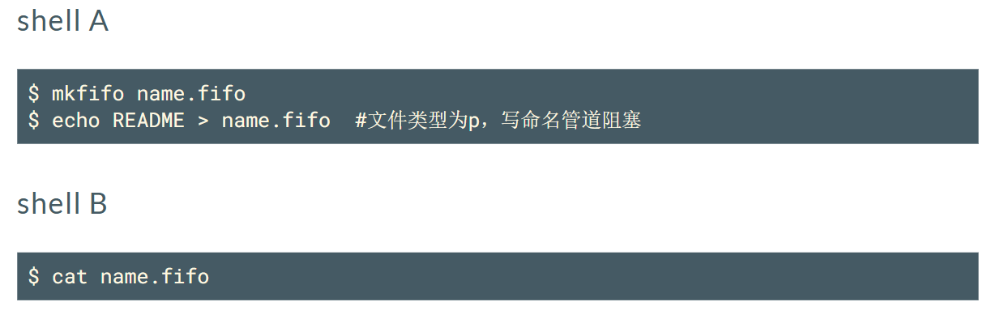

#### 消息队列 Message Queue

操作系统维护的以结构数据为基本单位的间接通信机制

- 每个消息（Message）是一个字节序列，有自己的**类型标识**
- 相同类型标识的消息组成按**先进先出**顺序组成一个消息队列

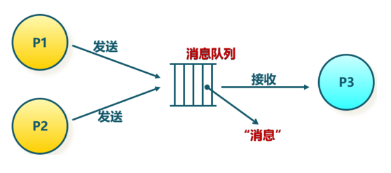

消息结构：msgbuf 由消息**类型**和消息**正文**组成

系统调用：

1. 获取唯一标识 ftok/宏定义

2. 创建消息队列 qid = megget(key, flags)

3. 收发消息 

   msgsnd(qid, buf, size, flags)

   msgrcv(qid, buf, size, type, flags)

   - type 实现了接收优先级的简单形式
     - type = 0：返回队列第一条信息
     - type > 0：返回队列第一条类型等于 type 的消息
     - type < 0：返回队列第一条类型小于等于 type 绝对值的消息

4. 消息队列控制（删除） msgctl

- 内核维护消息队列，完成消息中转
- 不同消息类型：
  - 优先级排序
  - 选择性接收
  - 安全和隔离

没有父子/兄弟关系的进程之间也可以通过消息队列通信

#### 共享内存 Shared Memory

把同一个物理内存区域同时映射到多个进程的内存地址空间的通信机制

- 每个进程的内存地址空间需明确设置**共享内存段**
- 优点：快速、方便地共享数据
  - **直接通信**，无需操作系统中转
- 不足：需要**信号量**等同步机制协调共享内存的**访问冲突**

系统调用：

1. 创建共享段  shmid = shmget(key, size, flags) 
2. 把共享段映射到进程地址空间  shmat(shmid, *shmaddr, shmflg)
   - shmaddr：共享内存映射地址，若为 NULL 则由系统自动指定
   - shmflg：共享内存段的访问权限和映射条件
   - 返回值为共享内存段映射地址，可以对这个地址进行读写
3. 取消共享段到进程地址空间的映射  shmdt(*shmaddr)
4. 共享段控制  shmctl

#### 信号 Signal

- 信号：**中断**正在运行的进程的**异步消息或事件**
- 信号机制：一种进程间异步通信机制
  - 间接通信，内核负责信号的转发/忽略

信号：**整数编号**，定义了对应的宏名（SIG 开头）

##### 信号发送：

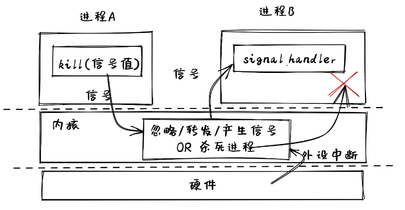

1. 进程通过内核发送，如 kill 命令
2. 内核直接发送（出错时，产生对应事件的信号）
   - SIGPIPE：读管道没有读取权限时
3. 外设通过内核发出（按下 Ctrl+C 时触发 SIGINT 信号）

##### 信号处理方式：

1. 忽略
2. 捕获：进程调用相应的处理函数进行处理
3. 默认：采取默认处理方式：杀死进程/忽略信号

##### 信号实现机制：

1. 注册信号处理函数
2. 分发信号到进程的信号处理函数
3. 执行信号处理函数

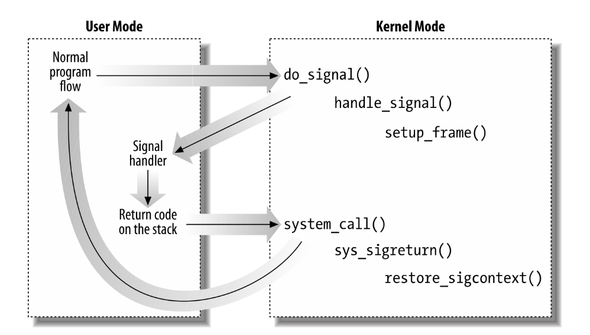


- 注册用户态信号处理函数 sig_handler
- 内核在返回用户态前，发现有信号要处理
- 内核在**用户栈压入 sig_handler 函数栈信息**
  - 模拟用户代码调用 sig_handler 函数
- 内核在**陷入上下文中修改用户态返回地址**
- 内核返回用户态，直接跳到 sig_handler
- 执行 sig_handler 函数结束后，**自动通过系统调用 sigreturn 陷入内核态**
- sigreturn **恢复进程正常执行的上下文，返回用户态继续执行**
  - 恢复之前备份的 Trap context

#### lab：支持 IPC 的 OS

**管道**：fd[0] 读端，fd[1] 写端

pipe 是进程控制块的资源之一：fd table 有一些指向 pipe 端口

**信号**：signal 是内核通知应用的软件中断

准备阶段：

1. 设定 signal 的整数编号值
2. 建立应对某 signal 编号值的例程 signal_handler

执行阶段：

1. 向某进程发出 signal，打断进程的当前执行（通过 kill 系统调用）
2. 转到对应进程的 signal_handler 执行

signal 也是进程控制块的资源之一

##### 管道的设计与实现

基于文件抽象，支持 I/O 重定向

- 管道实现 File Trait，支持 “|” 符号

sys_exec 支持命令行参数

- 命令行参数解析，压入用户栈

  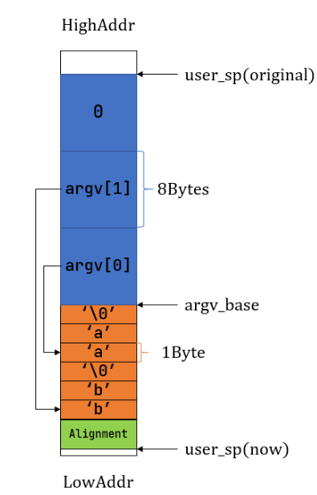

- Trap 上下文中，a0 表示命令行参数个数，a1 表示 argv_base 起始地址

通过**重定向**实现 “ A|B” 连接

- sys_dup 复制文件描述符

  ```rust
  // input redirection
  if !input.is_empty() {
      let input_fd = open(input.as_str(), OpenFlags::RDONLY);
      if input_fd == -1 {
          println!("Error when opening file {}", input);
          return -4;
      }
      let input_fd = input_fd as usize;
      close(0);
      assert_eq!(dup(input_fd), 0);
      close(input_fd);
  }
  // output redirection
  if !output.is_empty() {
      let output_fd = open(output.as_str(), OpenFlags::CREATE | OpenFlags::WRONLY);
      if output_fd == -1 {
          println!("Error when opening file {}", output);
          return -4;
      }
      let output_fd = output_fd as usize;
      close(1);
      assert_eq!(dup(output_fd), 1);
      close(output_fd);
  }
  ```

##### 信号的设计与实现

系统调用：

- sigaction：设置信号处理例程
- sigprocmask：设置要屏蔽的信号
- kill：将某信号发送给某进程
- sigreturn：清除堆栈帧，从信号处理例程返回（signal handle 返回前调用）

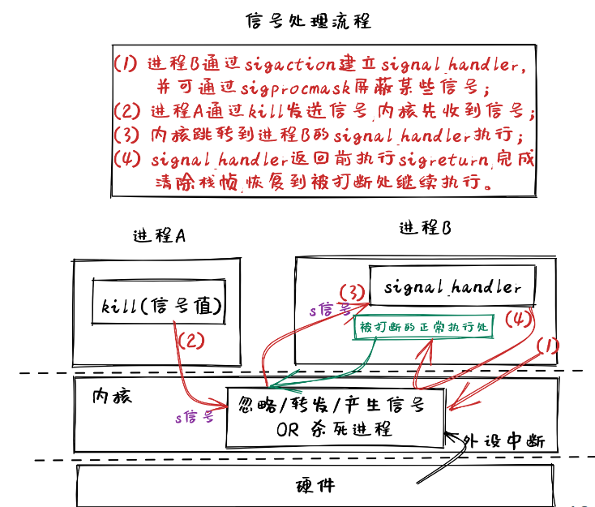

SignalAction 结构：handler 地址 + mask（SignalFlags 结构体）

TCB：增加成员变量

- signals 待响应的信号
- signal_mask 要屏蔽的信号
- handling_sig 正在处理的信号
- signal_actions 信号处理里程表
- killed/frozen 任务是否已经被杀死/暂停

sys_sigaction 函数调用：

- 对于需要修改的信号编号 signum：

  1. 保存老的 signal_handler 地址到 old_action

  1. 设置 action 为新的 signal_handler 地址

sys_kill 函数调用：

- 对进程号为 pid 的进程发送值为 signum 的信号：
  1. 根据 pid 找到TCB
  2. 在 TCB中的 signals 插入 signum 信号值

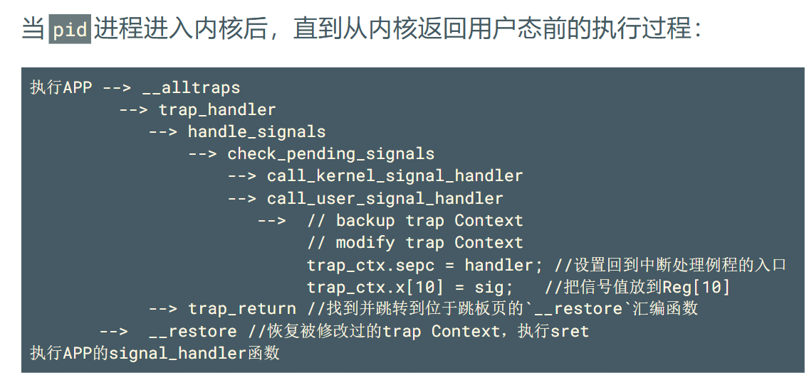

sys_sigreturn 系统调用：


## Ch11 线程

#### 线程

##### 进程存在的不足

1. 进程之间地址空间隔离，通过 IPC 共享/交换数据不方便
2. 管理进程（创建/删除/切换进程）开销大
3. 并行/并发处理困难
   - 资源使用效率低
   - 无法保证 I/O 密集型操作和计算密集型操作之间的连贯性

##### 线程的优势

1. 在应用中可能同时发生多种活动，且某些活动会被阻塞

   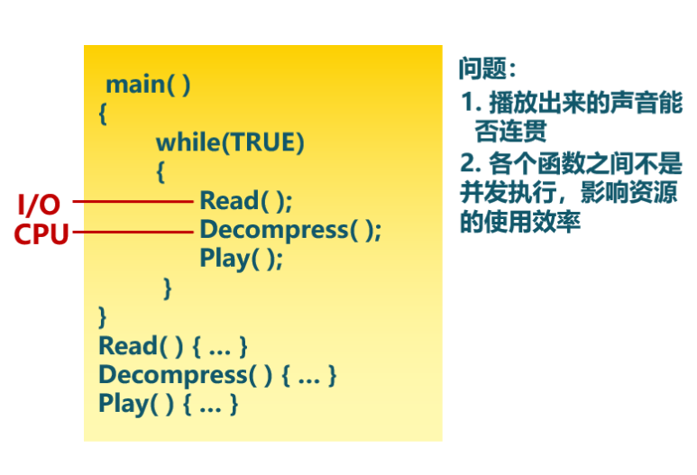

2. 将程序分解成可并行运行的多个顺序控制流

   - 可提高执行**效率**
     - 并行实体（多个顺序控制流）**共享同一个地址空间和所有可用数据，访问数据和共享资源方便**
     - **切换控制流轻量**，管理不同控制流便捷
   - 程序设计模型也会变得更**简单**

##### 线程和进程的区别

1. 进程是**资源（包括内存、打开的文件等）分配的单位**，线程是 **CPU 调度的单位**
2. 进程拥有一个完整的资源平台，而线程**只独享必不可少的资源，如寄存器和栈**
3. 线程同样具有就绪、阻塞、执行三种基本状态，同样具有状态之间的转换关系
4. 线程能减少并发执行的时间和空间开销
   - 线程的创建/终止/切换时间比进程短
   - 同一进程的各线程间共享内存和文件资源，可不通过内核进行直接通信

##### 线程和进程的关系

- 一个进程中可以同时存在多个线程
- 各个线程之间可以并发执行
- 各个线程之间可以共享地址空间和文件等资源
- 当进程中的一个线程崩溃时，会导致其所属进程的所有线程崩溃（这里是针对 C/C++ 语言，Java 语言中的线程崩溃不会造成进程崩溃）

#### 线程定义

- 线程是进程的一部分，**描述指令流执行状态**
- 它是进程中的**指令执行流的基本单元**，是**CPU调度的基本单位**

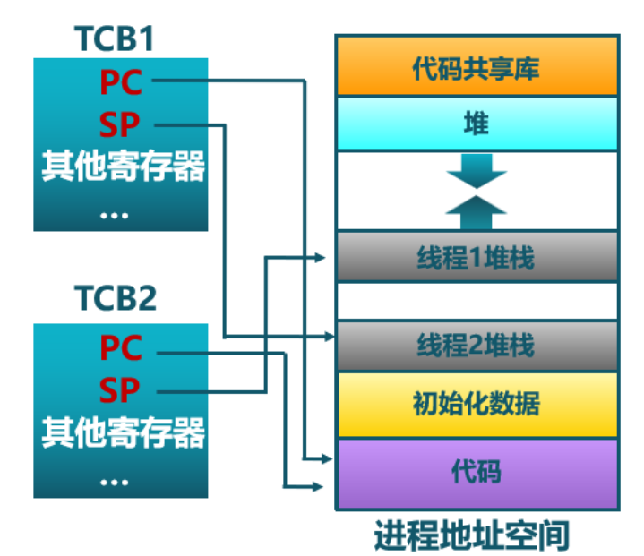

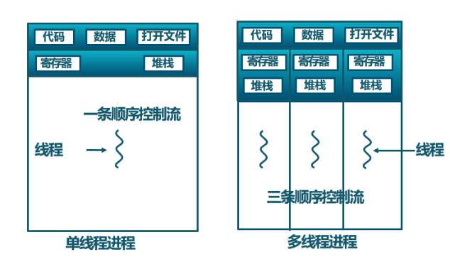

##### 进程和线程的角色

- 进程的**资源分配**角色
  - 进程由一组相关资源构成，包括地址空间（代码段、数据段）、打开的文件等各种资源
- 线程的**处理机调度**角色
  - 线程描述在进程资源环境中的指令流执行状态

##### **进程 = 线程 + 共享资源**

- 一个进程中可存在多个线程
- 线程共享进程的地址空间
- 线程共享进程的资源
- 线程崩溃会导致进程崩溃

#### 线程管理

##### 用户态管理的线程与内核态管理的线程

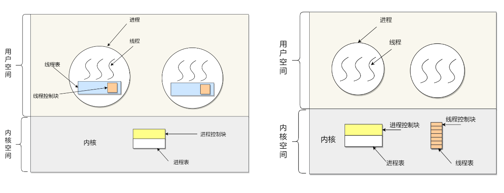

##### 用户态管理的线程

1. 创建线程  pthread_create
2. 等待线程  pthread_join
   - 一直阻塞调用它的线程，直至目标线程执行结束

#### 线程的设计实现

- 用户态管理且用户态运行的线程（内核不可见的用户线程）

  - Thread managed & running in User-Mode（用户态线程，绿色线程）

  - 优点：

    - 线程的调度不需要内核直接参与，控制简单
    - 可以在不支持线程的操作系统中实现
    - 创建和销毁线程、线程切换等**线程管理的代价比内核线程少得多**
    - **允许每个进程定制自己的调度算法**，线程管理比较灵活

    - 同一进程中只能同时有一个线程在运行，**如果有一个线程使用了系统调用而阻塞，那么整个进程都会被挂起**

  - 不足：

    - 一个线程发起系统调用而阻塞时，则整个进程进入等待
    - **不支持基于线程的处理机抢占**
    - 只能**按进程分配 CPU 时间**
    - 多个处理机下，同一个进程中的线程**只能在同一个处理机下分时复用**

- 内核态管理且用户态运行的线程（内核可见的用户线程）

  - Thread managed in Kernel-Mode & running in User-Mode
  - 特点：
    - 由内核通过系统调用实现的线程机制，由内核完成线程的创建、终止和管理
    - 由内核维护线程控制块 TCB, 在内核实现
    - **线程执行系统调用而被阻塞不影响其他线程**
  - 不足：
    - 在一般情况下，**线程切换开销**与进程切换开销相差不大，大于用户态管理且用户态允许的线程切换开销
    - 与传统的进程管理机制会产生一些矛盾，一些**系统调用的实现功能/语义上会不协调**
      - fork()、signal() ...

  - **多线程 fork() 引起的问题**
    - **竞态条件**：线程正在**修改共享变量或资源时调用了 fork()，会导致子进程继承这个状态和资源的不一致性**
    - **死锁**：线程正在**持有某个锁或资源时调用 fork()，可能导致子进程无法获得该锁而导致死锁**
    - **内存占用**：多线程 fork() 会复制整个进程的地址空间，包括**所有线程所拥有的栈、寄存器和锁等资源**
    - **性能下降**：多线程 fork() 的开销较大，可能会影响应用程序的性能

- 内核态管理且内核态运行的线程（**内核线程**）

  - Thread managed & running in Kernel-Mode

  - 由内核实现线程机制，由内核完成线程的创建、终止和管理

  - 由内核维护 TCB, 在内核实现

  - **线程在内核中执行**

    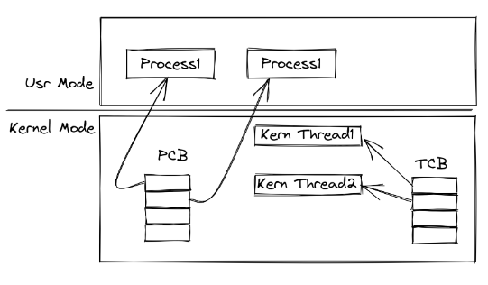

  - 一个内核线程可分时/并行处理一件内核任务

  - 内核线程的调度由内核负责，一个内核线程处于阻塞状态时不影响其他的内核线程

  - 作用：执行**周期性的任务**

    - 把 Buffer-Cache 定期写回到存储设备上
    - 在可用物理内存页很少情况下执行虚存交换操作
    - 实现文件系统的事务日志

- 混合管理且运行的线程（**轻量级进程**，混合线程）

  - Thread managed & running in Mixed-Mode

  - 轻量级进程（Light-Weight Process，LWP）是**内核支持的用户线程**

    - 一个进程可有一个或多个 LWP，**每个 LWP 是跟内核线程一对一映射的**，也就是 **LWP 都是由一个内核线程支持**
    - **在 LWP 之上也可使用用户线程**

  - **轻权进程与用户线程的对应关系**

    - 1 : 1，即一个 LWP 对应 一个用户线程：Linux, JVM

      - 用户态管理取消，内核管理线程

    - N : 1，即一个 LWP 对应多个用户线程：与 OS 无关的 Green Thread

      - 内核态仅管理包含多个线程的进程，用户态的线程运行时管理线程

    - M : N，即多个 LWP 对应多个用户线程：Solaris OS, Go runtime

      - 用户态线程运行时和内核协同进行管理

      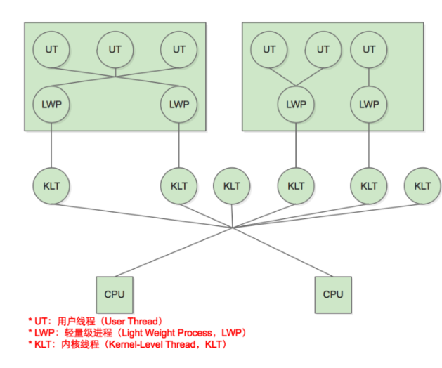

  - ##### 轻权进程管理

    - **编程人员**决定内核线程与用户级线程的对应关系
    - **用户级线程**由用户线程管理库管理
    - **内核**只识别内核级线程/进程，并对其进行调度
    - 内核与**用户态线程管理库**交互
    - 具有最大灵活度和实现复杂性

    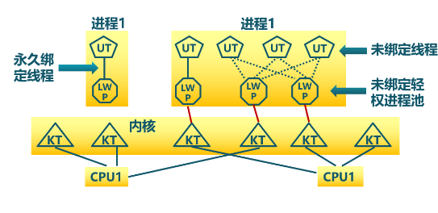

##### 线程的上下文切换

线程是调度的基本单位，而进程则是资源拥有的基本单位

- 不同进程中的线程切换：进程上下文切换
- 相同进程中的线程切换：
  - 虚拟内存等**进程资源**保持不动
  - 只需要切换**线程的私有数据、寄存器**等不共享的数据

#### lab：支持线程的 OS

##### 实验目标

并行化，提升效率

##### 用户态管理的用户线程

1. 用户态线程管理**运行时初始化**

   - 在应用的 main() 函数中，首先会依次调用 Runtime::new 和 Reuntime::init 两个函数完成线程管理**运行时的初始化过程**
   - 这样正在运行的 **TID 为 0 的主线程就可代表线程运行时**进行后续创建线程等一系列工作
   - **Runtime::new()** 的主要功能：
     1. **设置主线程**：初始化应用**主线程控制块**（TID为 0 ），并设置其状态为 Running
     2. **设置调度队列**：初始化线程控制块向量（线程调度队列），加入应用主线程控制块和空闲线程控制块，为后续的线程运行做好准备
     3. **设置当前运行线程 id**：设置 Runtime 结构变量中的 current 值为 0， 表示当前正在运行的线程是应用主线程
   - **Runtime::init()** 的主要功能：
     - 把 **Rutime 结构变量的地址**赋值给**全局可变变量 RUNTIME**，以便在后续执行中会根据 RUNTIME 找到对应的 Runtime 结构变量

2. 用户态管理的**线程创建**

   - 通过 runtime.spawn 函数完成

     1. 在线程向量中查找一个状态为 Available 的空闲线程控制块

     2. 初始化该空闲线程的线程控制块的**线程上下文**

        - x1 寄存器：老的返回地址（guard 函数地址）

        - nx1 寄存器：新的返回地址（输入参数 f 函数地址）

        - x2 寄存器：新的栈地址（available.stack + size）

   - **guard 函数**：意味着传入的 f 函数（线程的主体）已经返回，线程已完成运行任务，进而**取消引用我们的运行时**并**调用 t_return()**

3. 用户态管理的**线程切换**

   - 当应用要切换线程时，会调用 yield_task 函数，通过 runtime.t_yield 函数来完成具体的切换过程。

   - **runtime.t_yield()** 的主要功能：

     - 在线程向量中查找一个状态为 Ready 的线程控制块

     - 把当前运行的线程的状态改为 Ready，把新就绪线程的状态改为 Running，把 runtime 的 current 设置为新就绪线程控制块的 id

     - 调用函数 **switch** ，完成两个线程的栈和上下文的切换
       - 完成当前指令指针（PC）的切换
       - 完成栈指针的切换
       - 完成通用寄存器集合的切换

##### 内核态管理的用户线程

- 多线程时 fork 可能存在的问题
- 调用 sys_exit 可能出现的情况
  - 主线程调用：所属进程退出，回收其全部资源
  - 非主线程调用：当前线程退出并切换到下一个线程
- 等待线程结束 sys_waittid
  - 如果退出码存在（线程已结束），则回收线程控制块的资源
- sys_thread_create 创建线程
  - 线程的成员变量：用户态栈，内核态栈，跳板页，上下文


## Ch12 同步互斥

##### 背景

- 进/线程如果有资源共享
  - 存在**不确定性**
  - 存在**不可重现**
  - 可能出现难以重现的**错误**

- 操作系统需要利用同步机制在并发执行的同时，保证一些操作是**原子操作**
  - 原子操作是指一次不存在任何中断或失败的操作
  - 要么操作成功完成，或者操作没有执行，不会出现部分执行的状态

#### 现实生活中的同步互斥问题

- 方案一

  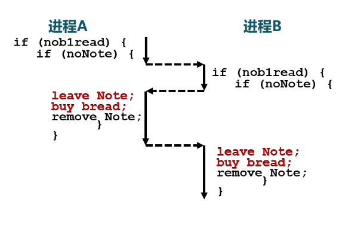

  - 可能买太多面包

- 方案二

  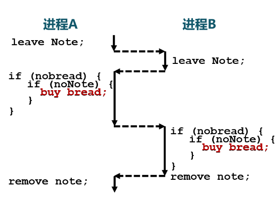

  - 可能没有人去买面包

- 方案三

  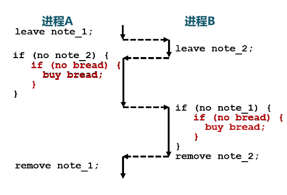

  - 可能没有人去买面包

- 方案四

  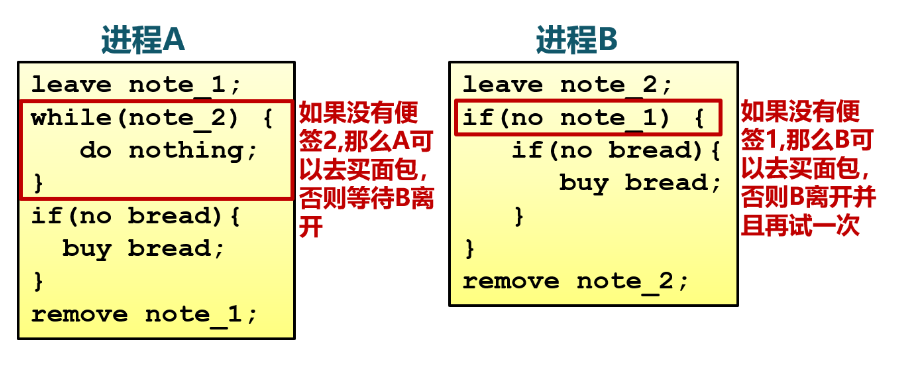

  - 有效
  - 缺点：
    - 对于多个线程，需要采用不同代码，过于复杂
    - A 等待时不能做其他事（忙等待 busy-waiting）

- 方案五

  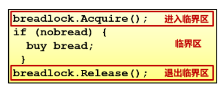

  - 利用两个原子操作实现一个**锁（lock）**
  - Lock.Acquire()
    - 在锁被释放前一直等待，然后获得锁
    - 如果两个线程都在等待同一个锁，并且同时发现锁被释放了，那么只有一个能够获得锁
  - Lock.Release()
    - 解锁并唤醒任何等待中的线程

#### 临界区

```
entry section
	critical section
exit section
	remainder section
```

- 进入区（entry section）
  - 检查可否进入临界区的一段代码
  - 如可进入，设置相应 "正在访问临界区" 标志
- 临界区（critical section）
  - 线程中访问临界资源的一段需要互斥执行的代码
- 退出区（exit section）
  - 清除 “正在访问临界区” 标志
- 剩余区（remainder section）
  - 代码中的其余部分

##### 临界区访问规则

1. **空闲则入**：没有线程在临界区时，任何线程可进入
2. **忙则等待**：有线程在临界区时，其他线程均**不能**进入临界区
3. **有限等待**：等待进入临界区的线程**不能**无限期等待
4. **让权等待（可选）**：不能进入临界区的线程，应释放CPU（如转换到阻塞状态）

#### 同步互斥方法

#### 禁用硬件中断

- 没有中断，没有上下文切换，因此**没有并发**
  - **硬件**将中断处理延迟到中断被启用之后
  - 现代计算机体系结构都提供指令来实现禁用中断
- 进入临界区：禁止所有中断，并保存标志
- 离开临界区：使能所有中断，并恢复标志
- 缺点：
  - 禁用中断后，线程无法被停止
    - 整个系统都会为此停下来
    - **可能导致其他线程处于饥饿状态**
  - 临界区可能很长
    - 无法确定响应中断所需的时间（可能存在硬件影响）
  - 不适合多核，**仅限于单处理器**

#### 基于软件的解决方法

- 线程可以通过一些**共有变量**来同步它们的行为

- 尝试一：根据 turn 值进入临界区

  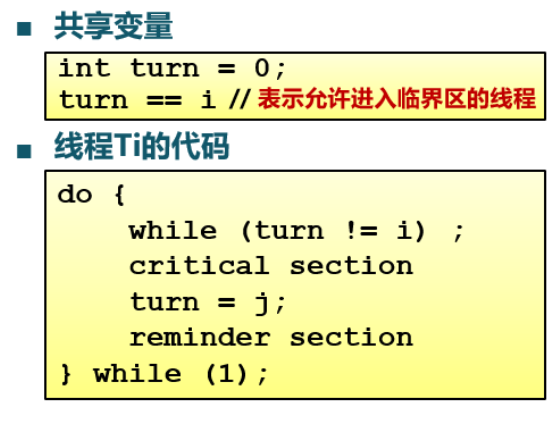

  - 满足 “忙则等待”，但是有时不满足 “空闲则入”
    - 初始化 turn = 0 时，若 T1 需要访问临界区，也需要等待 T0 进入过临界区后

- 尝试二：根据 flag 进入临界区

  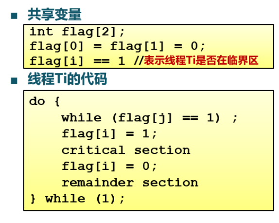

  - 互相依赖（线程忙等）
  - 不满足 “忙则等待”
    - flag[i] = flag[j] = 0 时，两个进程可能都进入临界区

- 尝试二：根据 flag 进入临界区

  

  - 满足 “忙则等待”，但是不满足 “空闲则入”
    - flag[i] = flag[j] = 1 时，没有人能进入临界区

#### Peterson算法 turn+flag

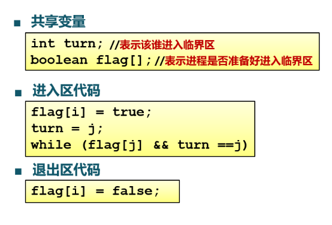

##### Dekkers 算法

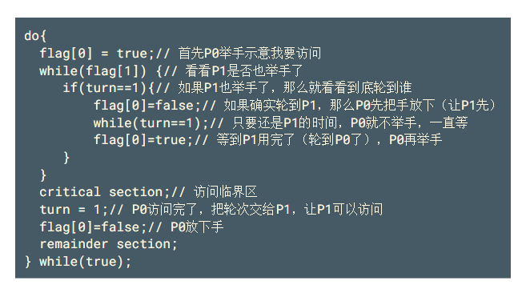

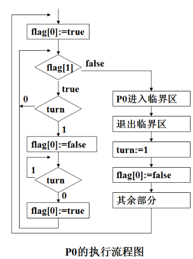

##### N 线程

- 一个共享的 turn 变量，若干线程排成一个环
- 每个环有个 flag 标志，想要进入临界区填写 flag 标志
- 有多个想进入临界区，从前往后走，执行完一个线程，turn 改为下一个线程的值


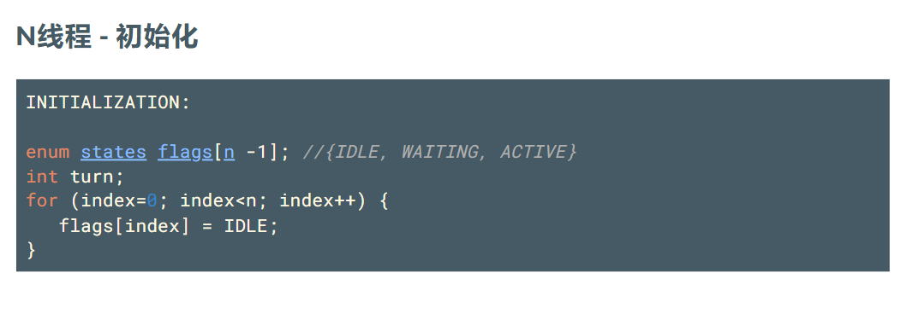

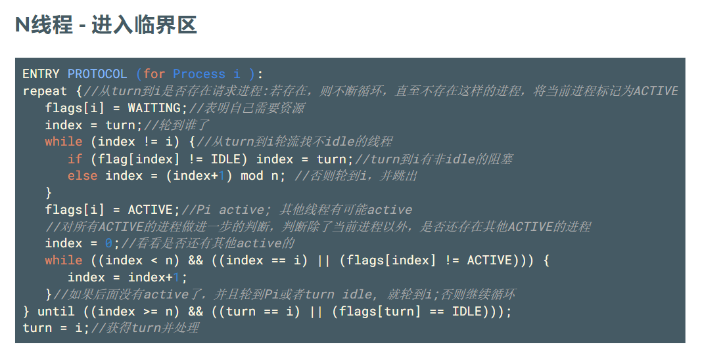


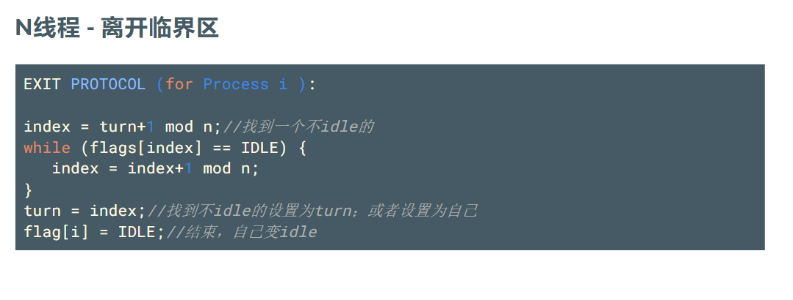

#### 更高级的抽象方法

- 基于软件的解决方法存在的问题
  - 复杂；需要**忙等待**
- 更高级的抽象方法
  - 硬件提供了一些**同步原语**
    - 中断禁用，原子操作指令等
  - 操作系统提供**更高级的编程抽象**来简化线程同步
    - 例如：**锁、信号量**
    - 用硬件原语来构建

##### 锁（lock）

- 锁是一个抽象的数据结构，是一种高级的同步抽象方法
  - 一个二进制变量（锁定/解锁）
  - 使用锁来控制临界区访问
  - Lock::Acquire()
    - 锁被释放前一直等待，后得到锁
  - Lock::Release()
    - 释放锁，唤醒任何等待的线程

##### 原子操作指令

- **测试和置位（Test-and-Set）指令**
  - 从内存单元中读取值
  - 测试该值是否为1（然后返回真或假）
  - 内存单元值设置为1
    - 输入0，改成1，返回0
    - 输入1，保持1，返回1

- 利用 TaS 指令实现锁

  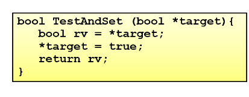

  

- **交换指令 CaS（Compare and Swap）**

  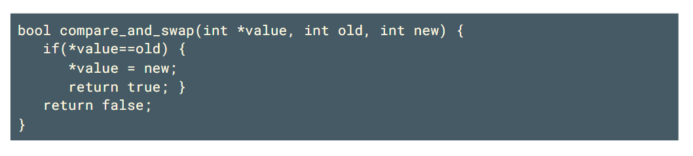

- 利用 CaS 执行实现锁

  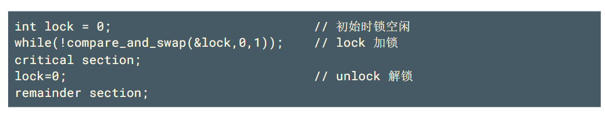

#### 自旋锁

- 存在**忙等待**问题

  - 线程在等待时也消耗 CPU 时间

  - 解决：将线程加入**等待队列**中，**等待锁**

    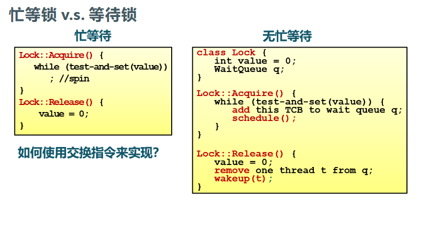

  - CaS 交换指令实现等待锁

    ```
    Lock::Acquire() {
    	while(!compare_and_swap(value, 0, 1)) {
    		add this TCB to wait queue q;
    		schedule();
    	}
    }
    
    Lock::Release() {
    	value = 0;
    	remove one thread t from q;
    	wakeup(t);
    }
    ```

- 优点

  - 适用于**单处理器**或者**共享主存的多处理器**中任意数量的线程同步
  - 简单并且容易证明
  - 支持多临界区

- 缺点

  - **忙等待**消耗处理器时间
  - 可能导致**饥饿**
    - 线程离开临界区时有多个等待线程的情况
  - 可能**死锁**：线程间相互等待，无法继续执行

#### 信号量

- 信号量是一种抽象数据类型，由一个**整型 (sem) 变量**和两个**原子操作**组成

  - TaS 和 CaS 是硬件原子操作，PV 则是**由操作系统保证**的原子操作

    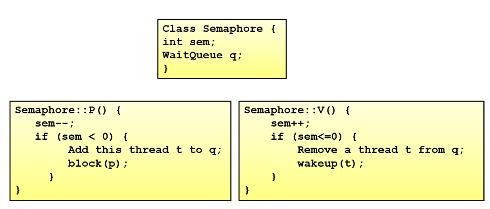

- P() 可能阻塞，V()不会阻塞

- 通常假定信号量是 “公平的”

  - 线程不会被无限期阻塞在 P() 操作
  - 假定信号量等待按**先进先出**排队

- **信号量的分类**

  - 二进制信号量：资源数目为 0 或 1

  - 计数信号量：资源数目为任何非负值

- **信号量的使用**

  - **互斥访问**

    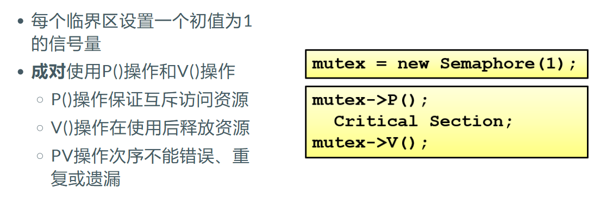

  - **条件同步**

    - 条件同步信号量的初值为 0
    - V() 操作后唤醒 P()

    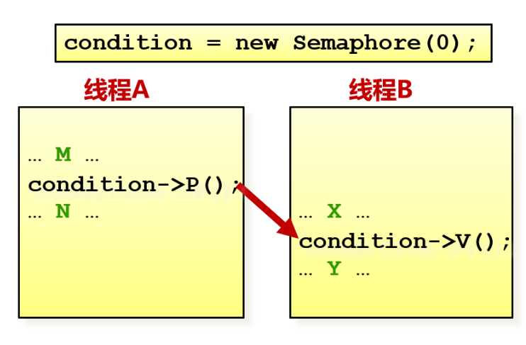

- **生产者-消费者问题**

  - 有界缓冲区的生产者-消费者问题
    - 一个或多个生产者在生成数据后放在一个缓冲区里
    - 单个消费者从缓冲区取出数据处理
    - 任何时刻只能有一个生产者或消费者可访问缓冲区

  

  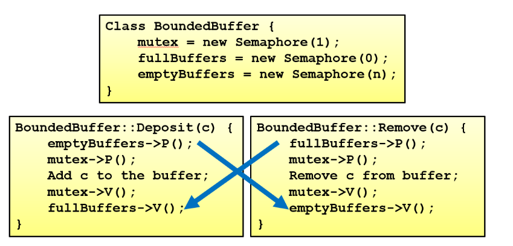

- 信号量机制存在的问题
  - 读/开发代码比较困难
  - 容易出错
    - 使用已被占用的信号量
    - 忘记释放信号量
    - 不能够避免死锁问题
    - 对程序员要求较高

#### 管程与条件变量

传统条件变量和锁机制的问题

- 程序**可读性差**：要了解对于一组共享变量及信号量的操作是否正确，则必须通读整个系统或者并发程序
- 程序**不利于修改和维护**：程序局部性很差，所以任一组变量或一段代码的修改都可能影响全局
- 程序**正确性难以保证**：操作系统或并发程序通常很大，很难保证一个复杂的系统没有逻辑错误
- 容易发生**死锁**：如果不使用好 PV 操作时，逻辑上发生错误，很有可能会导致死锁

##### 管程

- 管程是一种用于多线程互斥访问共享资源的**程序结构**
  - 模块化，一个管程是一个基本程序单位，可以单独编译
  - 抽象数据类型，管程是一种**特殊的数据类型**，其中不仅有数据，而且有对数据进行操作的代码
  - 信息隐蔽，管程是半透明的，管程中的过程（函数）实现了某些功能，在其外部则是不可见的
- 采用**面向对象方法**，简化了线程间的同步控制
- 任一时刻最多只有一个线程执行管程代码
- 正在管程中的线程可临时放弃管程的互斥访问，等待事件出现时恢复

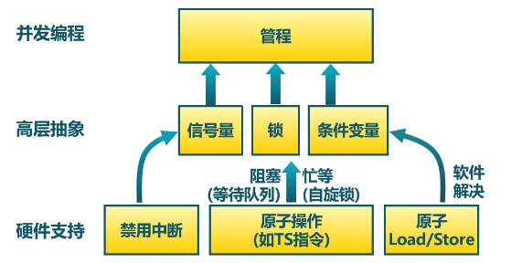

##### 管程的外部特征

管程中的共享变量在管程外部是不可见的，外部只能通过调用管程中所说明的外部过程 (函数）来间接地访问管程中的共享变量

- **互斥**：任一时刻管程中只能有一个活跃进程，通过锁竞争进入管程
- **等待**：进入管程的线程**因资源被占用**而进入等待状态
  - 每个条件变量表示一种等待原因，对应一个**等待队列**
  - **入口队列**管理**未进入管程**的线程/进程
- **唤醒**：管程中等待的线程可以在其他线程释放资源时被唤醒
- **管程操作**：进入 enter，离开 leave，等待 wait，唤醒 signal

##### 条件变量

- 条件变量是多线程编程中的一种**同步机制**，用于线程间通信和协调
  - 它是一个结构体，包含了一个**等待队列**和一些**基本操作函数**
  - 通过条件变量实现线程的阻塞、唤醒和通讯等功能
- 条件变量**与互斥锁（mutex）配合**，可实现**线程间的同步和互斥**
  - 共享资源被占用时，线程可通过条件变量挂起自己
  - 其他线程释放该资源后，继续执行

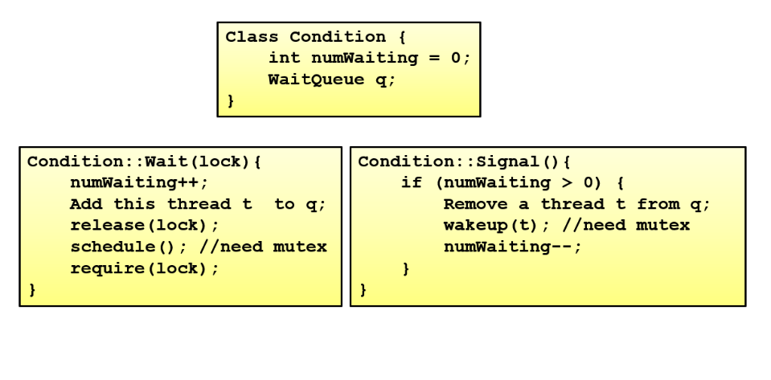


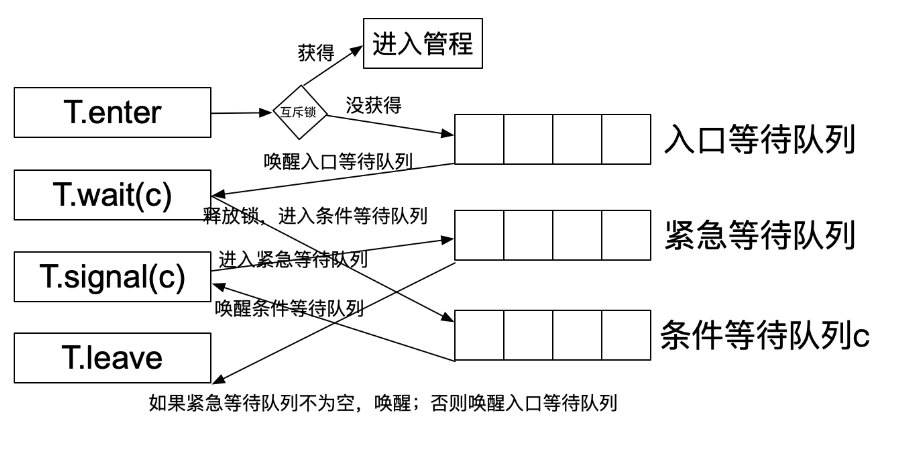

##### 管程实现方式

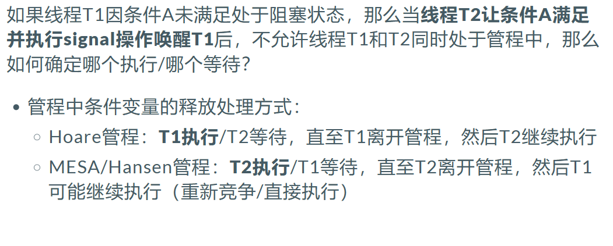

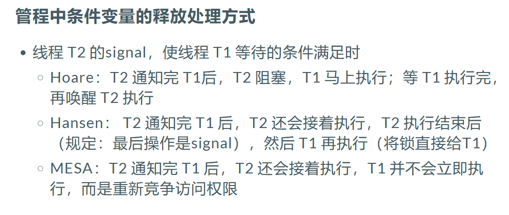

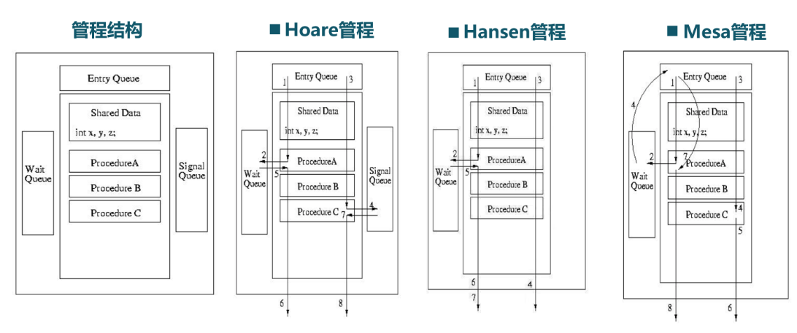


##### 管程条件变量释放处理方式

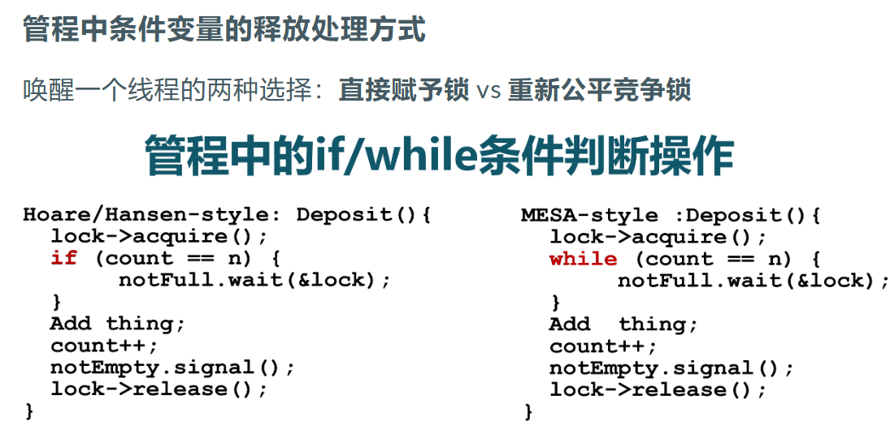

##### Hoare 管程

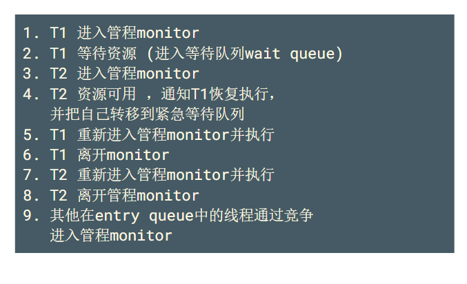

##### MESA 管程

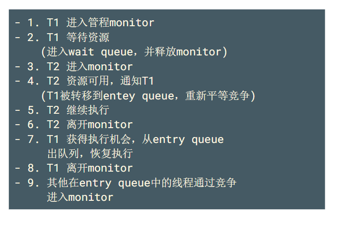

##### Hansen 管程

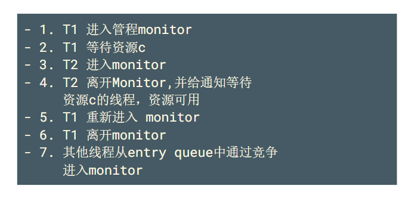

##### 生产者-消费者问题的管程实现

- MESA 管程，需要重新竞争

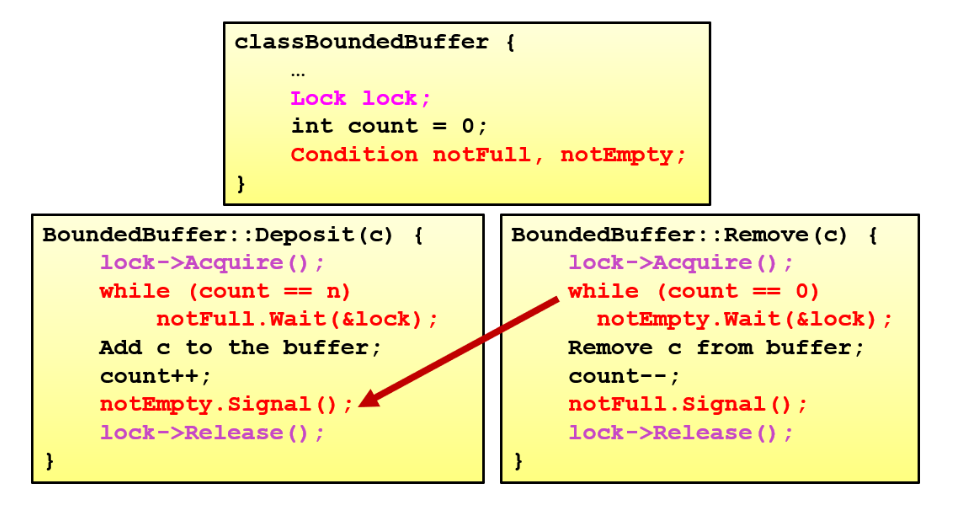


#### 同步互斥实例问题

##### 哲学家就餐问题

- 方案一

  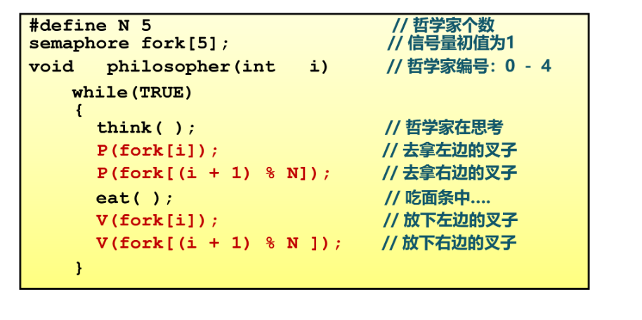

  - 不正确，可能导致死锁

- 方案二

  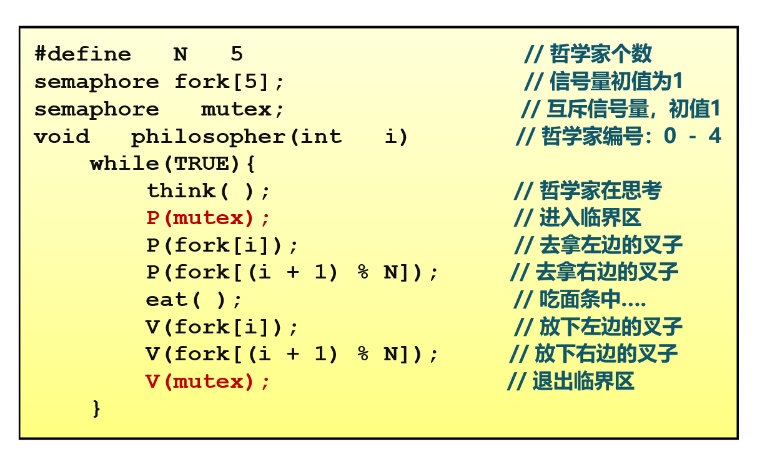

  - 互斥访问正确，但每次只允许一人进餐

- 方案三

  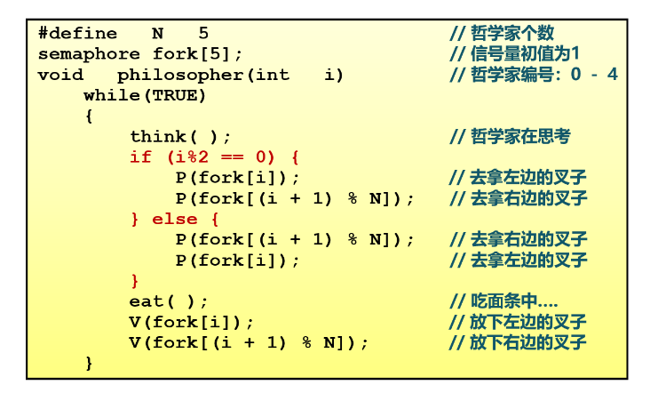

  - 没有死锁，可有多人同时就餐

- 方案四：AND 型信号量

  

- 方案五

  - 扩展性最强，而且能获得最大的并行度
  - 用一个数组 state 跟踪每一个哲学家是在进餐、思考还是饥饿状态
    - 用 mutex 保护对其的访问

  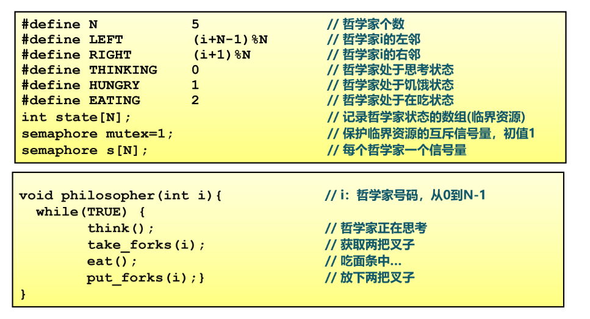

  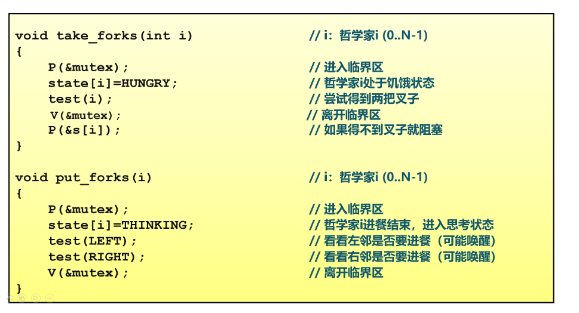

  

##### 读者-写者问题

- 读者优先策略
  - 只要有读者正在读状态，后来的读者都能直接进入
  - 如读者持续不断进入，则写者就处于饥饿
- 写者优先策略
  - 只要有写者就绪，写者应尽快执行写操作
  - 如写者持续不断就绪，则读者就处于饥饿

**信号量实现方案**

- 读者优先

  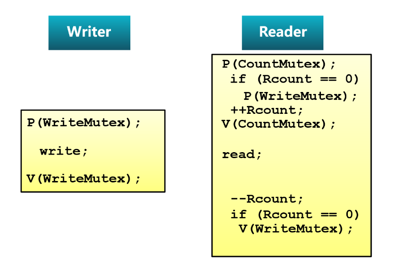

- 写者优先

  - 

**管程实现方案**

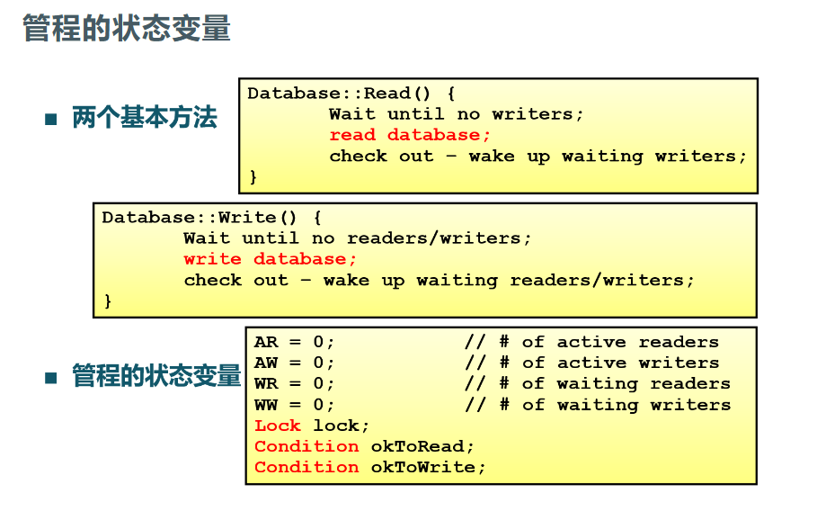

- 写者优先

  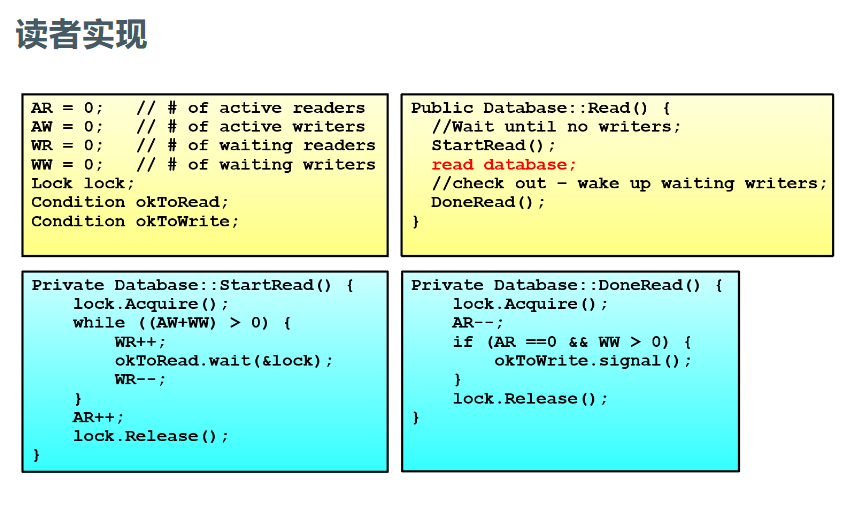

  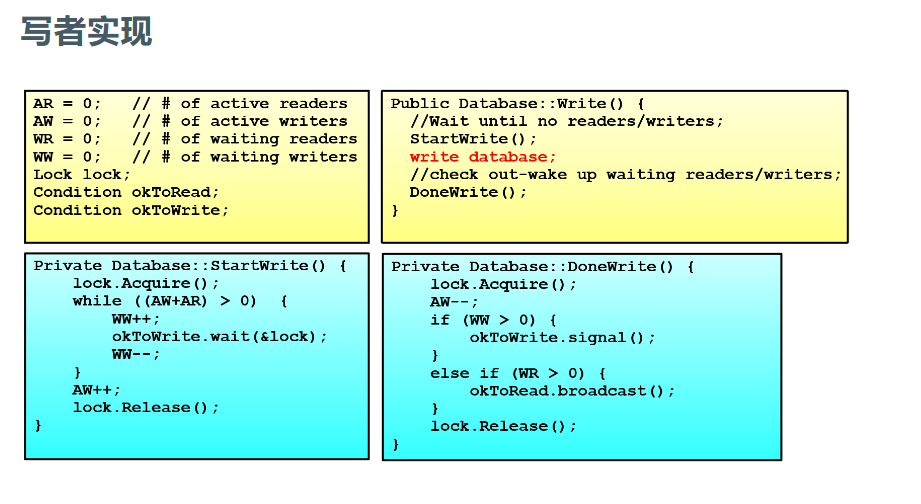

#### 死锁

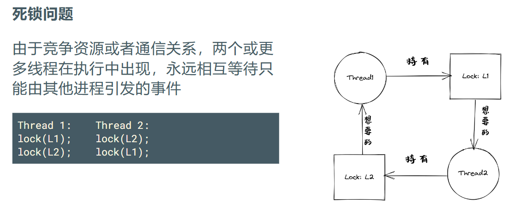

##### 资源

- 可重用资源
  - 硬件：处理器、内存、设备等
  - 软件：文件、数据库和信号量等
  - 可能出现死锁：每个进程占用一部分资源并请求其它资源
- 可消耗资源
  - 在 I/O 缓冲区的中断、信号、消息等
  - 可能出现死锁：进程间相互等待接收对方的消息

##### 资源分配图

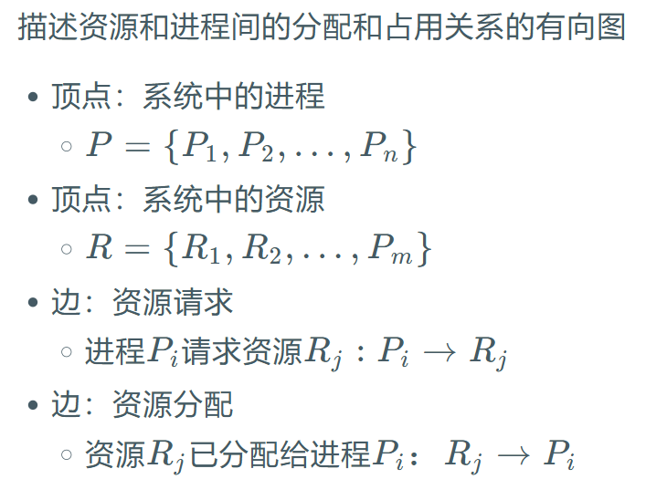

##### 死锁问题产生的必要条件

- **互斥**：任何时刻只能有一个进/线程使用一个资源实例
- **持有并等待**：进/线程保持至少一个资源，并正在等待获取其他进程持有的资源
- **非抢占**：资源只能在进程使用后自愿释放
- **循环等待**
  - 存在等待进程集合 {𝑃0，𝑃1，...，𝑃𝑁}
  - 进程间形成相互等待资源的环

##### 死锁处理办法

- **死锁预防**（Deadlock Prevention）
  - 确保系统永远不会进入死锁状态
- **死锁避免**（Deadlock Avoidance）
  - 在使用前进行判断，只允许不会出现死锁的进程请求资源
- **死锁检测和恢复**（Deadlock Detection & Recovery）
  - 在检测到运行系统进入死锁状态后，进行恢复
- **由应用进程处理死锁**
  - 大多数操作系统（包括UNIX）选择忽略死锁

##### 死锁预防

破坏产生死锁的必要条件：


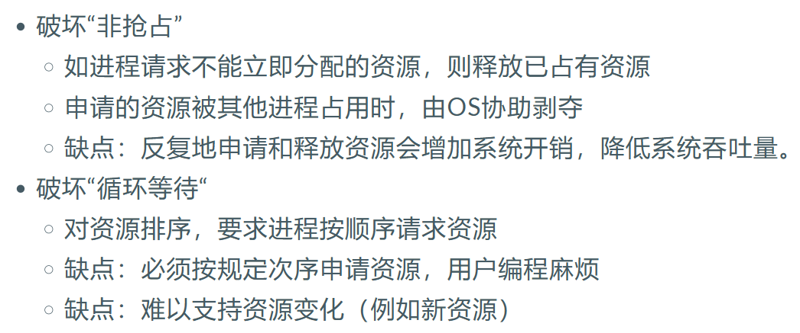

##### 死锁避免

利用额外的先验信息，在分配资源时判断是否会出现死锁，只在不会死锁时分配资源

- 要求进程**声明需要资源的最大数目**
- 限定提供与分配的资源数量，确保满足进程的最大需求
- 动态检查的资源分配状态，确保不会出现环形等待

**安全状态**

- 针对所有已占用进程，存在安全执行序列 <𝑃1，𝑃2，...，𝑃𝑁>
- 𝑃𝑖 要求的资源 ≤ 当前可用资源 + 所有 𝑃𝑗 持有资源，其中 𝑗<𝑖
- 如 𝑃𝑖 的资源请求不能立即分配，则 𝑃𝑖 等待所有 𝑃𝑗 (𝑗<𝑖)  完成
- 𝑃𝑖 完成后，𝑃𝑖+1 可得到所需资源，执行完并释放所分配的资源
- 最终整个序列的所有 𝑃𝑖 都能获得所需资源

**安全状态与死锁的关系**

- 系统处于安全状态，一定没有死锁
- 系统处于不安全状态，可能出现死锁
  - 避免死锁就是确保系统不会进入不安全状态

- 处于安全状态是没有死锁的充分条件

**银行家算法（Banker's Algorithm）**

- 银行家算法是一个避免死锁产生的算法。以银行借贷分配策略为基础，判断并保证系统处于安全状态
  - 客户在第一次申请贷款时，声明所需最大资金量，在满足所有贷款要求并完成项目时，及时归还
  - 在客户贷款数量不超过银行拥有的最大值时，银行家尽量满足客户需要

- 银行家 ↔ 操作系统；资金 ↔ 资源；客户 ↔ 线/进程
- 算法思路
  1. 对于一个线程 T 的请求，判断请求的资源是否超过最大可用资源
     - 如果超过，不分配，T 阻塞等待
     - 如果不超过，继续 2
  2. 如果分配给该请求资源，判断是否安全
     - 安全则分配给 T 资源；否则不分配，T 阻塞等待
  3. 如何判断是否安全？
     - 判断是否每个线程都可以安全完成
       - 如果每个都可以完成则安全；否则不安全

- 数据结构

  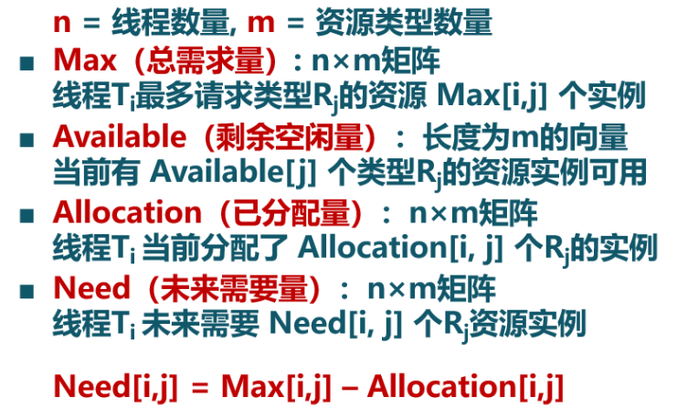

- **判断安全状态**

  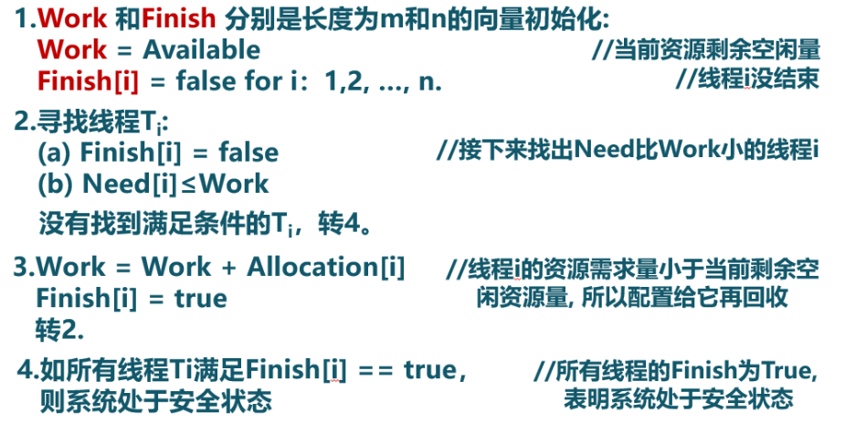

- 完整算法

  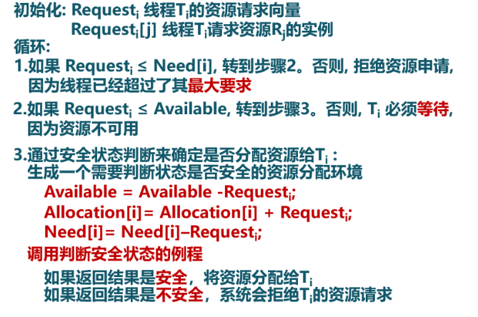

##### 死锁检测

- 允许系统进入死锁状态
- 维护系统的资源分配图
- 定期调用死锁检测算法来搜索图中是否存在死锁
- 出现死锁时，用死锁恢复机制进行恢复

**死锁检测算法**

- 数据结构

  

- 完整算法

  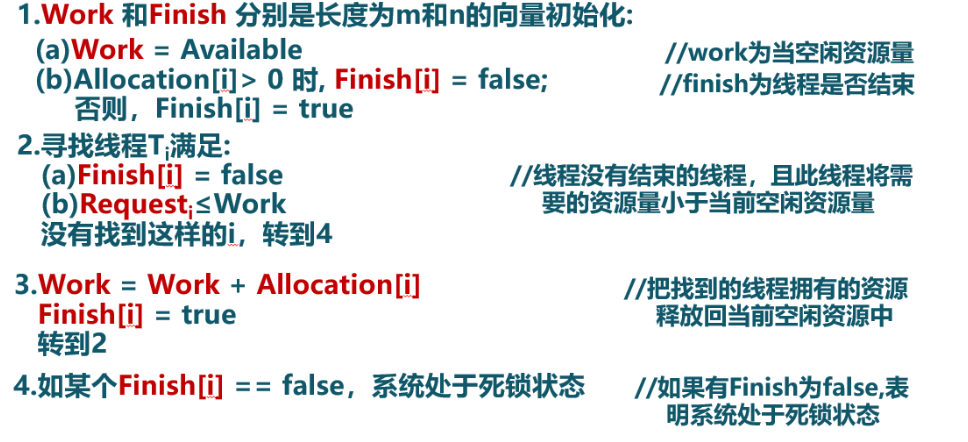

- 使用死锁检测算法

  - 死锁检测的时间和周期选择依据
    - 死锁多久可能会发生
    - 多少进/线程需要被回滚
  - 资源图可能有多个循环
    - 难于分辨 “造成” 死锁的关键进/线程

##### 死锁恢复

1. **进程终止**
   - 终止所有的死锁进程
   - 一次只终止一个进程直到死锁消除
   - 终止进程的顺序的参考因素：
     - 进程的优先级
     - 进程已运行时间以及还需运行时间
     - 进程已占用资源
     - 进程完成需要的资源
     - 终止进程数目
     - 进程是交互还是批处理
2. **资源抢占**
   - 选择被抢占进程
     - 参考因素：最小成本目标
   - 进程回退
     - 返回到一些安全状态，重启进程到安全状态
   - 可能出现**饥饿**
     - 同一进程可能一直被选作被抢占者

#### lab：支持同步互斥的 OS

##### 竞争条件

- **并发、无序**的线程在使用**有限、独占、不可抢占**的资源而产生矛盾称为**竞争（Race）**
- 多个线程无序竞争不能被同时访问的资源而**出现执行出错**的问题，称为**竞争条件（Race Condition）**

##### 互斥锁

**spin mutex** v.s. **block mutex**

- 看起来在等待队列上的插入/取出/等待更耗时间

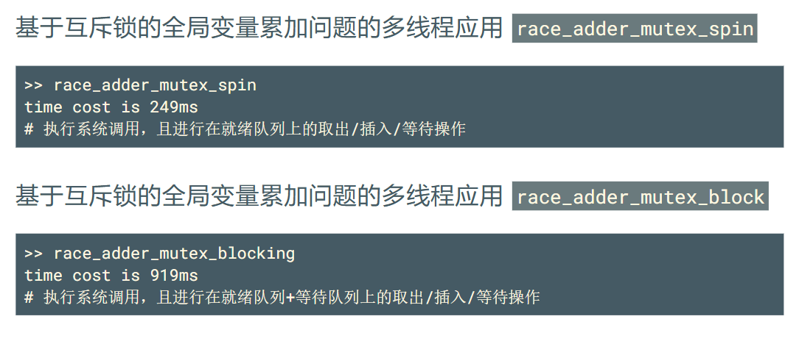

**UpSafeCell** 数据结构

- 允许在单核上安全使用可变全局变量
- 内部可变性和运行时借用检查
- exclusive_access 得到独占访问权

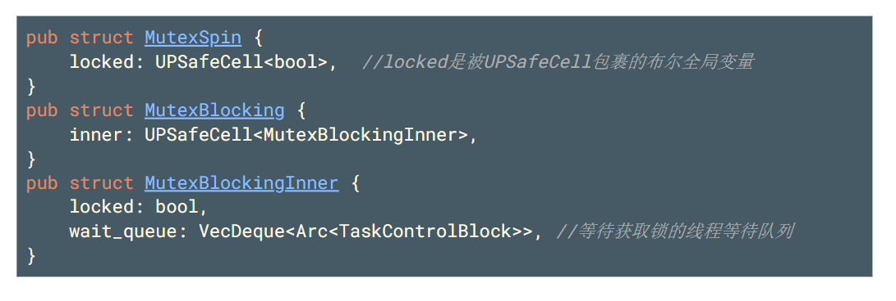

##### 信号量

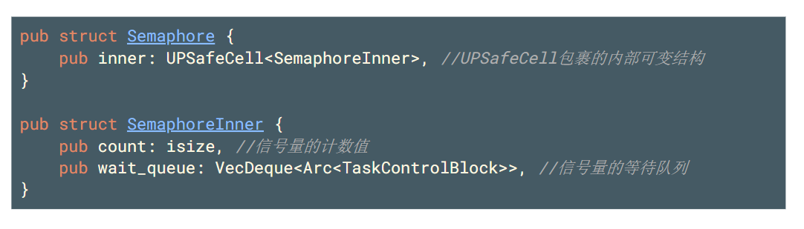

##### 管程与条件变量

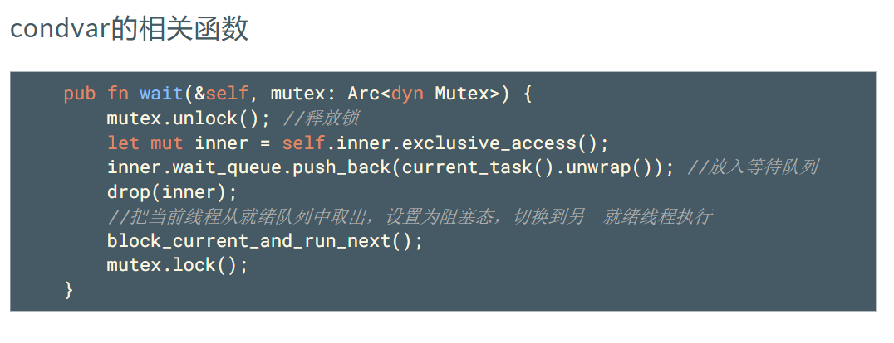

**条件变量实现 sleep**

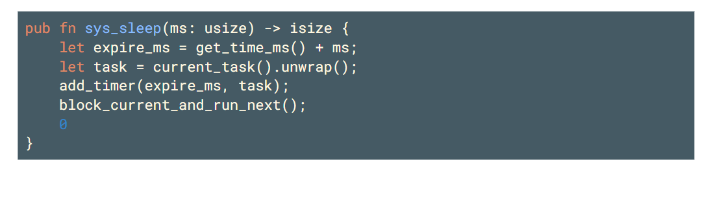


