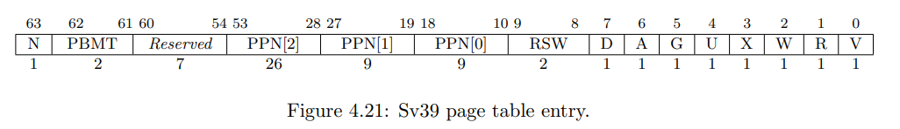

### rCore Lab2 实验报告

张一可 计15 2021010793

#### 功能实现

`sys_get_time` 和 `sys_task_info` 只需要查页表得到待存放结果的数据结构（`TimeVal` 和 `TaskInfo`）每个成员变量的实际地址，写入对应数据即可。可以调用当前执行进程的 `memory_set` 的 `translate` 方法查页表得到物理地址。

`mmap` 和 `munmap` 在当前 `memory_set` 中插入对应的地址映射区间，可通过 `insert_framed_area` 实现，并需要对于起始地址未对齐、mmap 权限位不合法、mmap 区间与已映射区间重叠、munmap 区间存在未映射区域等非法情况进行检查。

#### 问答作业

1. **请列举 SV39 页表页表项的组成，描述其中的标志位有何作用？**

   

   - V 位表示页表项是否有效，仅当其为 1 时页表项有效。

   - 权限位 R，W，X 分别表示该虚拟页面是否可读、可写和可运行。当 R，W 和 X 位都为 0 时，PTE 是指向下一级页表的指针；否则，PTE 为 leaf PTE。W 为 1 而 R 位为 0 的 PTE 不符合规范，会触发 page fault。
   - G 位为 1 表示对应的地址映射存在于所有地址空间中，

   - U 位表示 PTE 对应的虚拟页面是否被允许在 U 特权级访问。

   - A（Accessed）位表示 PTE 对应的虚拟页面是否被访问过；D（Dirty）位表示 PTE 对应的虚拟页面是否被修改过。

2. **缺页**

   **缺页指的是进程访问页面时页面不在页表中或在页表中无效的现象，此时 MMU 将会返回一个中断， 告知 os 进程内存访问出了问题。os 选择填补页表并重新执行异常指令或者杀死进程。**

   - **请问哪些异常可能是缺页导致的？**

     读取页面时的 Load Page Fault，写入页面时的 Store Page Fault，指令执行缺页异常 Instruction Page Fault
     
   - **发生缺页时，描述相关重要寄存器的值，上次实验描述过的可以简略。**

     stval 的值为缺页时试图访问的虚拟地址，scause 的值为 Interrupt 位置 0 + Load/Store Page Fault 对应的 Exception Code，sepc 为触发缺页异常时执行到的 PC 的值，stvec 为异常处理程序地址。

   **缺页有两个常见的原因，其一是 Lazy 策略，也就是直到内存页面被访问才实际进行页表操作。 比如，一个程序被执行时，进程的代码段理论上需要从磁盘加载到内存。但是 os 并不会马上这样做， 而是会保存 .text 段在磁盘的位置信息，在这些代码第一次被执行时才完成从磁盘的加载操作。**

   - **这样做有哪些好处？**

     这样可以防止加载大量不会被实际执行的程序进入内存，减少不必要的磁盘 IO，提高进程执行的效率。

   **其实，我们的 mmap 也可以采取 Lazy 策略，比如：一个用户进程先后申请了 10G 的内存空间， 然后用了其中 1M 就直接退出了。按照现在的做法，我们显然亏大了，进行了很多没有意义的页表操作。**

   - **处理 10G 连续的内存页面，对应的 SV39 页表大致占用多少内存 (估算数量级即可)？**

     10G 页面含有约 $2.61 \times 10^6$ 个物理页，每个 PTE 为 8B，因此大约占用 $10^7$ 数量级的内存。
   - **请简单思考如何才能实现 Lazy 策略，缺页时又如何处理？描述合理即可，不需要考虑实现。**

     mmap 时记录所有需要映射的虚拟地址区间的起始位置，但不进行实际的新建页表项的过程。

     访问页面时，若发生缺页异常，跳转至 stvec 处的异常处理程序，判断访问的虚拟地址是否在当前映射的 mmap 区间中，若在 mmap 区间内，则新建页表项完成虚拟地址所在页面到物理页面的映射。

   **缺页的另一个常见原因是 swap 策略，也就是内存页面可能被换到磁盘上了，导致对应页面失效。**

   - **此时页面失效如何表现在页表项 (PTE) 上？**

     PTE 的 V 位被设为 0，表示页表项失效。

3. **双页表与单页表**

   **为了防范侧信道攻击，我们的 os 使用了双页表。但是传统的设计一直是单页表的，也就是说， 用户线程和对应的内核线程共用同一张页表，只不过内核对应的地址只允许在内核态访问。 (备注：这里的单/双的说法仅为自创的通俗说法，并无这个名词概念，详情见 [KPTI](https://en.wikipedia.org/wiki/Kernel_page-table_isolation) )**

   - **在单页表情况下，如何更换页表？**
   
     通过改变当前 satp 寄存器的值为用户线程对应 satp 的值更换页表。
   - **单页表情况下，如何控制用户态无法访问内核页面？（tips:看看上一题最后一问）**
   
     设置页面的 U 位为 0，表示在 U 态无权限访问物理页面。
   - **单页表有何优势？（回答合理即可）**
   
     无需引入复杂的跳板机制，在 Trap 处理时切换地址空间，降低了实现的复杂度。
   - **双页表实现下，何时需要更换页表？假设你写一个单页表操作系统，你会选择何时更换页表（回答合理即可）？**
   
     双页表实现下，在内核态和用户态之间切换时需要更换页表。
   
     单页表系统中，在多个用户线程之间切换时需要更换页表。

#### 荣誉准则

1. 在完成本次实验的过程（含此前学习的过程）中，我曾分别与 **以下各位** 就（与本次实验相关的）以下方面做过交流，还在代码中对应的位置以注释形式记录了具体的交流对象及内容：无

2. 此外，我也参考了 **以下资料** ，还在代码中对应的位置以注释形式记录了具体的参考来源及内容：无

3. 我独立完成了本次实验除以上方面之外的所有工作，包括代码与文档。 我清楚地知道，从以上方面获得的信息在一定程度上降低了实验难度，可能会影响起评分。

4. 我从未使用过他人的代码，不管是原封不动地复制，还是经过了某些等价转换。 我未曾也不会向他人（含此后各届同学）复制或公开我的实验代码，我有义务妥善保管好它们。 我提交至本实验的评测系统的代码，均无意于破坏或妨碍任何计算机系统的正常运转。 我清楚地知道，以上情况均为本课程纪律所禁止，若违反，对应的实验成绩将按“-100”分计。