#### CH1 操作系统概述

**什么是操作系统**

- 应用和硬件之间的中间层
- 资源管理程序，管理软硬件资源，解决访问冲突
- 控制程序：为程序提供服务，防止错误

**操作系统内核的抽象**

- **CPU 处理器  $\rightarrow$  进程**
- **主存  $\rightarrow$  地址空间**
- **I/O 设备  $\rightarrow$  文件**

**==操作系统内核的特征==**

- **并发**：同时存在多个运行程序
- **共享**：程序间 "同时" 访问互斥共享各种资源
- **虚拟**：每个程序 "独占" 整台计算机
- **异步**：服务完成时间不确定，也可能失败

**操作系统的发展历史**

- 单用户系统 LibOS：OS = 装载器 + 程序库
- 批处理系统 BatchOS：OS = 装载器 + 程序控制器 + 输出处理器
- 多道程序系统 MultiprogOS：OS = 装载器 + 程序调度 + 内存管理 + 输出管理
- 分时系统：OS = 装载器 + 程序调度 + 内存管理 + 中断处理 + 输出管理
- 分布式系统：重点是网络/存储/计算效率
- AloT 系统：分布式多设备
  - OS = 分布式（程序/OS调度 + 内存管理 + 安全/更新）

**操作系统结构**

- 简单结构
- 单体分层结构（**宏内核**）
  - Linux，Android，IOS

- ==**微内核架构**==
  - 内核系统 + 插件，扩展性强
- 外核结构
- 虚拟机结构

**Linux 系统调用**

- **fork()** 父进程返回子进程的 pid，子进程返回 0
- **exec()** 不返回调用函数，覆盖之前的代码和数据段
- 文件抽象成**字节流**，open() 打开文件，read() / write() 读写文件，close() 关闭文件，不同文件用 fd 文件标识符区分
- **pipe()** 管道，pip[0] 读，pip[1] 写，完成父子进程通信

#### 第二讲：实验介绍

**LibOS**：以库的形式提供给应用程序的 OS

**批处理OS**：特权级切换，系统调用，异常处理

**多道程序OS**：内存划分与管理，协作式调度

**分时多任务OS**：中断处理，上下文切换，抢占式调度

**OS 地址空间抽象**

- 程序间内存空间隔离
- 超越物理内存的虚拟存储

**OS 进程抽象**

- 动态创建程序执行
- 多处理器并行

**OS 文件抽象**

- 处理数据的便捷持久存储
- 进程间信息交互：信号，管道
- 可并发：线程，协程，资源共享，同步互斥
- 管理外设

**裸机程序**：移除**标准库**依赖，与**操作系统**无关的 OS 类型的程序

- **标准库**：与操作系统相关
- **核心库**：与操作系统无关

可执行文件格式

- 三元组：**CPU 架构/厂商/操作系统**
- ELF 文件格式：**文件头，Progam Header Table，不同 Section**

硬件启动

**软件启动**：QEMU 模拟器，启动流程为：

- 初始化执行 bootloader（RUSTSBI）
- bootloader 初始化并加载 OS
- OS 内核执行初始化工作

LibOS：建立应用程序的**执行环境**，与硬件隔离

实现步骤：

- 设置编译器参数，编译裸机程序
- 建立裸机程序的**栈和 SBI 服务请求接口**
- 运行 OS 的**起始地址和执行环境初始化**

设置内存布局

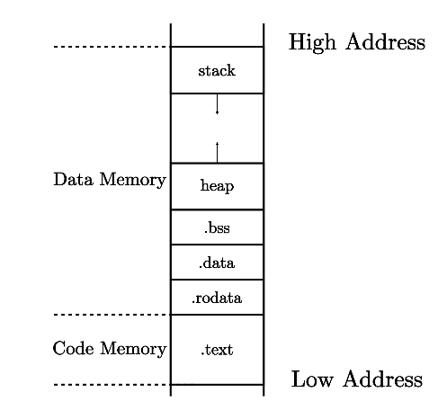

函数调用规定

entry.asm 

- 开辟 **OS 栈帧**，位于 .bss .stack ，将 sp 设置为最高地址
- 将控制权转交给 rust_main 函数

sbi.rs

- **汇编级 SBI 调用**
- ecall 指令，参数依次存于 x10, x11, x12，返回值存于 x11，SBI 编号存于 x17

实现 **println! 宏**：基于 print_char 的 SBI 调用

实现 **panic! 宏**：优雅的处理错误并退出

#### 第三讲：基于特权级的隔离与批处理

硬件  $\rightarrow$   OS  $\rightarrow$   应用

==**OS 和硬件间的接口/边界**==：**指令集 + 寄存器**

OS 是对硬件的虚拟与抽象

==**OS 和应用程序的接口/边界**==：**系统调用 + 进程地址空间**

OS 对应用程序的作用：

- 提供服务：通过**系统调用**
  - 本质：函数调用
  - 进入内核态前保存现场，从内核态返回时恢复现场
  - 利弊：简单，快捷，存在安全问题
- 地址空间隔离与抽象

==**隔离**==

- **目的**：应用程序不会影响或破坏其他应用或操作系统的正常执行或信息泄露
- **本质**：应用程序间需要**交换信息或共享资源**
- **方法**：软件，硬件，网络

- OS 隔离应用程序
  - 对**控制**的隔离：特权级机制
  - 对**数据**的隔离：地址空间
  - 对**时间**的隔离：中断处理
    - 中断：**异步**（外设触发，而不是由 CPU 指令引起）
    - 时钟中断：打断一直占用 CPU 的应用程序，让 OS 内核能周期性地进行资源管理
  - **破坏隔离**时：**异常**处理

三种内核态和用户态切换的原因：异常，中断，系统调用

==**RISC-V 系统模式**==

执行环境 AEE/SEE/HEE

二进制接口 ABI/SBI/HBI

Hypervisor 虚拟机监视器

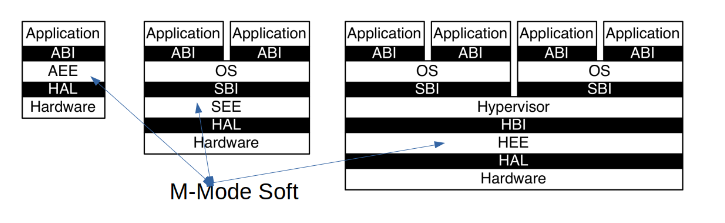

从左到右依次是：

- **单应用场景**：单个应用程序在 ABI 上运行
- **操作系统场景**：每个应用程序通过 ABI 与 OS 通信，OS 通过 SBI 和 SEE 通信
- **虚拟机场景**：多个 OS 运行在虚拟机监视器 Hypervisor 上

应用场景：

- 只有 M Mode：小型设备（蓝牙耳机等）
- U + M Mode：嵌入式设备（电视遥控器，刷卡机等）
- U + S + M Mode：手机
- U + S + H + M Mode：数据中心服务器

硬件线程 Hart（CPU Core）运行在某个特权级上

特权级

- **U（User）用户态**：非特权级模式，应用程序运行
  - 进行基本计算
- **S（Supervisor）内核态**：特权级模式，OS 运行
  - 执行特权级指令，影响应用程序执行
- **H（Hypervisor）虚拟机监视器**：特权级模式，虚拟机运行
  - 限制 OS 访问内存空间
- **M（Machine）机器态**：特权级模式，Bootloader/BIOS 运行
  - 控制物理内存，直接关机

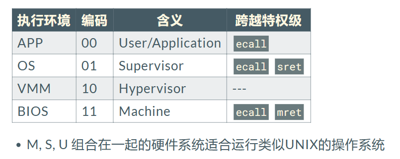

随应用的需求变化，各个特权级可以灵活组合

**CSR 寄存器**

==**硬件隔离手段（三防）**==保障计算机安全可靠

- 权力：防止应用访问系统管控相关寄存器，mstatus / sstatus
- 时间：防止应用长期使用 100% 的计算机，sstatus / stvec
- 数据：防止应用破坏窃取数据，sstatus / stvec / satp

**系统编程**

==**U Mode 编程**==：通过系统调用从操作系统获得服务，访问硬件资源

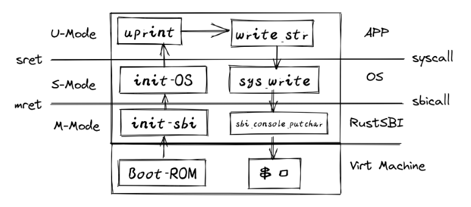

用户态越界访问特权级指令

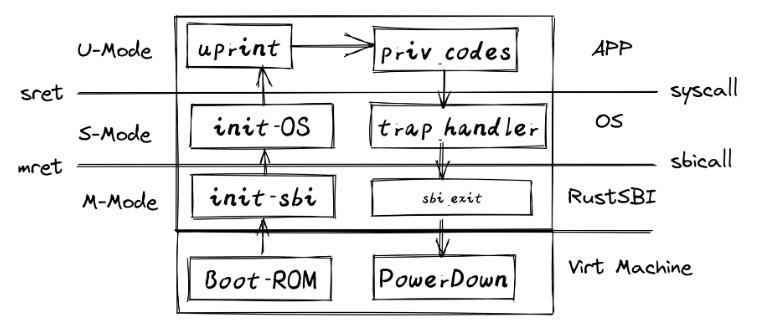

特权操作

- mret / sret 从机器态/内核态返回
- wfi 等待中断
- sfence.vma 虚拟地址无效和同步
- **fence.i** 冲刷 i-cache，**不是**特权级指令

==**M Mode 编程**==：Hart 对硬件有完全控制，可以拦截和处理中断/异常

**中断/异常响应**

- **硬件响应**：设置中断标记，根据中断向量调用相应服务
  - mepc 设置为异常/中断指令的 PC
    - 异常：mepc 为导致异常的指令
    - 中断：mepc 为恢复执行的位置
  - PC 转移到 mtvec
  - 设置 mcause，mtval
    - mie & mip 得到中断类型
      - 软件中断：核间中断，一个 hart 中断另一个 hart
      - 时钟中断：mtime > mtimecmp
      - 外部中断：外设触发
  - mstatus MIE 位设为 0 禁用中断，MPIE <= MIE
  - MPP <= 之前的权限模式，更改权限模式为 M
- **软件响应**：保存当前处理状态，执行中断程序，清除中断标记，恢复之前的保存状态

**中断/异常开销**

- 建立中断/异常/系统调用号与对应服务
- 内核堆栈建立
- 验证系统调用参数
- 内核态到用户态的数据拷贝
- 内存状态改变

**M Mode 的中断/异常委托机制**

- mideleg / medeleg 将中断异常委托给 S Mode 处理

==**M Mode 内核态编程**==

**中断/异常处理**

- **初始化**：编写 trap_handler，并将其地址设给 stvec
- **软件执行**：处理器跳转到 trap_handler，处理异常，返回之前的指令和特权级继续执行

**虚存机制**

satp 寄存器在 S 模式下控制分页，字段包括

- **MODE**：是否开启分页，页表级数
- **ASID**：可选，避免切换进程时刷新 TLB
- **PPN**：根页表的物理页号

==**实验：批处理操作系统**==

**AppManager** 实现加载不同的应用程序执行，完成 APP 与 OS 的隔离

从 ELF 文件读取 APP 总数和内容，每个 APP 都被加载到 0x80400000 地址执行

特权级切换：切换**用户栈和内核栈**，保证**安全**

**Trap 上下文**：OS 保存在内核栈中

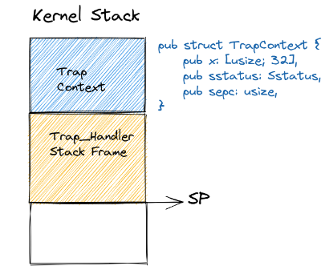

**Trap 处理**：保存 Trap 上下文，跳转到 Trap handler 执行

- csrrw sp, sscratch, sp 完成 sp <= 内核栈栈顶，sscratch <= 用户栈栈顶的切换
- 保存通用寄存器，sstatus 和 sepc 到内核栈
- 保存 sscratch 中的 user sp

**Trap 处理完成**：\_\_restore 恢复 Trap 上下文，sp 恢复为用户栈栈顶，sret

- sret 的硬件逻辑：pc <= sepc，恢复响应异常/中断，回到 sstatus.spp U Mode

**run_next_app 实现**：构造 Trap 上下文（sepc 设为 0x80400000，sp 指向用户栈），压入 Kernel Stack，通过 _\_restore 恢复，sret

#### 第四讲：多道程序与分时多任务

**多道程序**：内存中存在多个可执行程序，按**时间片**分时共享 CPU

**协作式调度**：可执行程序主动放弃 CPU 使用，操作系统选择下一个执行程序使用 CPU

**进程**：

- 应用的一次执行过程
- 程序的一次动态执行过程，也称**任务 ** Task
- 动态性（可以暂停和继续），并发性，有限度的独立性
- 是执行中的文件，**进程 = 程序 + 状态**

**作业 ** Job：一组相互关联程序执行过程形成的一个整体

**抢占式调度**：基于时钟中断机制，进程被动放弃 CPU 使用

**进程状态**：控制流 PC，数据，寄存器，栈帧位置 SP 等   =>  **任务上下文**

保存在 **进程控制块 PCB** 中

进程状态变迁：

抢占，等待 sleep（yield 系统调用），唤醒，退出 exit 系统调用

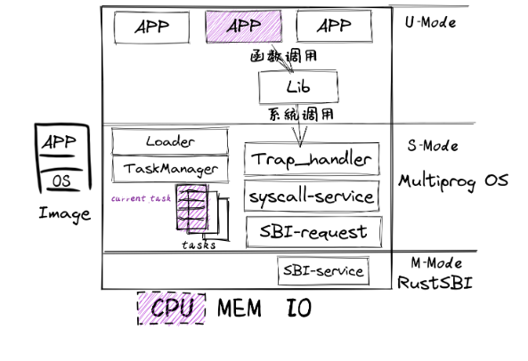

- **编译**：
  - 应用程序和内核**独立编译，合并为一个镜像**
  - APP 各自有不同的起始地址 Loader
- **构造**：
  - 进程控制块 TCB
  - 系统调用 SBI 服务请求接口
  - 进程管理和初始化 TaskManager
- **运行**：
  - 进程 yield / exit 系统调用实现主动切换（协作式调度）
  - 时钟中断实现被动切换（抢占式调度）

概念：进程/任务，时间片，任务片

任务上下文：ra，sp，callee saved 寄存器

**不同类型上下文**：

- 任务上下文 Task Context 保存在内存中
  - 用于任务切换：内核中不同应用的 Trap 控制流之间切换
- Trap Context 保存在内核栈上
- 函数调用上下文保存在用户栈上

**控制流**

- 普通控制流 CCF：程序正常执行，可预测
- 异常控制流 ECF：执行环境切换，即 Trap 控制流

**控制流上下文**（执行环境状态）：通用寄存器，CSR 寄存器

以上三种上下文都属于**控制流上下文**

任务切换：**\_\_switch** 函数实现保存和恢复任务上下文，并完成换栈

**任务控制块 TCB**：Task Context + Task Status

**协作式调度**：yield 和 exit 系统调用

run_next_task 调用 \_\_switch 实现任务上下文切换

**抢占式调度**：设置时钟中断，收到时钟中断后统计任务的使用时间片，时间片用完后切换任务

#### 第五讲：物理内存管理

==**地址空间**==

逻辑地址 LA + 段式管理 => 虚拟地址（线性地址） VA

虚拟地址 VA + 页式管理 => 物理地址 PA

**计算机存储层次**

CPU  =>  缓存  =>  内存  =>  外存

**虚存的作用**

- 简化应用编译和加载运行
  - 简化执行程序连接和加载，**共享**动态链接库，连续虚拟地址空间中的**内存分配**等
- 保护数据
  - 进行读/写/执行权限检查，特权级检查

==**内存分配**==

- **静态内存分配**：编译时的内存分配，按段管理，**全局/静态数据段、常量数据段、代码段**
- **动态内存分配**：运行时内存分配，**栈和堆**
  - 分类：
    - **显式分配**（malloc，free）：需要手动释放分配块
    - **隐式分配**：编译器/运行时库自动释放分配块（垃圾回收）
    - **栈**由编译器进行隐式分配，**堆**由程序员进行显式分配
  - **连续内存分配**
    - **内存碎片**问题：内碎片，外碎片
    - **动态分区分配**
      - 空闲块组织方式，分配时分割空闲块的剩空间，释放时合并被释放的块
      - 分配策略：
        - First Fit 最先匹配：简单，但**外碎片严重，分配大块时较慢**
        - Best Fit 最佳匹配：适合于小尺寸分配；存在**外碎片**问题；释放分区时进行合并，速度慢；**容易产生无用小碎片**
        - Worst Fit 最差匹配：中等大小的分配效果好；**外碎片**；释放分区慢；容易**破坏大的空闲分区**
    - **伙伴系统**
      - 目标：减少**外碎片**，提高分配释放效率
      - 观察：系统申请连续空间大小经常为 2 的幂次
      - 实现
        - 数据结构：空闲块按**大小**和**起始地址**组织成**二维数组**
        - 分配：从小到大在空闲块中找最小可用块
          - 如空闲块过大，对其**二等分**
        - 释放：把块放入空闲块数组，并进行**合并**
          - 合并条件：大小相等且地址相邻，低地址为 $2^{i+1}$ 倍数
      - 优化：空闲块大于申请块 3/4，则对可用空闲块四等分
      - 分析**存储利用率和分配释放开销**
  - **非连续内存分配**
    - 基于页表，内核可以把**地址不连续的物理页转换为地址连续的虚拟页**，解决内存分配的碎片问题
    - **段式管理**：段表位于内存中，由内核管理，与进程/任务对应
      - 优势：**内存保护**，划定各个段的访问权限
    - **页式管理**：页表位于内存中，由内核管理，与进程/任务对应
      - 优势：**内存利用**和**优化转移到后备存储**
      - 内存访问性能：访问一个内存单元至少需要 2 次内存访问
        - SV39 三级页表：3 次内存访问
        - 解决：**TLB 快表**
      - 页表存储空间大
        - 解决：**多级页表**
    - **段页式管理**
    - **反置页表**
      - 所有进程共享一个反置页表，基于**进程 id + 页号的 Hash 映射值**查找对应页表中的物理页号
      - 页表项：**PID，页号，控制位，链接指针（进程共享内存），next（处理 Hash 冲突）**
        - 所谓**反置**：**页表项 index = 物理页号**
      - 优势：
        - **节省空间，所有进程共享一个反置页表**
        - **不需要多级页表转换，简化管理**
      - 劣势：**需要额外的数据结构，实现复杂**

==**RISC-V SV39 页机制**==

VA：VPO 12 位（页面大小 4096），VPN[2]、VPN[1]、VPN[0] 各 9 位

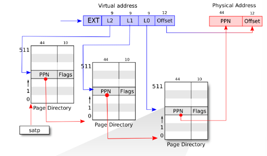

==**应用地址空间 & 内核地址空间**==

Memory Set  =>  **Map Area（逻辑段）** =>  Page Table（页表）

**_\_restore** 在初始化应用程序时

- 设置 sscratch 为用户地址空间中的 \*TrapContext
- 设置 stap

**\_\_all_traps**

- 保存通用寄存器，sstatus，sepc 到 TrapContext
- 读出 kernel_satp，kernel_sp，trap_handler
- 跳转到 trap_handler 地址执行（jr t1，不能用编译器相对位置寻址的 call trap_handler）

#### 第六讲：虚拟内存管理

==虚拟存储==

- 挑战：解决计算机系统**内存不够用**的问题
- 解决方法
  - **函数覆盖**：应用程序以**函数/模块**为单位手动换入换出内存
  - **程序交换**：操作系统以**程序**为单位自动换入换出内存
  - **虚拟存储**：操作系统以**页**为单位自动换入换出程序
    - **虚拟存储 = 内存 + 外存**

- **覆盖技术**
  - 不同时间段执行的**函数或模块**（不存在调用关系的**覆盖段**）可以共享一块有限的空间
  - 程序  =>  **常驻区** + **可选区**（相互覆盖）
  - 缺点：
    - **增加编程困难**，程序员需要划分功能模块，并确定模块间的覆盖关系
    - **增加执行时间**，需要从外存装入覆盖模块
- **交换技术**
  - 操作系统以**程序**为单位自动换入换出内存
  - **换入**：外存 => 内存，**换出**：内存 => 外存
  - 交换时机：**内存空间不够**
  - 程序换入时需要进行重定位（不一定位于原处，需要某种寻址机制）
- **虚拟存储**
  - 操作系统以**页**为单位自动换入换出程序
  - 原理：**程序的局部性（时间局部性，空间局部性，分支局部性）**
    - 一段时间内访问的地址空间位于邻近的一页或几页内
    - 与 TLB，Cache 的特性相符
  - 思路：操作系统将不常用的内存块暂存到外存
  - 特征：
    - 不连续性：物理内存分配非连续，虚拟地址空间使用非连续
    - 虚拟内存空间可以大于实际的物理内存
    - 可以只对部分虚拟地址空间进行调入和调出
  - 实现：
    - 硬件：MMU / TLB / Page  Table 实现地址转换、缺页时的硬件异常
    - 软件：内存中建立页表或段表，管理页面的换入换出
      - **请求调页**：需要访问某处数据时，把数据从外存调入内存
      - **页面调换**：不常用页换出，常用页换入
      - **缺页异常处理**：
        - TLB 未命中，读页表
        - 页表中 Valid 位为 0，触发缺页异常
        - OS 查找外存中对应页面内容
          - 未被映射的页位于磁盘中的交换空间
          - **外存中页地址存储于 Valid = 0 的 PTE 中**
          - ==**如 MapArea 的 MapType = Direct 时为外存地址**==
        - 寻找空闲物理页帧，把外存中的页面内容换入其中
        - 如无空闲物理页帧，通过置换算法换出某物理页帧到外存
        - 修改页表项，建立虚拟页到物理页的映射
        - OS 返回应用程序，重新执行内存读取指令
  - 性能：**有效存储访问时间 EAT** = 内存访问时间 $\times (1-p)$ + 缺页异常处理时间
    - 缺页异常处理时间 = 磁盘访问时间 $\times p\times (1+q)$
    - 缺页率  $p$，**写回概率  $q$**

==页面置换算法==

- 时机：空闲内存数量到达**下限**时开始回收内存，到达**上限**时暂停回收
- **常驻内存**的页面：**PTE 中的页面锁定标志位置位**

**局部页面置换算法**：页面换入换出的范围是当前进程的物理页面

- **OPT 最优页面置换算法**
  - 置换在**未来最长时间**不访问的页面
  - 优：理想情况下缺页最少
  - 劣：实际系统中**无法实现**，无法预知每个页面在下次访问前的等待时间，除非先模拟运行一遍

- **FIFO 先进先出页面置换算法**
  - 选择在内存中**驻留时间最长**的页面进行置换
  - 实现：维护逻辑页面链表，按照驻留内存时间排序
  - 优：实现简单
  - 劣：性能较差，存在 Belady 现象

- **LRU 最近最久未使用算法**
  - 选择**最长时间没有被引用**的页面进行置换
  - 实现：
    - **链表**：维护按照最近一次访问时间排序的页面链表
    - **活动页面栈**
  - 优：没有 Belady 现象，OPT 算法的近似
  - 劣：开销大

- **Clock 时钟页面置换算法**
  - 页表项中增加**访问位**，对页面的访问情况进行大致统计
    - 驻留位 + 访问位 + 页帧号
  - 各页面组成**环形链表**，指针指向最先调入的页面
  - 实现：**结合例子**
    - 页面装入内存，访问位初始化为 0
    - 访问页面，访问位置 1
    - 缺页时，沿着环形链表检查
      - 访问位为 0，置换该页
      - 访问位为 1，访问位置 0，指针移动到下一个页面，直到找到可以置换的页面
  - LRU 和 FIFO 的折中
  - ==**存在** Belady 现象==

  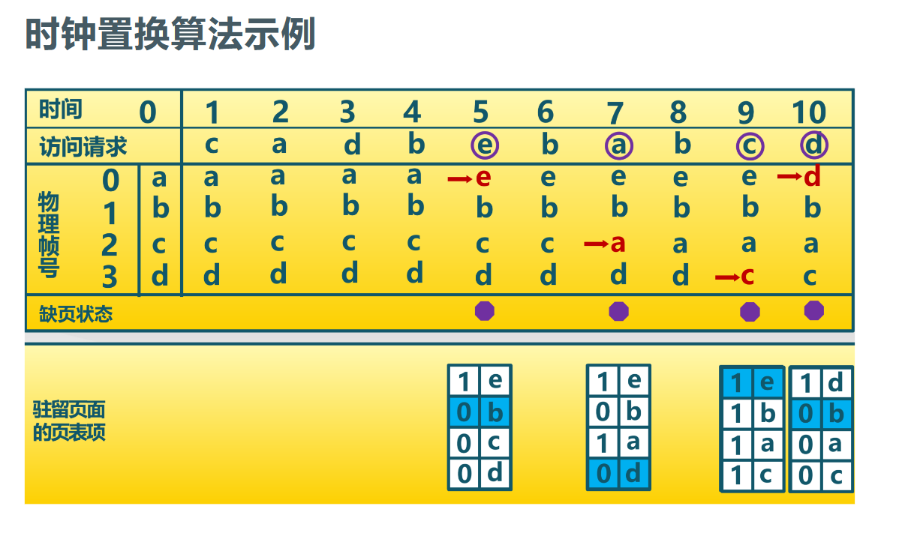

  > 访问在内存中页面时，指针位置不变
  >
  > 访问不在内存中页面时，指针移动到置换出去的页面位置的下一个

- **改进的时钟页面置换算法**

  - 页表项中增加**修改位**，修改页面遍历两次后才被替换，减少修改页的缺页处理开销

- **LFU 最不常用页面置换算法**

  - 置换**访问次数最少**的页面
  - 劣：开销大，开始时频繁使用、但之后不使用的页面很难置换
    - 解决：计数定期右移

- **Belady 现象**

  - FIFO 算法会出现分配的物理页面数增加，缺页次数反而升高的异常现象
    - FIFO 算法的置换特征和进程访问内存的动态特征矛盾
  - OPT、LRU、LFU 算法不存在 Belady 现象
  - FIFO 和 Clock 存在
    - Clock 算法不能准确记录页面的访问位置
    - **非堆栈类算法**存在 Belady 现象

**全局页面置换算法**：动态适应进程的内存需求，为进程分配**数目可变**的物理页面

- **工作集页面置换算法**
  - **工作集**：$W(t,\Delta)$，$t$ 为当前执行时刻，$\Delta$ 为一个定长的页面访问时间窗口，窗口大小为 $\tau$ 
    - **工作集大小**随着内存访问**局部性区域位置**的改变而改变
  - **常驻集**：当前时刻，**实际驻留内存**中的页面集合
  - 二者关系
    - 工作集是进程运行过程中的固有性质，常驻集取决于系统分配的物理页面数目和页面置换算法
    - 工作集包含于常驻集时，缺页较少
    - 工作集发生剧烈变动时，缺页较多
    - 常驻集大小达到一定数目后，缺页率不会明显下降
  - 算法思路
    - 维护**工作集窗口内**的访存页面链表，换出**不在工作集中**的页面
    - 常驻集大小（为进程分配的物理页面大小）动态变化
- **缺页率页面置换算法**
  - **缺页率**：
    - 缺页次数 / 内存访问次数
    - 缺页平均时间间隔的倒数
  - 算法思路
    - 通过调节**常驻集大小**，使每个进程的**缺页率**保持在合理范围内
    - 访存时设置**引用位**标志
    - 缺页时，计算上次缺页时间 $t_{last}$ 到现在时间 $t_{current}$ 的间隔
      - $t_{current} - t_{last} > T$，置换所有在 $[t_{current},t_{last}]$ 内没有被引用的页
      - $t_{current} - t_{last} \le T$，增加缺失页到常驻集中
      - $T$ 为容忍的缺页窗口大小
- **抖动问题**
  - 分配给进程的**物理页面太少，不能包含工作集**，导致大量缺页，频繁置换
  - 原因：进程数目增加，分配给每个进程的物理页面数减小，缺页率上升
  - 解决：在**并发水平**和**缺页率**之间达到平衡
    - 选择合适的**进程数量**和**进程所需物理页面数**

#### 第七讲：进程管理与单处理器调度

==**进程管理**==

- 目标：提高**开发效率**和**执行效率**
- **进程**：一个具有一定**独立功能**的程序在某**数据集合**上的一次**执行和资源使用**的动态过程
  - 可以创建子进程，用新的程序内容覆盖已有的程序内容
  - 程序动态申请/使用/释放各种资源的载体

- **进程管理类系统调用**

  - fork：父进程返回子进程的 pid，子进程返回 0

  - exec：执行新程序替代原有程序

- **进程控制块 PCB**

  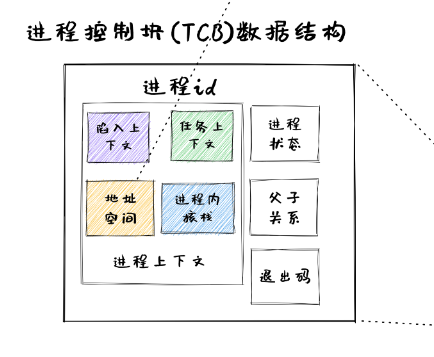

**进程创建和程序加载**

- Windows 下：CreateProcess
- Linux 下：fork 和 exec
  - **fork()** 复制父进程内存，变量，除 a0 返回值外的所有寄存器
  - **exec()** 加载新程序取代当前运行进程

**进程等待和退出**

- **wait()** 系统调用等待子进程结束，得到子进程 exit status 作为返回值
- **僵尸进程**：已经执行 sys_exit 退出，但还没有被父进程通过 sys_wait 回收
- **孤儿进程**：父进程先退出的子进程，由 root 进程负责等待并回收
- 进程退出： **exit()** 系统调用，参数为 exit status
  - 关闭打开的文件等占用资源，释放内存
  - 检查父进程是否存活，若没有存活，设父进程为 root 进程
  - 进入僵尸 zombie 状态，等待父进程回收
- 优先级控制：**nice() 指定进程初始优先级，进程优先级随着执行时间而衰减**
- 进程调试：**ptrace() 允许一个进程控制另一个进程的执行，设置断点和查看寄存器等**
- 定时：**sleep()** 让进程在定时器等待队列中等待指定时间

**系统调影响进程状态**

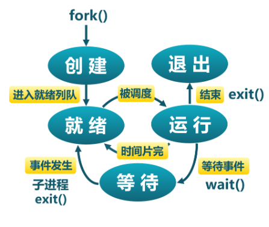

**解决 fork() 开销昂贵的问题**

- **vfork()** 创建进程时，不再创建完全一样的内存镜像，**Copy On Write** 
- **spawn()** 高效进程创建

**==单处理器调度==**

**衡量调度算法的准则**

- CPU 使用率，吞吐量，周转时间，就绪等待时间，响应时间，公平性
  - **周转时间**：从初始化到结束的总时间
  - **就绪等待时间**：在就绪队列中的总时间（不包括运行时间）
  - **响应时间**：从提交请求到产生响应的总时间
- **低延迟**：减少**响应时间**，减少平均响应时间的波动
- **高带宽**：增加**吞吐量**，减少上下文切换开销，减少就绪等待时间，保证吞吐量不受用户交互影响

**调度算法**

- **FCFS 先来先服务调度算法**
  - 优点：简单，公平
  - 缺点：
    - 平均等待时间较差，波动大
    - I/O 资源和 CPU **资源利用率较低**
      - CPU 密集型程序先到达，I/O 密集型程序等待，I/O 资源利用率低
- **SJF 短作业优先调度算法**
  - 优点：具有**最优平均周转时间**
  - 缺点：
    - 不允许抢占
    - 连续短作业会使长作业无法获得 CPU 资源，可能导致**饥饿**
    - **无法准确预知**程序所需的 CPU 计算时间，需要用历史执行时间预估
- **SRT 最短剩余时间算法**
  - 支持**抢占式调度**
    - 有新进程就绪，且新进程服务时间小于当前进程**剩余时间**时，转到新的进程执行
  - 可能导致**饥饿**
- **HRRN 最高响应比优先算法**
  - **响应比** $R = (w + s)/s$
  - $w$ 为就绪等待时间，$s$ 为执行时间
  - FCFS 和 SJF 的综合，在 SJF 的基础上关注进程等待时间，**防止无限期延迟**
    - 同时考虑作业的等待时间和估计的运行时间
  - 不允许抢占

**时间片轮转算法 RR**

- **时间片**：分配处理机资源的基本单元
- 选择合适的时间片长度
  - **太短：上下文切换开销大，影响系统吞吐量**
  - **太长：进程等待时间长，退化成 FCFS**
- 公平，但平均等待时间较差

**MQ 多级队列调度算法**

- 就绪队列被划分为多个独立**子队列**，如**前台进程**、**后台进程**子队列
- 每个队列有自己的调度策略
  - 前台进程：RR，后台进程：时间片大的 RR/FCFS
- **队列间调度**
  - **固定优先级**：先前台，后后台（可能导致饥饿）
    - A 优先级高于 B，运行 A
    - A 和 B 优先级相同，轮转运行 A 和 B
  - **时间片轮转**：80% 前台，20% 后台
    - 每个队列都能得到一个确定能能够调度其进程的 CPU 总时间

**MLFQ 多级反馈队列调度算法**

- 核心问题：进程工作长度未知，希望同时减少**响应时间和周转时间**
- 调度规则：
  - A 优先级 > B 优先级，运行 A
  - A 优先级 = B 优先级，轮转/FIFO 运行 A 和 B
- 工作进入系统时，放在最高优先级（最上层队列）
  - 在当前时间片进程未完成，降到下一个优先级
  - 当前时间片进程主动释放 CPU，优先级不变
- **时间片大小随着优先级增加而增加**（优先级越低，时间片越长）
- 效果：CPU 密集型进程优先级下降很快，I/O 密集型进程停留在高优先级
- 潜在问题：CPU 密集型进程会饥饿，恶意进程会想办法留在高优先级
  - 改进：**一旦进程用完了其在某一层中的时间配额，就降低其优先级**
    - 经过一段时间，就将系统中所有工作重新加入最高优先级队列

**公平共享调度算法  FSS**

- 控制用户对系统资源的访问
  - 用户拥有多个进程，按**用户**优先级分配资源，保证不重要的用户无法垄断资源，未使用的资源按比例分配

==**实时调度**==

**实时操作系统**

- **性能指标**：时间约束的**及时性**
- **特性**：时间约束的**可预测性**
- **分类**：
  - 强实时操作系统：具有**硬时限**，deadline 前必须完成
  - 弱实时操作系统：具有**软时限**，deadline 前尽量但非必须完成
- 任务 & **周期实时任务**
  - 参数：周期 p，执行时间 e
- 可调度性
- 分类：静态优先级调度，动态优先级调度

**实时调度**

- **速率单调调度算法 RM**
  - 适用于静态优先级调度
  - 周期越短优先级越高，执行**周期最短**的任务
  - 抢占式调度
  - 问题：优先级固定，有的任务可能错过 ddl
- **最早截止时间优先算法 EDF**
  - 适用于动态优先级调度
  - 执行**离截止时间最近**的任务
- **最低松弛度优先算法 LLF**
  - 根据**任务紧急或松弛程度**确定任务优先级
  - 松弛度 = 必须完成时间 - 本身还需要运行时间 - 当前时间
  - 松弛度越低，优先级越高

**优先级反置**

- 高优先级进程长时间等待低优先级进程所占用资源的现象
- **优先级继承**
  - **占用资源的低优先级进程**继承**申请资源的高优先级进程**的优先级
  - 只在**想占有资源的高优先级进程被阻塞**时，才提高占有资源的低优先级进程的优先级
  - **临界区**：互斥访问共享资源的代码片段
- **优先级天花板协议**
  - 不管是否发生等待，都提升占用资源进程的优先级
  - 占用资源进程的优先级与所有可能申请该资源进程的最高优先级相同
  - 优先级高于系统中**所有被锁定资源的优先级上限**，任务执行**临界区**时不会被阻塞

==**实验**==

应用 shell 的执行过程

- sys_read 系统调用获取字符串，得到执行文件名
- sys_fork 创建子进程
- 子进程中 sys_exec 执行应用
- 父进程中 sys_waitpid 等待子进程结束

**loader.rs**：基于应用名进行应用加载

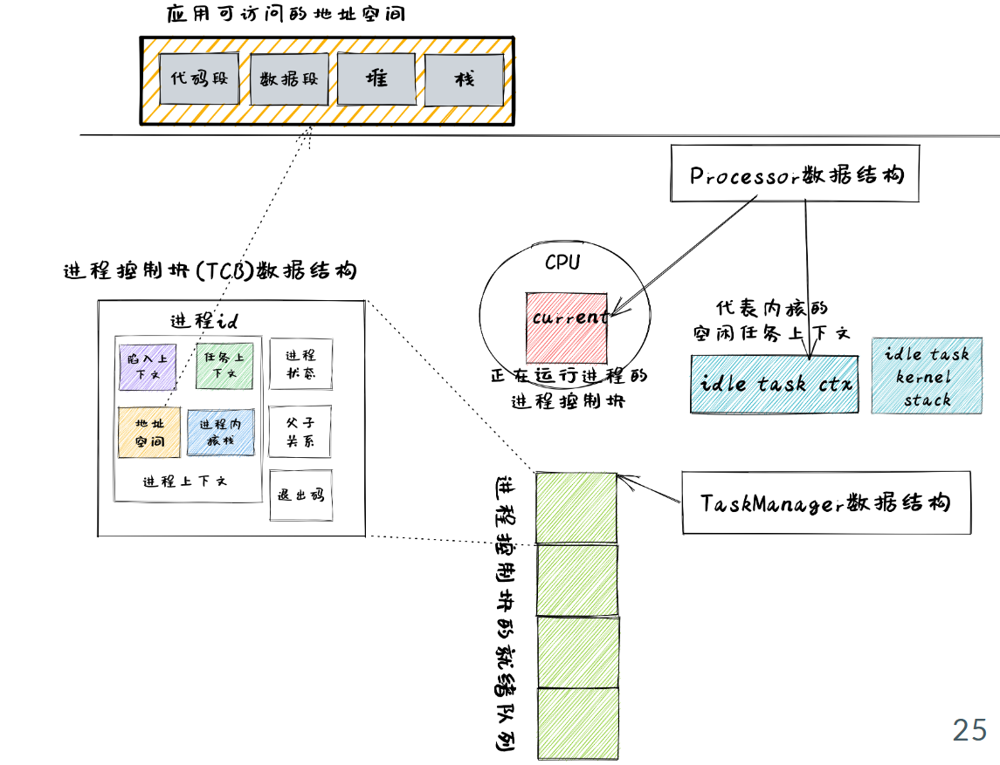

**TaskControlBlock  TCB 的组成**

**TaskManager 管理调度就绪进程**

**Processor 管理当前进程执行状态**

- **idle_task** 初始化运行在 CPU 上
  - 不等同于 root 进程 initproc
- switch 完成 idle_task 和进程的任务切换

**进程管理机制实现**

- 创建初始进程 initproc
  - root 进程，放入 TaskManager 的进程队列中
- fork 实现
- exec 实现
  - **回收已有应用的地址空间**，用 ELF **初始化新的地址空间并替换**
- yield 实现
  - 取出进程，状态变为 Ready，放入就绪队列队尾
  - **调用 schedule 触发调度并切换任务**
- exit 实现
  - 取出进程，状态变为 Zombie
  - 退出码 exit_code 写入进程控制块中
  - **其子进程（孤儿）挂在 initproc 下**
  - 释放应用地址空间
  - 调用 schedule 触发调度并切换任务
    - schedule 调用 \_\_switch 切换回 idle_task
    - run_tasks 调用 \_\_switch 从 idle_task 切换到 TaskManager 提供的 task
- waitpid 实现
  - 不存在进程 ID 为 pid 的子进程时，返回 -1
  - 存在进程 ID 为 pid 的 Zombie 状态子进程时，回收子进程，返回子进程 pid，更新退出码参数为 exit_code
  - 子进程存在但还没退出时，返回 -2
    - 应用程序继续 yield 等待直到 waitpid 成功
  - 返回前，释放子进程的 TCB

- sys_read 函数调用
  - 调用 SBI 子模块的 console_getchar 接口