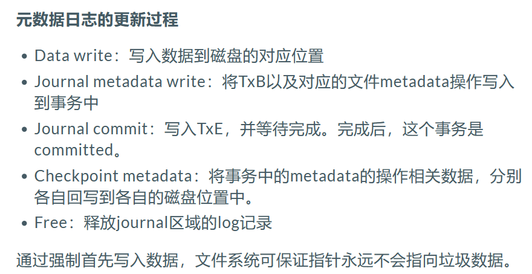

#### 文件系统

1. **VFS 设计**

   

2. **崩溃一致性**

   inode，data bitmap 和 data block 之间的不一致

   崩溃场景：

   - 只将数据写入磁盘，没有 inode 指向它
   - 只有更新的 inode 写入磁盘，数据尚未写入，会读取垃圾数据
   - 只有更新后的 data bitmap 写入磁盘，但没有指向它的 inode，造成空间泄露，对应数据块之后永远不会再被使用
   - inode 和 bitmap 写入磁盘，但没有写入数据
   - inode 和 data 写入，但没有更新 bitmap
   - bitmap 和 data 写入，没有指向它的 inode

   崩溃解决方案1：**文件系统检查程序 fsck**

   - **超级块检查**
   - **inode bitmap 与 inode 一致性检查**：选择信任 inode，确保所有看起来在使用的 inode 都有标记
   - **inode 状态检查**：若 inode 字段存在问题，认为 inode 是可疑的，被清除
   - **inode 链接计数检查**：若不一致，则修复 inode 中的计数
   - **重复指针检查**：两个不同 inode 引用同一个块时，如果一个 inode 明显错误，可能会被清除或复制指向的块，从而为每个 inode 提供其自己的文件数据
   - **坏块检查**：如果指针超出有效指向范围，则从 inode 中清除该指针
   - **目录检查**

   崩溃解决方案2：基于 **write ahead log 预写日志**的文件系统

   

   

#### 进程间通信

1. **概念**
2. **Pipe 管道**
3. **FIFO 命名管道**
4. **消息队列**

