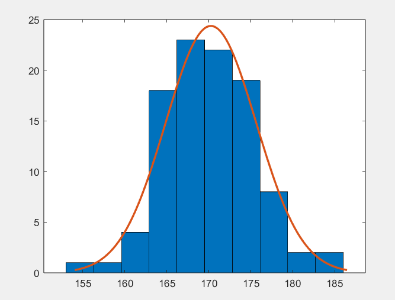
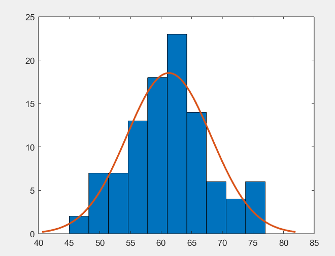

## 实验12 统计推断

计15 张一可 2021010793

### 实验目的

1. 掌握数据的参数估计、假设检验的基本原理、算法，以及用 MATLAB 实现的方法
2. 练习用这些方法解决实际问题

### 12-2 

#### 问题分析与模型建立

（1）根据经验可得加油站汽油价格应符合正态分布，设为 $N(\mu, \sigma^2)$，设 $\mu_0=115$，则假设检验为
$$
H_0: \mu=\mu_0;\ H_1: \mu \ne \mu_0
$$
方差未知，检验统计量为
$$
t=\frac{\overline{x}-\mu_0}{\frac{s}{\sqrt{n}}} \sim t(n-1)
$$
当 $|t|\le t_{1-\alpha/2}$ 时接受 $H_0$，否则拒绝 $H_0$，可用 MATLAB 软件的 t 检验 ttest 求解

（2）为单样本区间估计问题，可利用 MATLAB 软件的 normfit 求解

（3）为双样本均值区间估计问题，则满足
$$
t=\frac{(\overline{x} - \mu_1)-(\overline{y}-\mu_2)}{\sqrt{s^2(\frac{1}{n_1}+\frac{1}{n_2})}} \sim t(n_1+n_2-2),\ s^2=\frac{(n_1-1)s_1^2+(n_2-1)s_2^2}{n_1+n_2-2}
$$
利用 t 分布的分位数 $t_{1-\alpha/2}(n_1+n_2-2)$，可得 $\mu_1 -\mu_2$ 的区间估计为
$$
(\overline{x}-\overline{y}) \pm t_{1-\alpha/2}(n_1+n_2-2)S\sqrt{\frac{1}{n_1}+\frac{1}{n_2}}
$$

#### 算法实现

MATLAB 求解程序如下：

```
jan=[119 117 115 116 112 121 115 122 116 118 109 112 119 112 117 113 114 109 109 118];
feb=[118 119 115 122 118 121 120 122 128 116 120 123 121 119 117 119 128 126 118 125];

[h1,sig1,ci1]=ttest(jan,118);
[h2,sig2,ci2]=ttest(feb,118);

[mu1,sigma1,muci1,sigmaci1]=normfit(jan);
[mu2,sigma2,muci2,sigmaci2]=normfit(feb);

[le,ri]=solve(mu1,mu2,sigma1,sigma2,length(jan),length(feb),0.05);

function [f1,f2]=solve(xbar,ybar,s1,s2,m,n,alpha)
spower=((m-1)*s1^2+(n-1)*s2^2)/(m+n-2);
a=tinv(1-alpha/2,m+n-2);
f1=xbar-ybar-a*sqrt(spower/m+spower/n);
f2=xbar-ybar+a*sqrt(spower/m+spower/n);
end
```

#### 实验结果与讨论

（1）利用 1 月数据，置信度为 $\alpha=0.05$ 时，$h=1$，$p=0.0038$，拒绝假设 $H_0$，认为汽油价格不是 $115$ 美分/gal；

利用 2 月数据，置信度为 $\alpha=0.05$ 时，$h=1$，$p=0.0037$，拒绝假设 $H_0$，认为汽油价格不是 $115$ 美分/gal

（2）1 月汽油价格 $\alpha=0.05$ 的置信区间为 $[113.34, 116.96]$ 美分/gal，1 月汽油价格 $\alpha=0.05$ 的置信区间为 $[119.01, 122.49]$ 美分/gal

（3）1 月和 2 月汽油价格之差的置信区间为 $[-8.03,-3.17]$ 美分/gal


### 12-6

#### 问题分析与模型建立

对于 (1)，可画图，并利用 jbtest 或 lillietest 检验样本是否服从正态分布。对于 (2)，验证为正态分布后，可对样本进行参数估计，得到总体均值和区间估计。

对于 (3)，设 10 年前的数据结果为 $\mu_0$，可进行假设检验
$$
H_0:\mu=\mu_0;\ H_1:\mu \ne \mu_0
$$
由于方差未知，可采用 t 检验，检验统计量为
$$
t=\frac{\overline{x}-\mu_0}{\frac{s}{\sqrt{n}}} \sim t(n-1)
$$
当 $|t|\le t_{1-\alpha/2}$ 时接受 $H_0$，否则拒绝 $H_0$，可用 MATLAB 软件的 t 检验 ttest 求解


#### 算法实现

MATLAB 实现代码如下：

```
H=[172 171 166 160 155 173 166 170 167 173 178 173 163 165 170 163 172 182 171 177 ...
    169 168 168 175 176 168 161 169 171 178 177 170 173 172 170 172 177 176 175 184 ...
    169 165 164 173 172 169 173 173 166 163 170 160 165 177 169 176 177 172 165 166 ...
    171 169 170 172 169 167 175 164 166 169 167 179 176 182 186 166 169 173 169 171 ...
    167 168 165 168 176 170 158 165 172 169 169 172 162 175 174 167 166 174 168 170];
W=[75 62 62 55 57 58 55 63 53 60 60 73 47 66 60 50 57 63 59 64 ...
    55 67 65 67 64 50 49 63 61 64 66 58 67 59 62 59 58 68 68 70 ...
    64 52 59 74 69 52 57 61 70 57 56 65 58 66 63 60 67 56 56 49 ...
    65 62 58 64 58 72 76 59 63 54 54 62 63 69 77 76 72 59 65 71 ...
    47 65 64 57 57 57 51 62 53 66 58 50 52 75 66 63 50 64 62 59];

h1=jbtest(H); h2=jbtest(W);

histfit(H);
histfit(W);

hbar=mean(H);
wbar=mean(W);

[mu1,sigma1,muci1,sigmaci1]=normfit(H);
[mu2,sigma2,muci2,sigmaci2]=normfit(W);

[h3,sig3,ci3]=ttest(H,167.5);
[h4,sig4,ci4]=ttest(W,60.2);
```

#### 实验结果与讨论

（1）绘制身高和体重的直方图分别如下，可以看到分布均符合正态分布，同时可以用 jbtest 的结果加以验证





（2）全校学生身高的平均值的点估计为 $170.25$ cm，$\alpha = 0.05$ 的置信区间为 $[169.18, 171.32]$ cm ；

全校学生体重的平均值的点估计为 $61.27$ kg，$\alpha = 0.05$ 的置信区间为 $[59.90, 62.64]$ kg .

（3）显著性水平 $\alpha=0.05$ 时，对于身高，t 检验得到 $h = 1$，$p=1.7\times 10^{-6}$，拒绝假设 $H_0$，认为全校学生的平均身高改变；

对于体重，t 检验得到 $h = 0$，$p=0.1238$，接受假设 $H_0$，认为学生的平均体重不变；


### 12-7

#### 问题分析与模型建立

设正常人和患胃溃疡病人的溶菌酶含量均服从正态分布，均值分别为 $\mu_1$, $\mu_2$，方差分别为 $\sigma_1$, $\sigma_2$，问题转化为假设检验
$$
H_0: \mu_1=\mu_2;\ H_1: \mu_1 \ne \mu_2
$$
样本方差未知，检验统计量为
$$
t = \frac{\overline{x}-\overline{y}}{\sqrt{\frac{s^2}{n_1}+\frac{s^2}{n_2}}} \sim t(n_1+n_2-2)， s^2=\frac{(n_1-1)s_1^2+(n_2-1)s_2^2}{n_1+n_2-2}
$$
取 $t(n_1+n_2-2)$ 的 $1-\alpha /2$ 分位数 $t_{1-\alpha/2}$，假设检验的规则为 $|t|\le t_{1-\alpha/2}$ 时接受 $H_0$，否则拒绝 $H_0$（接受 $H_1$）

利用 MATLAB 的 ttest2 双样本 t 检验函数即可求解

#### 算法实现

MATLAB 代码实现如下：

```
A=[0.2 10.4 0.3 0.4 10.9 11.3 1.1 2.0 12.4 16.2 ...
    2.1 17.6 18.9 3.3 3.8 20.7 4.5 4.8 24.0 25.4 ...
    4.9 40.0 5.0 42.2 5.3 50.0 60.0 7.5 9.8 45.0];
B=[0.2 5.4 0.3 5.7 0.4 5.8 0.7 7.5 1.2 8.7 ...
    1.5 8.8 1.5 9.1 1.9 10.3 2.0 15.6 2.4 16.1 ...
    2.5 16.5 2.8 16.7 3.6 20.0 4.8 20.7 4.8 33.0];

[h1,sig1,ci1]=ttest2(A,B);
[h2,sig2,ci2]=ttest2(A(1:25),B);
```

#### 实验结果与讨论

（1）中，显著性水平 $\alpha=0.05$ 时，t 检验得到 $h=1$，$p=0.0251$，$ci=[0.9886, 14.3114]$，此时拒绝假设 $H_0$，即认为两组样本均值不同。

（2）中，删除胃溃疡病人组最后 5 个数据后，t 检验得到 $h=0$，$p=0.1558$，$ci=[-1.5035, 9.1528]$，此时接受假设 $H_0$，认为两组样本均值相同。


### 收获与总结

通过实验，我复习了概率论与数理统计的知识，对常见的区间估计、假设检验方法进行了回顾。我也通过练习，掌握了利用 MATLAB 软件解决概率统计问题的常见方法。
