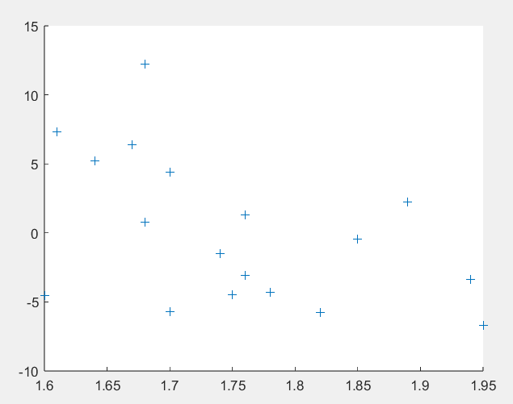
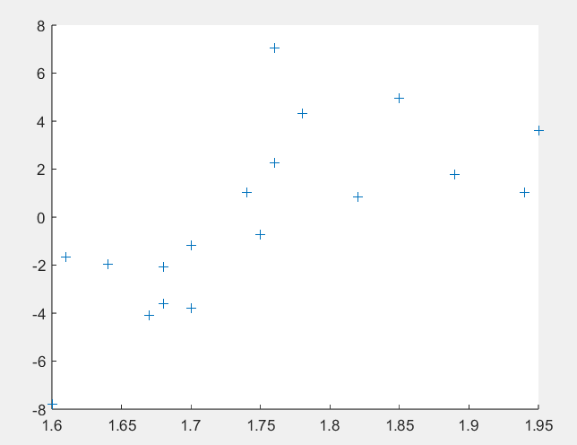
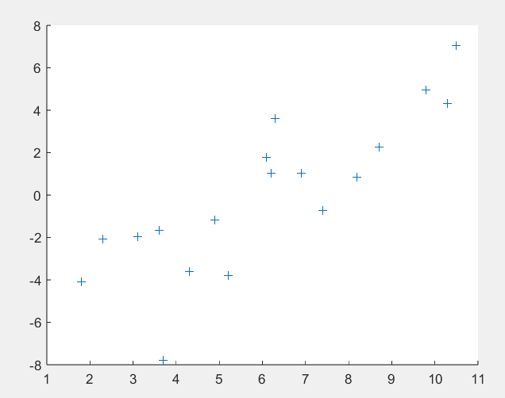
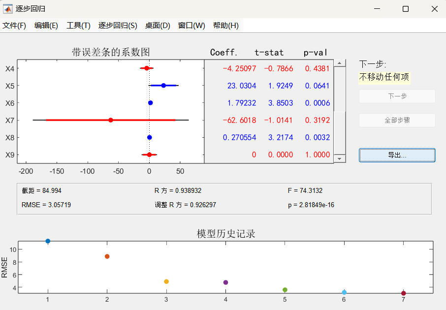
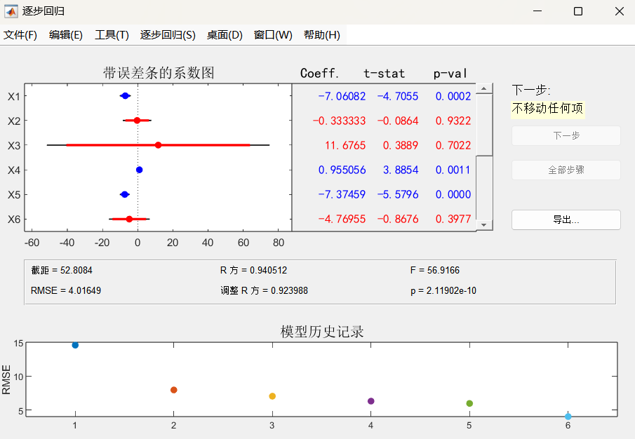
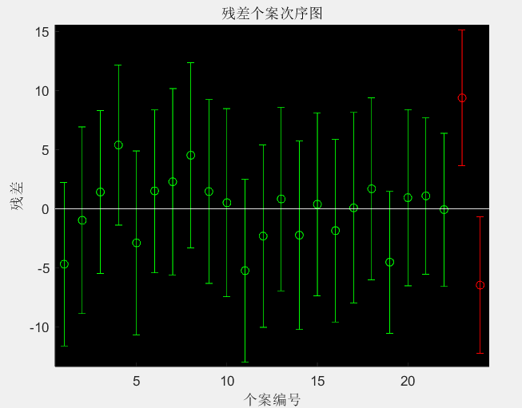
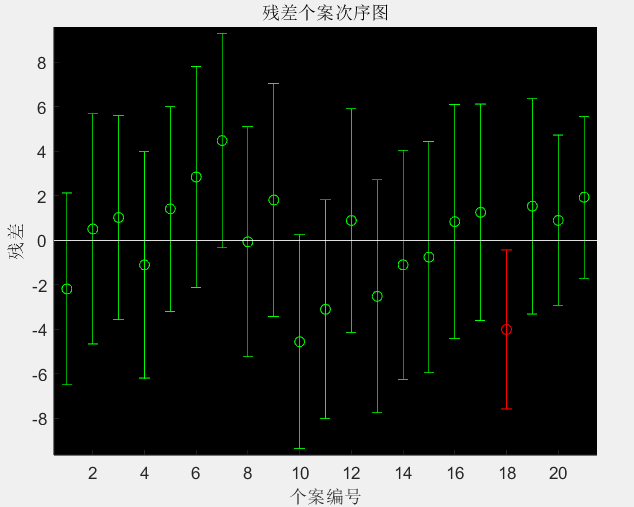

## 实验12 回归分析

计15 张一可 2021010793

### 实验目的

1. 了解回归分析的基本原理，掌握 MATLAB 实现的方法
2. 练习用回归分析解决实际问题

### 13-5

#### 问题分析与模型建立

从题目出发，由最简单的一次函数关系入手。如果效果不好或与图形观察结果不符合，再考虑交互项或是高次项。

根据这种思想，对于第一问，回归模型设计为：
$$
y=\beta_0 + \beta_1x_A + \beta_2x_B + \epsilon
$$
其中 $x_A$ 和 $x_B$ 需要尝试 $x_1,x_2,x_3$ 的不同组合，利用 MATLAB 中的 regress 函数求解。

第二问引入了所有的自变量，但解法与第二问基本相同，对应的回归模型设计为：
$$
y=\beta_0 + \beta_1x_1 + \beta_2x_2 + \beta_3x_3 + \epsilon
$$
可以通过比较决定系数 $R^2$ 、$F$ 值、$p$ 值、以及 $s^2$ 的大小来综合衡量模型的好坏。

第三问种，通过 MATLAB 提供的 rcoplot 函数进行残差分析，去除异常点后重新用 regress 求解即可。

#### 代码实现

MATLAB 代码实现如下：

```matlab
y=[11.2 13.4 40.7 5.3 24.8 12.7 20.9 35.7 8.7 9.6 ...
    14.5 26.9 15.7 36.2 18.1 28.9 14.9 25.8 21.7 25.7];
x1=[16.5 20.5 26.3 16.5 19.2 16.5 20.2 21.3 17.2 14.3 ...
    18.1 23.1 19.1 24.7 18.6 24.9 17.9 22.4 20.2 16.9];
x2=[6.2 6.4 9.3 5.3 7.3 5.9 6.4 7.6 4.9 6.4 ...
    6.0 7.4 5.8 8.6 6.5 8.3 6.7 8.6 8.4 6.7];
x3=[587 643 635 692 1248 643 1964 1531 713 749 ...
    7895 762 2793 741 625 854 716 921 595 3353];

n=length(y);
X=[ones(n,1)  x1', x2'];
[b1,bint1,r1,rint1,s1]=regress(y',X);
rcoplot(r1,rint1);

X=[ones(n,1)  x2', x3'];
[b2,bint2,r2,rint2,s2]=regress(y',X);

X=[ones(n,1)  x1', x3'];
[b3,bint3,r3,rint3,s3]=regress(y',X);

X=[ones(n,1)  x1', x2', x3'];
[b4,bint4,r4,rint4,s4]=regress(y',X);

y=[y(1:7) y(9:19)];
x1=[x1(1:7) x1(9:19)];
x2=[x2(1:7) x2(9:19)];
n=length(y);
X=[ones(n,1)  x1', x2'];
[b11,bint11,r11,rint11,s11]=regress(y',X);
s211=sum(r11.^2)/(n-2);
```

#### 实验结果与讨论

（1）第一问中，采用 $x_1$, $x_2$, $x_3$ 不同组合得到的计算结果如下：

1. 采用 $x_1$ 和 $x_2$ 两个变量，$y=\beta_0 + \beta_1x_1 + \beta_2x_2 + \epsilon$

   |           | 点估计     | 区间估计               |
   | --------- | ---------- | ---------------------- |
   | $\beta_0$ | $-34.0725$ | $[-48.2643, -19.8808]$ |
   | $\beta_1$ | $1.2239$   | $[0.0251, 2.4227]$     |
   | $\beta_2$ | $4.3989$   | $[1.1790, 7.6189]$     |

   $R^2=0.8020$，$F=34.4278$，$p = 1.0514 10^{-6}$，$s^2 = 21.6084$

2. 采用 $x_1$ 和 $x_3$ 两个变量，$y=\beta_0 + \beta_1x_1 + \beta_2x_3 + \epsilon$

   |           | 点估计                  | 区间估计                          |
   | --------- | ----------------------- | --------------------------------- |
   | $\beta_0$ | $-31.5998$              | $[-46.8352, -16.3643]$            |
   | $\beta_1$ | $7.3519$                | $[5.2732, 9.4305]$                |
   | $\beta_2$ | $8.2663 \times 10^{-4}$ | $[-6.4614\times 10^{-4}, 0.0023]$ |

   $R^2=0.7672$，$F=28.0054$，$p = 4.1690\times 10^{-6}$，$s^2 = 25.4100$

3. 采用 $x_2$ 和 $x_3$ 两个变量，$y=\beta_0 + \beta_1x_2 + \beta_2x_3 + \epsilon$

   |           | 点估计                  | 区间估计               |
   | --------- | ----------------------- | ---------------------- |
   | $\beta_0$ | $-31.2152$              | $[-48.7280, -13.7025]$ |
   | $\beta_1$ | $2.5955$                | $[1.7447, 3.4464]$     |
   | $\beta_2$ | $4.1981 \times 10^{-4}$ | $[-0.0012, 0.0020]$    |

   $R^2=0.7103$，$F=20.8433$，$p = 2.6683\times 10^{-5}$，$s^2 = 31.6120$

因此，最佳模型是选用 $x_1$ 和 $x_2$ 为变量，模型为 $y=-34.0725+1.2239x_1+4.3989x_2$

（2）采用 $x_1$，$x_2$ 和 $x_3$ 三个变量，$y=\beta_0 + \beta_1x_1 + \beta_2x_2 + \beta_3x_3 + \epsilon$ 的计算结果如下：

|           | 点估计                 | 区间估计                          |
| --------- | ---------------------- | --------------------------------- |
| $\beta_0$ | $-36.7649$             | $[-51.6274, -21.9024]$            |
| $\beta_1$ | $1.1922$               | $[0.0015, 2.3828]$                |
| $\beta_2$ | $4.7198$               | $[1.4754, 7.9643]$                |
| $\beta_3$ | $7.6294\times 10^{-4}$ | $[-5.8596\times 10^{-4}, 0.0021]$ |

$R^2=0.8183$，$F=24.0220$，$p = 3.6289\times 10^{-6}$，$s^2 = 21.0661$

由结果可知，使用所有三个变量之后的 $R^2$ 值、$F$ 值都比只使用 $x_1$ 和 $x_2$ 两个变量更高，且剩余方差 $s^2$ 下降，代表模型对问题描述的更加准确。然而这些值的变化并不多，这代表着增加 $x_3$ 对于该回归模型的贡献并不大。而 $\beta_3$ 的置信区间包含 0，说明置信度 $\alpha$ = 0.05 时应拒绝 $y$ 与 $\beta_3$ 线性相关的假设，$x_3$ 仅仅与 $y$ 存在很弱的相关性，实际意义并不大。因此，最佳模型仍应仅选用 $x_1$ 和 $x_2$ 为变量，为
$$
y=-34.0725+1.2239x_1+4.3989x_2
$$
（3）绘制残差图，可以发现存在编号 8 和 20 的 2 个异常点：


去除 2个异常样本点后，重新计算线性回归模型的结果如下：

|           | 点估计     | 区间估计               |
| --------- | ---------- | ---------------------- |
| $\beta_0$ | $-35.7095$ | $[-45.2643, -26.1557]$ |
| $\beta_1$ | $1.6023$   | $[0.7776, 2.4270]$     |
| $\beta_2$ | $3.3926$   | $[1.2166, 5.5686]$     |

$R^2=0.9127$，$F=78.3937$，$p = 1.1435\times 10^{-8}$，$s^2 = 9.1809$

得到去除异常样本点去掉后的最终模型为 
$$
y=-35.7095+1.6023x_1+3.3926x_2
$$


### 13-8

#### 问题分析与模型建立

由题目，第一问，对于普通车和豪华车的模型分别为
$$
y_1 = \beta_0^{(1)} + \beta_1^{(1)}x_1 + \beta_2^{(1)}x_2 , \ \ y_2 = \beta_0^{(2)} + \beta_1^{(2)}x_1 + \beta_2^{(2)}x_2
$$
第二问引入变量 $x_3$，$x_3 = 0$ 表示普通车，$x_3 = 1$ 表示豪华车，建立统一模型
$$
y = \beta_0 + \beta_1x_1 + \beta_2x_2 + \beta_3x_3
$$
绘制残差散点图可以帮助发现变量之间的相关关系，判断选择的回归模型是否合理。对于多变量模型，可以考虑进一步引入交叉项和二次项提升预测的准确性。

#### 代码实现

MATLAB 求解代码如下：

```matlab
clear all;
y1=[22.1 15.4 11.7 10.3 11.4 7.5 13.0 ...
    12.8 14.6 18.9 19.3 30.1 28.2 25.6 ...
    37.5 36.1 39.8 44.3];
y2=[7.2 5.4 7.6 2.5 2.4 1.7 4.3 ...
    3.7 3.9 7.0 6.8 10.1 9.4 7.9 ...
    14.1 14.5 14.9 15.6];
x1=[1.89 1.94 1.95 1.82 1.85 1.78 1.76 ...
    1.76 1.75 1.74 1.70 1.70 1.68 1.60 ...
    1.61 1.64 1.67 1.68];
x2=[6.1 6.2 6.3 8.2 9.8 10.3 10.5 ...
    8.7 7.4 6.9 5.2 4.9 4.3 3.7 ...
    3.6 3.1 1.8 2.3];

n=length(y1);
X=[ones(n,1) x1' x2'];
[b1,bint1,r1,rint1,s1]=regress(y1',X);
[b2,bint2,r2,rint2,s2]=regress(y2',X);

X=[ones(2*n,1) [x1 x1]' [x2 x2]' [zeros(1,n) ones(1,n)]'];
[b,bint,r,rint,s]=regress([y1 y2]',X);

scatter(x1, r(1:18), '+');
scatter(x2, r(1:18), '+');
scatter(x1, r(19:36), '+');
scatter(x2, r(19:36), '+');

X1=[x1 x1]';
X2=[x2 x2]';
X3=[zeros(1,n) ones(1,n)]';
Y=[y1 y2]';

X=[X1 X2 X3 X1.*X2 X1.*X3 X2.*X3 X1.^2 X2.^2 X3.^2];
stepwise(X,Y);
```

#### 实验结果与讨论

（1）对于普通车，计算结果如下：

|           | 点估计     | 区间估计              |
| --------- | ---------- | --------------------- |
| $\beta_0$ | $90.1814$  | $[46.1971, 134.1656]$ |
| $\beta_1$ | $-27.6588$ | $[-54.5542, -0.7634]$ |
| $\beta_2$ | $-3.2283$  | $[-4.2747, -2.1819]$  |

$R^2=0.8593$，$F=45.7992$，$p = 4.0978\times 10^{-7}$，$s^2 = 20.7910$

豪华车的计算结果为：

|           | 点估计    | 区间估计             |
| --------- | --------- | -------------------- |
| $\beta_0$ | $24.5471$ | $[5.9201, 43.1740]$  |
| $\beta_1$ | $-4.6285$ | $[-16.0184, 6.7614]$ |
| $\beta_2$ | $-1.4360$ | $[-1.8792, -0.9929]$ |

$R^2=0.8402$，$F=39.4474$，$p = 1.0614\times 10^{-6}$，$s^2 = 3.7288$

（2）统一模型下的计算结果为：

|           | 点估计     | 区间估计               |
| --------- | ---------- | ---------------------- |
| $\beta_0$ | $64.5753$  | $[33.5007, 95.6499]$   |
| $\beta_1$ | $-16.1436$ | $[-35.1193, 2.8320]$   |
| $\beta_2$ | $-2.3322$  | $[-3.0705, -1.5939]$   |
| $\beta_3$ | $-14.4222$ | $[-17.6546, -11.1898]$ |

$R^2=0.8366$，$F=54.6111$，$p = 1.0976\times 10^{-12}$，$s^2 = 22.6642$

|         | (1)中结果                                | 统一模型结果                             |
| ------- | ---------------------------------------- | ---------------------------------------- |
| $x_3=0$ | $y_1 = 90.1814 - 27.6588x_1 - 3.2283x_2$ | $y_1 = 64.5753 - 16.1436x_1 - 2.3322x_2$ |
| $x_3=1$ | $y_1 = 24.5471 - 4.6285x_1 - 1.4360x_2$  | $y_2 = 50.1531 - 16.1436x_1 - 2.3322x_2$ |

统一模型在 $x_3 = 0$ 和 $x_3 = 1$ 时对于两种车的结果与 (1) 中结果相差较大，说明当前的统一模型并不适用。

（3）普通车关于 $x_1$，$x_2$ 的残差散点图分别如下：



豪华车关于 $x_1$，$x_2$ 的残差散点图如下：



观察可知两种类型残差散点图的趋势不同，表明 $x_1$，$x_2$ 与 $x_3$ 有交互作用，应在统一模型中增加交叉项

（4）利用 stepwise 逐步增加交互项，直至剩余残差 $s^2$ 不再下降：



得到最终预测模型为：
$$
y=84.9440-19.0370x_1-6.8094x_2-65.6343x_3+0.2706x_2^2+23.0304x_1x_3+1.7923x_2x_3
$$


### 13-11

#### 问题分析与模型建立

设病痛减轻时间为 $y$，用药剂量为 $x_1$，性别为 $x_2$，血压组别为 $x_3$。假设 $y$ 的影响因素有很多，例如线性项 $x_1$, $x_2$, $x_3$、交互项 $x_1x_2$, $x_1x_3$, $x_2x_3$ 和二次项 $x_1^2$, $x_2^2$, $x_3^2$ 等等。可以采用逐步回归的方式依次选择引入和剔除的变量，利用 MATLAB 工具箱函数 stepwise 求解。

得到模型后，可进一步通过残差分析逐步剔除异常样本点，得到最终模型。

#### 代码实现

MATLAB 求解代码如下：

```matlab
y=[35 43 55 47 43 57 ...
    26 27 28 29 22 29 ...
    19 11 14 23 20 22 ...
    13 8 3 27 26 5];
x1=[2 2 2 2 2 2 ...
    5 5 5 5 5 5 ...
    7 7 7 7 7 7 ...
    10 10 10 10 10 10];
x2=[0 0 0 1 1 1 ...
    0 0 0 1 1 1 ...
    0 0 0 1 1 1 ...
    0 0 0 1 1 1];
x3=[0.25 0.5 0.75 0.25 0.5 0.75 ...
    0.25 0.5 0.75 0.25 0.5 0.75 ...
    0.25 0.5 0.75 0.25 0.5 0.75 ...
    0.25 0.5 0.75 0.25 0.5 0.75];

X=[x1' x2' x3' (x1.*x2)' (x1.*x3)' (x2.*x3)' (x1.^2)' (x2.^2)' (x3.^2)'];
stepwise(X,y);

n=length(y);
x4=x1.*x2;
x5=x1.*x3;
x6=x1.^2;
x7=x3.^2;
X3=[ones(n,1) x1' x4' x5' x6' x7'];
[b2,bint2,r2,rint2,s2]=regress(y',X3);
rcoplot(r2,rint2);

X2=[ones(n-5,1) [x1(1:3) x1(5:7) x1(9:18) x1(20:22)]' [x4(1:3) x4(5:7) x4(9:18) x4(20:22)]' [x5(1:3) x5(5:7) x5(9:18) x5(20:22)]' [x6(1:3) x6(5:7) x6(9:18) x6(20:22)]' [x7(1:3) x7(5:7) x7(9:18) x7(20:22)]'];
[b,bint,r,rint,s]=regress([y(1:3) y(5:7) y(9:18) y(20:22)]',X2);
rcoplot(r,rint);
```

#### 实验结果与讨论

本题中利用 stepwise 得到回归模型的顺序如下：

1. Stepwise 自动调节选择 $x_1^2$, $x_1x_2$, $x_1^2$，RMSE 为 6.298
2. 手动加入 $x_1x_3$，自动提示加入 $x_3^2$，RMSE 降低到 4.016



此时得到的模型为
$$
y = 52.8084 - 7.0608x_1 + 0.9551x_1x_2 - 7.3746x_1x_3 + 0.5111x_1^2 + 42.5282x_3^2
$$
进一步绘制残差个案次序图，去除异常残差点直到不存在异常残差点：



去除残差点 4，8，19，23，24 后，最终预测模型为 
$$
y=46.7237-5.6107x_1+0.7045x_1x_2-9.1549x_1x_3+0.4938x_1^2+55.1979x_3^2
$$


### 总结与收获

在课堂上，我复习了回归分析背后的概率论、假设检验等知识基础。通过实验，我熟悉了 MATLAB 线性回归工具箱的使用，并进一步掌握了根据实际问题建立回归模型进行拟合和预测的方法。感谢老师的耐心讲解与助教的指导和帮助。
