### 实验 3 作业

张一可 2021010793 计15

### 实验目的

1. 掌握 MATLAB 计算拉格朗日、分段线性、三次样条三种插值的方法，改变节点数目，对三种插值结果进行初步分析。
2. 掌握 MATLAB 梯形公式、辛普森公式计算数值积分。
3. 通过实例学习用插值和数值积分解决实际问题。

### 第 2 题

用 $y = x^{1/2}$ 在 $x = 0, 1, 4, 9, 16$ 产生 5 个节点 $P_1, P_2, P_3, P_4, P_5$，用不同的节点构造插值公式来计算 $x = 5$ 处的插值（如用 $P_1, P_2,...,P_5$；$P_1, P_2, ...,P_4$；$P_2, P_3, P_4$；$...$）与精确值比较并进行分析。

##### 算法设计

选取不同的节点，并采用拉格朗日插值、分段线性插值、三次样条插值三种方式分别计算积分，从而考察各个采用插值方法时，节点选取对于结果准确性和鲁棒性的影响。

##### 计算程序

```matlab
xx=[0 1 4 9 16];
x=5;
y=sqrt(x);

compute(xx,x,y); 			% 选取P1,P2,P3,P4,P5
compute(xx(1:4),x,y);		% 选取P1,P2,P3,P4
compute(xx(2:4),x,y);		% 选取P2,P3,P4
compute(xx(2:5),x,y);		% 选取P2,P3,P4,P5

function compute(x0,x,y)
    y0=sqrt(x0);
    y1=lagr(x0,y0,x);		% 拉格朗日插值
    dy1=y1-y;
    
    y2=interp1(x0,y0,x);	% 分段线性插值
    dy2=y2-y;
    
    y3=spline(x0,y0,x);		% 三次样条插值
    dy3=y3-y;
    [dy1 dy2 dy3]
end
```

##### 计算结果

| 采用插值点         | 拉格朗日插值 | 分段线性插值 | 三次样条插值 |
| ------------------ | ------------ | ------------ | ------------ |
| P1, P2, P3, P4, P5 | -0.1567      | -0.0361      | -0.0728      |
| P1, P2, P3, P4     | -0.2361      | -0.0361      | -0.2361      |
| P2, P3, P4         | 0.0306       | -0.0361      | 0.0306       |
| P2, P3, P4, P5     | 0.0179       | -0.0361      | 0.0179       |

##### 结果分析与结论

对比三种方法，可以看到：

1. 拉格朗日插值与三次样条插值的关系：在点数小于等于 4 时，拉格朗日多项式的次数小于等于 3，与三次样条插值结果一致。而在点数大于 4 时，拉格朗日插值相比三次样条插值震荡更明显，收敛性不能保证，误差也相对更大。
2. 分段线性插值的误差仅与距离待插值点 $x=5$ 最近的插值点有关。由于 4 种插值方案种均选择了 P2, P3 两点，所以误差相同。
3. 三次样条插值与分段线性插值的优劣取决于插值点的选取。在插值点选取更合理的情况下（如 P2, P3, P4, P5），三次样条插值的误差小于分段线性插值。而在插值点选取不够合理的情况下，分段线性插值的误差更小（如 P1, P2, P3, P4）。

下图依次为采用四种插值方案时，得到拉格朗日插值结果的图像：

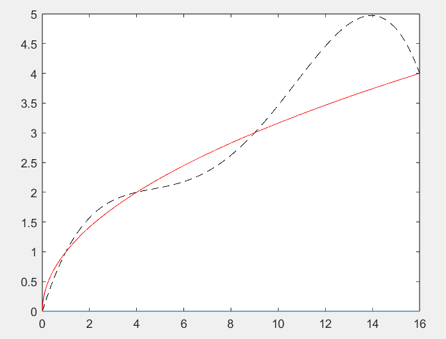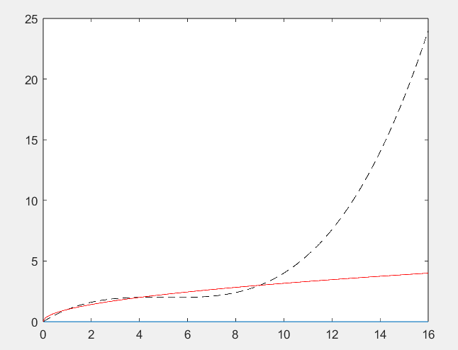

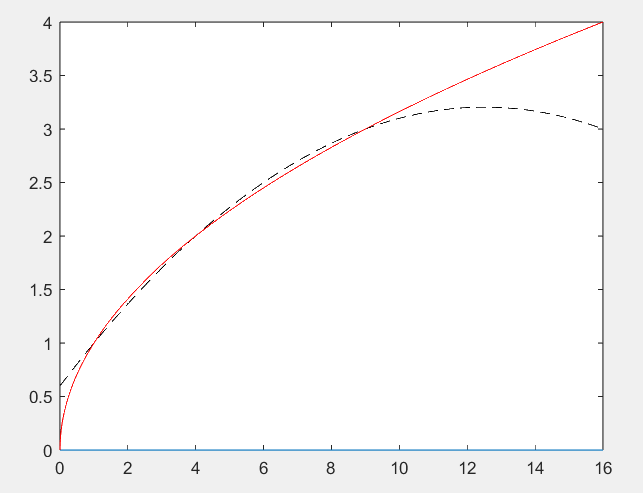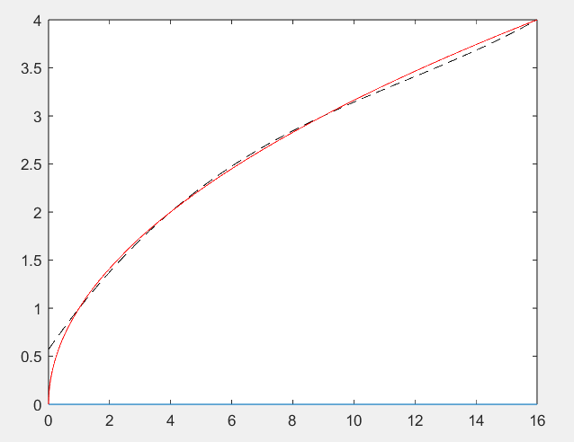

下图依次为采用四种插值方案时，得到三次样条插值结果的图像：

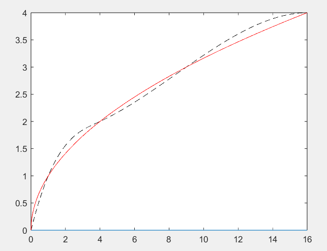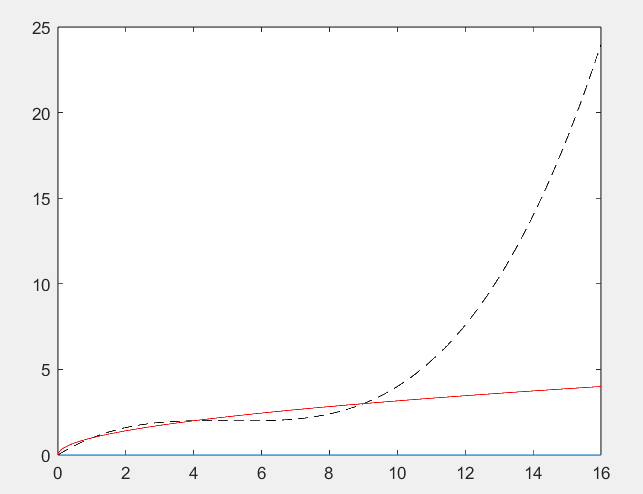

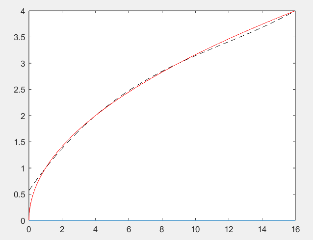

### 第 10 题

表中给出的 $x, y$ 数据位于机翼剖面的轮廓线上，$y_1$ 和 $y_2$ 分别对应轮廓的上下线。假设需要得到 $x$ 坐标每改变 0.1 时的 $y$ 坐标。试完成加工所需数据，画出曲线，求机翼剖面的面积。

| $x$   | 0    | 3    | 5    | 7    | 9    | 11   | 12   | 13   | 14   | 15   |
| ----- | ---- | ---- | ---- | ---- | ---- | ---- | ---- | ---- | ---- | ---- |
| $y_1$ | 0    | 1.8  | 2.2  | 2.7  | 3.0  | 3.1  | 2.9  | 2.5  | 2.0  | 1.6  |
| $y_2$ | 0    | 1.2  | 1.7  | 2.0  | 2.1  | 2.0  | 1.8  | 1.2  | 1.0  | 1.6  |

##### 问题分析与模型建立

需要先插值得到 $x$ 坐标每改变 0.1 时的 $y$ 坐标，从而画出机翼曲线，再对利用插值后得到的点作为采样点，积分得到机翼剖面的面积。

##### 算法设计

考虑到拉格朗日插值在高次时具有较强的震动性，我采用较为误差较小的三次样条插值对 $y_1$ 和 $y_2$ 分别进行插值。使用加密后的数据点作为采样点，我使用辛普森公式对其进行积分，得到 $y_2$ 积分值与 $y_1$ 积分值的差作为机翼面积，即：
$$
S = \int_{0}^{15} [y_1(x)-y_2(x)]dx \approx I1 - I2
$$

##### 计算程序

```matlab
x0 = [0 3 5 7 9 11 12 13 14 15];
y10 = [0 1.8 2.2 2.7 3.0 3.1 2.9 2.5 2.0 1.6];
y20 = [0 1.2 1.7 2.0 2.1 2.0 1.8 1.2 1.0 1.6];

x = 0:0.1:15;
y1 = spline(x0, y10, x);
y2 = spline(x0, y20, x);
z = 0*x;
plot(x,z,x,y1,x,y2);

I2 = simpson(0.1, 75, y2);
I1 = simpson(0.1, 75, y1);
I1-I2

% 计算区间数为2m,区间大小为h的simpson积分
function I=simpson(h,m,y)
    I = y(1) + y(2*m+1);
    for k = 0:m-1
        I = I + 4 * y(2*k+2);
    end
    for k = 1:m-1
        I = I + 2 * y(2*k+1);
    end
    I = I * h/3;
end
```

##### 计算结果

采用三次样条插值得到间距为 0.1 的采样点处的插值结果如下：

| $x$   | 0    | 0.1   | 0.2   | 0.3   | 0.4   | ...  | 14.6  | 14.7  | 14.8  | 14.9  | 15    |
| ----- | ---- | ----- | ----- | ----- | ----- | ---- | ----- | ----- | ----- | ----- | ----- |
| $y_1$ | 0    | 0.109 | 0.213 | 0.314 | 0.410 | ...  | 1.734 | 1.696 | 1.662 | 1.629 | 1.600 |
| $y_2$ | 0    | 0.049 | 0.099 | 0.147 | 0.195 | ...  | 1.250 | 1.323 | 1.406 | 1.498 | 1.600 |

绘制机翼曲线图：

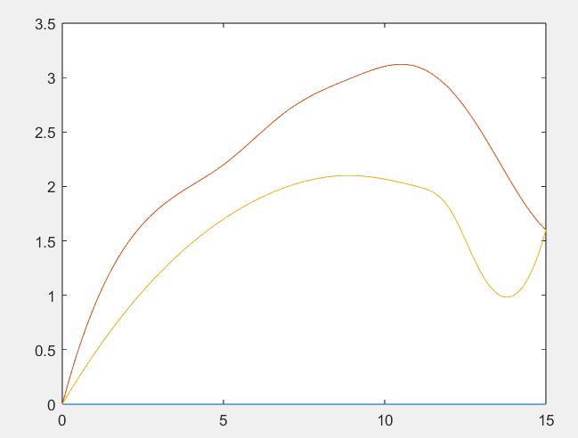

计算得到机翼面积为 11.346 。

##### 结果分析与结论

下图依次为拉格朗日插值和分段线性插值得到的机翼曲线：

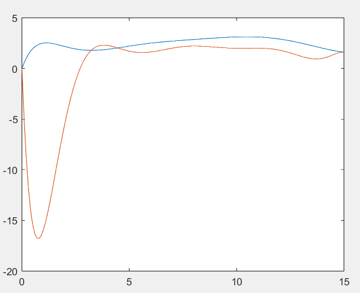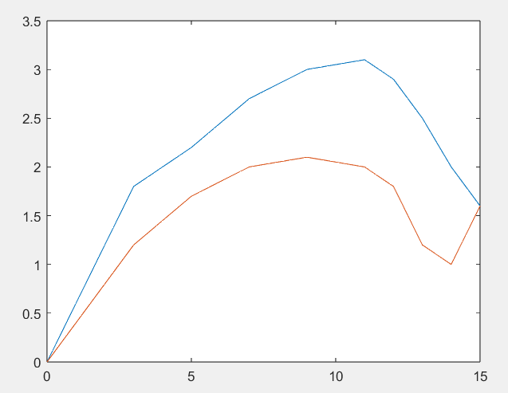

可以通过对比看到，三次曲线插值得到的机翼图像具有更好的光滑性，更加符合实际情况，因此更适用于实际生产中的建模与数值估算。

### 第 12 题

在桥梁一端每隔一段时间记录 1 min 有几辆车过桥，得到下表中的过桥车辆数据：

| 时间 | 车辆数 | 时间  | 车辆数 | 时间  | 车辆数 |
| ---- | ------ | ----- | ------ | ----- | ------ |
| 0:00 | 2      | 9:00  | 12     | 18:00 | 22     |
| 2:00 | 2      | 10:30 | 5      | 19:00 | 10     |
| 4:00 | 0      | 11:30 | 10     | 20:00 | 9      |
| 5:00 | 2      | 12:30 | 12     | 21:00 | 11     |
| 6:00 | 5      | 14:00 | 7      | 22:00 | 8      |
| 7:00 | 8      | 16:00 | 9      | 23:00 | 9      |
| 8:00 | 25     | 17:00 | 28     | 24:00 | 3      |

试估计一天通过桥梁的车流量。

##### 问题分析与模型建立

已知各时刻 1min 内同行的车辆数，假设 $f(x)$ 为该日 $x$ 时（以分钟为单位）的车流量密度，即每分钟通过的车辆数，则一天内通过的车流量即为 $f(x)$ 对于时间 $x$ 在一天内的积分。

我们假设 $f(x)$ 是关于时间的连续函数，且二阶导数连续，则可用三次样条插值得到精度更高的数据点的估计值，再带入积分公式进行积分，得到该日车流量：
$$
\int_{0}^{1439}f(x)dx
$$

##### 算法设计

根据模型假设，先采用三次样条函数插值得到每分钟的车流量密度，再通过梯形积分公式进行数值积分。

##### 计算程序

```matlab
x = [0 2 4 5 6 7 8 9 10.5 11.5 12.5 14 16 17 18 19 20 21 22 23 24];
y = [2 2 0 2 5 8 25 12 5 10 12 7 9 28 22 10 9 11 8 9 3];
x = x*60;

xt = 0:24*60;
yt = spline(x,y,xt);
zt = 0*xt;
plot(xt/60,yt,x/60,y);
I = trapz(yt);
I
```

##### 计算结果

绘制三次样条插值得到一天内各个时刻车流量密度的曲线图如下：

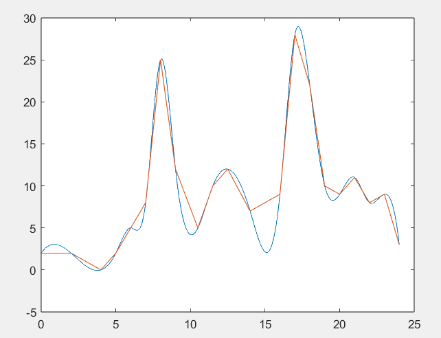

利用梯形公式积分，得到插值后的当天车流量 12668 辆。

##### 结果分析与结论

将三次样条插值换为分段线性插值，得到结果为 12990 辆。

可以看到三次样条插值相比于分段线性插值得到的车流量曲线图更加平滑，但三次样条插值相比于线性插值计算量更大，而二者从结果上相差不大。因此对于这一建模问题来说，在需要处理的数据量较大时，采用线性插值可能具有更高的计算效率。