### 实验 4 作业

张一可 2021010793 计15

### 实验目的

1. 练习数值微分的计算
2. 掌握用 MATLAB 软件求微分方程初值问题数值解的方法
3. 通过实例学习用微分方程模型解决简化的实际问题
4. 了解欧拉方法和龙格-库塔方法的基本思想和计算公式，及稳定性的概念

### 第 3 题

##### 算法设计

设火箭的质量为 $m$，所受推力为 $F$，单位时间消耗的燃料质量为 $\lambda$，重力加速度为 $g$，阻力相对于速度平方的系数为 $k$，对火箭进行受力分析，得到第一阶段，在燃料用尽前，即 $t \le 60$ s 时，其速度 $v_1$ 与时间 $t$ 满足常微分方程：
$$
\frac{dv_1}{dt} = \frac{F - (m - \lambda t)g - kv_1^2}{m - \lambda t}
$$
初值条件为 $v_1(0) = 0$ .

第二阶段，火箭燃料用尽后，设其质量变为 $m'$，速度 $v_2$ 与时间 $t$ 满足常微分方程：
$$
\frac{dv_2}{dt} = -\frac{m' - kv_2^2}{m'}
$$
初值条件为根据第一阶段计算得到的 $v_2(t_{60}) = v_1(t_{60})$ .

同时，在两个阶段，火箭上升路程 $y$ 与时间满足：
$$
\frac{dy}{dt} = v
$$
并且满足初值条件 $y_1(0) = 0$，$y_2(t_{60}) = y_1(t_{60})$，因此可以构建向量 $[y \ v]$ 关于时间 $t$ 的常微分方程，利用 ode 求解。

##### 计算程序

```matlab
clc,clear,clf,shg
g=9.8;
m0=1400;
m1=1080;
F=32000;
r=18;
k=0.4;

opt1=odeset('RelTol',1e-6,'AbsTol',1e-9);
ts1=0:1:60;
x01=[0;0];
[t1,y1]=ode45(@f1,ts1,x01,opt1,m0,F,r,k,g);
a1=(F-(k.*y1(:,2).*y1(:,2))-(m0-r.*t1).*g)./(m0-r.*t1);

ts2=60:1:80;
x02=[y1(end,1) y1(end,2)];
[t2,y2]=ode45(@f2,ts2,x02,opt1,m0,m1,k,g);
a2=((-k.*y2(:,2).*y2(:,2))-(m0-m1).*g)./(m0-m1);

plot(t1,y1(:,1),t2,y2(:,1)); %路程
pause

plot(t1,y1(:,2),t2,y2(:,2)); %速度
pause

plot(t1,a1,t2,a2); %加速度
pause

function y=f1(t,x,m0,F,r,k,g) %第1阶段方程
y=[x(2);(F-k*x(2)*x(2)-(m0-r*t)*g)/(m0-r*t)];
end

function y=f2(t,x,m0,m1,k,g) %第2阶段方程
y=[x(2);(-k*x(2)*x(2)-(m0-m1)*g)/(m0-m1)];
end
```

##### 计算结果

燃料用光时 $v=267 \ m/s$，$h=12190 \ m$，$a=0.91 \ m/s^2$

$t=72 \ s$ 时到达最高点，$h=13115\ m$，$a=-9.81 \ m/s^2$

高度曲线为：

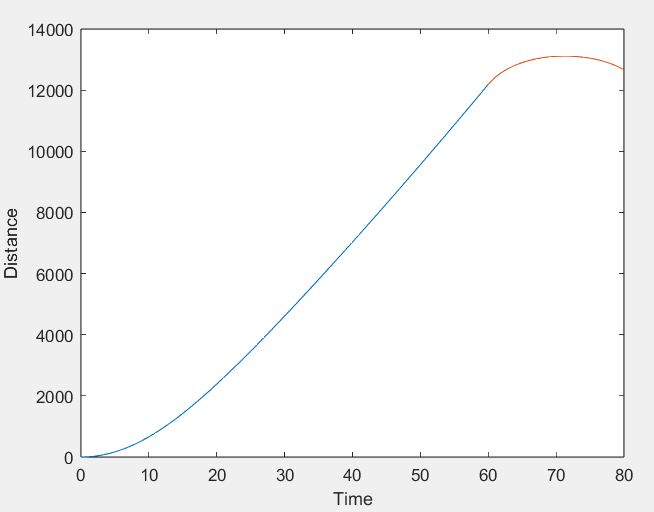

速度曲线为：

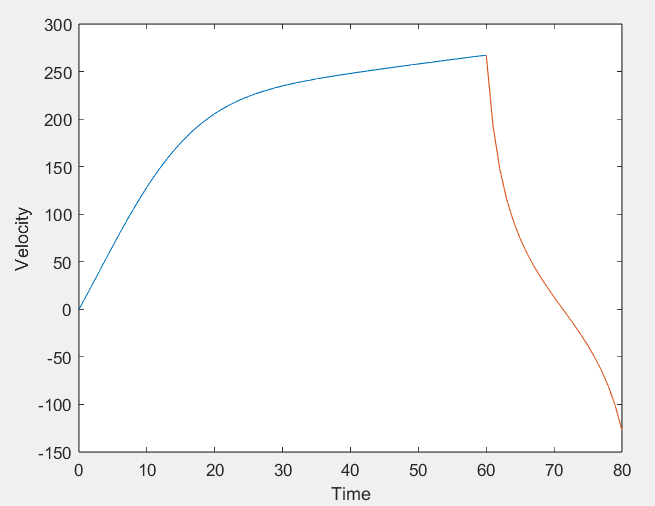

加速度曲线为：

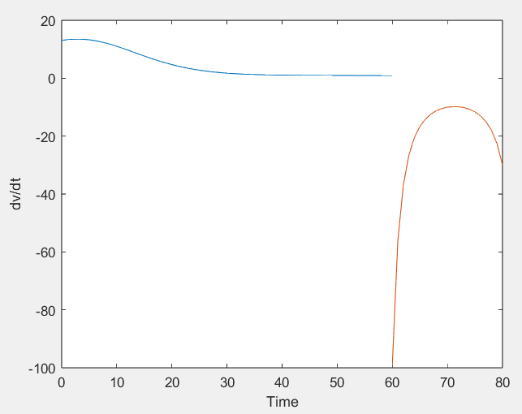

##### 结果分析与结论

另一种方法是先解速度关于时间的ode，再积分得到路程。而上述解法中利用两个 ode 方程构成向量同时求解，非常巧妙。
$$
[\frac{dx}{dt} \space \frac{dv}{dt}] = [v \space a]
$$

### 第 5 题

##### 算法设计

设桶在时间 $t$ 时的速度为 $v$，下落距离为 $y$，受到的重力为 $G$，浮力为 $F_{浮}$，阻力系数为 $k$，根据题目条件，对桶进行受力分析，得到桶的速度与时间的关系以及路程与时间的关系分别为：
$$
\frac{dv}{dt} = \frac{G-F_{浮}-k\ v}{m} \\
\frac{dy}{dt} = v
$$
初值条件为 $t = 0$ 时 $v = 0$，$y = 0$，将两个常微分方程带入 ode 公式即可求解。

##### 数值法求解

对于速度 $v$ 关于时间 $t$ 的一阶非齐次线性ODE，采用参数变易求解得：
$$
v = \frac{G-F_{浮}}{k}(1-e^{-\frac{k}{m}t})
$$
对 $v$ 积分，得到路程为：
$$
y = \int_{0}^{t}v(\tau)d\tau = \frac{G-f_{浮}}{k}(t+\frac{m}{k}e^{-\frac{k}{m}t}) - \frac{m(G-f_{浮})}{k^2} 
$$
代入体重数据，得到 $v = 40 ft/s$ 时 $t = 11.8243s$，得到 $h = 238.76ft$，此时桶还没有到达海底，因此桶会发生破裂。

##### 计算程序

```matlab
G=527.436;
F=470.327;
k=0.08;
g=9.8/0.3048;
ts=0:1:14;
x0=[0;0];
opt1=odeset('RelTol',1e-6,'AbsTol',1e-9);
[t,y]=ode45(@f,ts,x0,opt1,G,F,k,g);

figure
yyaxis left
plot(t,y(:,2)) %速度
xlabel('Time');
ylabel('Velocity');
yyaxis right
plot(t,y(:,1)) %路程
ylabel('Distance')

function dx=f(t,x,G,F,k,g) 
dx=[x(2);(G-F-k*x(2))/(G/g)];
end
```

##### 计算结果与结论


可以从图中直观地看出，当桶的下降路程未到深度 $300ft$ 时，其速度已经超过了 $40ft/s$。

这说明桶会破裂，工程师赢得了这场官司。

### 第 9 题

##### 算法设计

用向量 $[x \ y]$ 表示两种群数量，得到两种群数量相对时间的的 ode 方程如下：
$$
\frac{dx}{dt} = r_1x(1-\frac{x}{n_1}-s_1\frac{y}{n_2}) \\
\frac{dy}{dt} = r_2y(1-s_2\frac{x}{n_1}-\frac{y}{n_2})
$$

##### 计算程序

```matlab
r1=1;r2=1;
n1=100;n2=100;
s1=0.5;s2=2;
x0=[10;10];
ts=0:0.5:15;
opt1=odeset('RelTol',1e-6,'AbsTol',1e-9);
[t,x]=ode45(@f,ts,x0,opt1,r1,r2,n1,n2,s1,s2);

plot(t,x(:,1),t,x(:,2),'-.'),xlabel('time'),ylabel('number'),legend('x','y')

function dx=f(t,x,r1,r2,n1,n2,s1,s2)
dx=[r1.*x(1).*(1-x(1)./n1-s1.*x(2)./n2);
    r2.*x(2).*(1-s2.*x(1)./n1-x(2)./n2)];
end
```

##### 计算结果

(1) $t$ 充分大后，种群甲的数量到达最大容量，种群乙灭亡。


(2) 改变固有增长率 $r$ 主要改变了种群的增长速率，而对两种群最终的数量没有影响，即使增大 $r_2$ 使种群乙在开始阶段增长速率大于种群甲，种群乙也最终会灭亡：

$r_1 = 1$，$r_2 = 3$

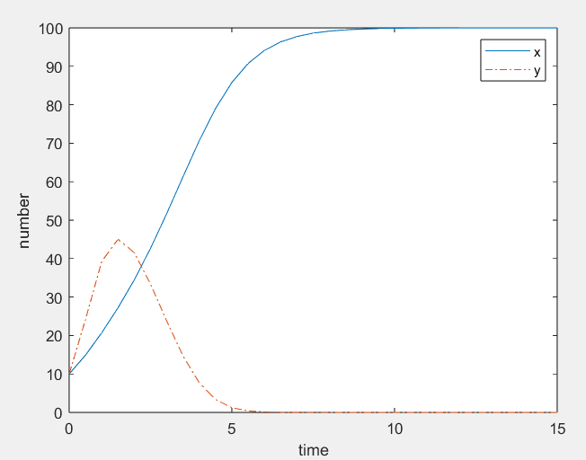

$r_1 = 3$，$r_2 = 1$

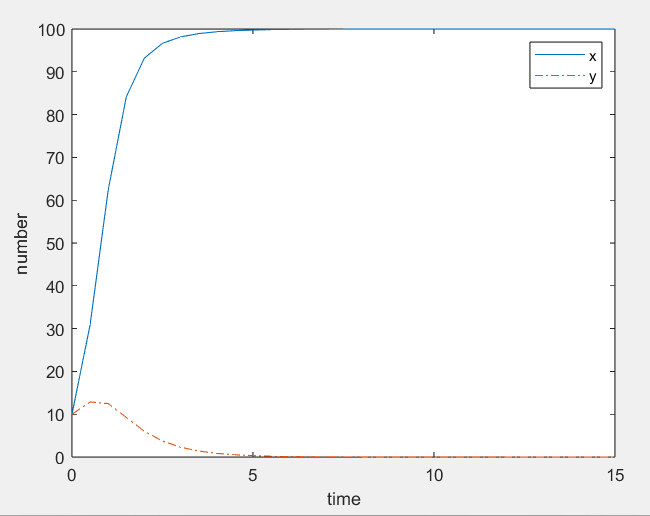

改变最大容量 $n$ 也不会影响种群最终的发展趋势，即使增大种群乙的最大容量 $n_2$，种群乙也最终会灭亡，而改变种群甲的最大容量 $n_1$ 则会决定其最终的种群容量：

$n_1 = 100$，$n_2 = 200$

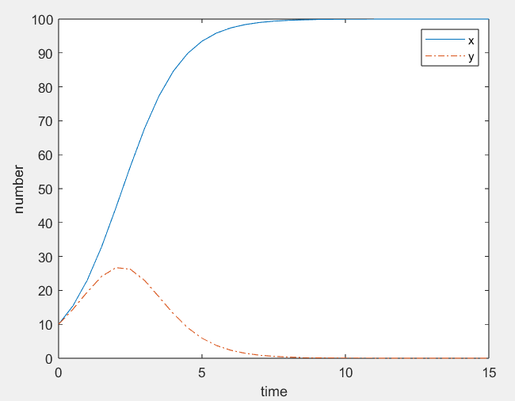

$n_1 = 200$，$n_2 = 100$

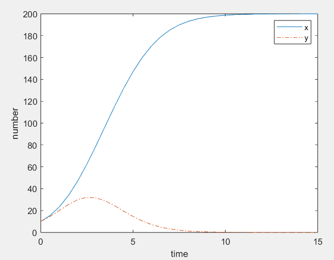

改变初始值 $x_1$，$x_2$ 对两种群最终的发展趋势和种群容量也没有影响：

$x_1 = 10$，$x_2 = 100$

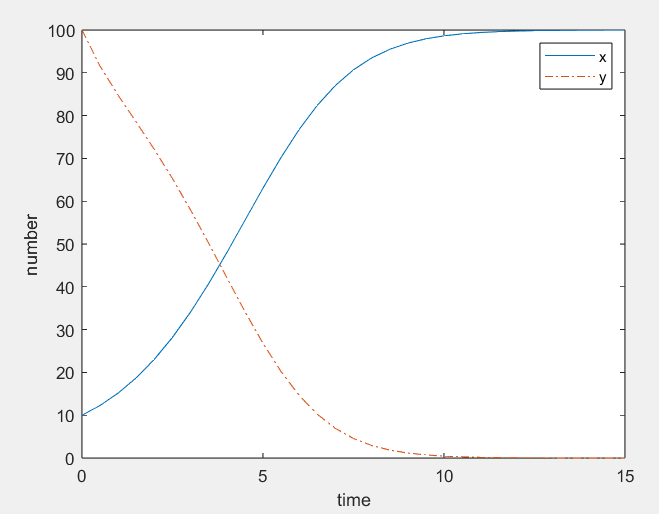

而设置 $s_1 = 1.5$，$s_2 = 0.7$ 时，最终结果为种群乙存活并达到最大容量，种群甲则灭亡。由此推测决定种群是否存活的因素为**竞争种群消耗本种群资源的相对能力**，即如果竞争种群消耗供养本种群资源的消耗能力强于本种群（即本种群的 $s$ 值大于1），则意味着对方在竞争中更有利，有能力把供养本种群的资源都消耗光，种群存在灭绝的风险。

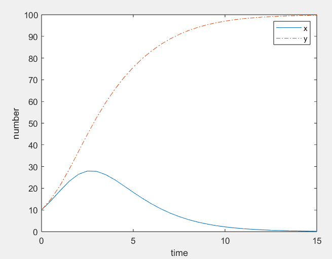

(3) 进一步实验，在 $s_1 = 0.8$，$s_2 = 0.7$ 时，两种群皆能存活，这是因为双方的 $s$ 值都小于 1，即使两种群的数量都到达最大容量，也不足以耗尽竞争种群的资源。但此时两种群都无法到达最大容量 $n$，而竞争更具优势的乙种群（$s$ 更小）的最终数量更高：

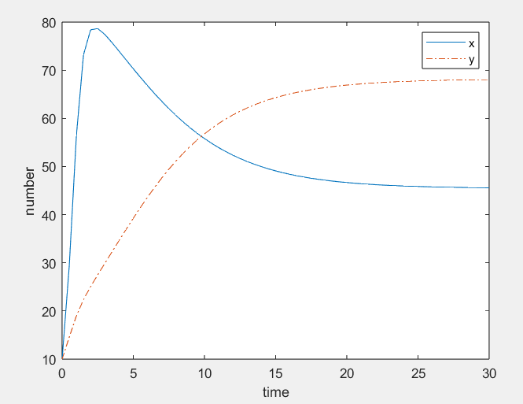

而在 $s_1 = 1.5$，$s_2 = 1.7$ 时，只有竞争存在优势（$s$ 更小）的甲种群可以在竞争中存活，并可以到达最大容量：

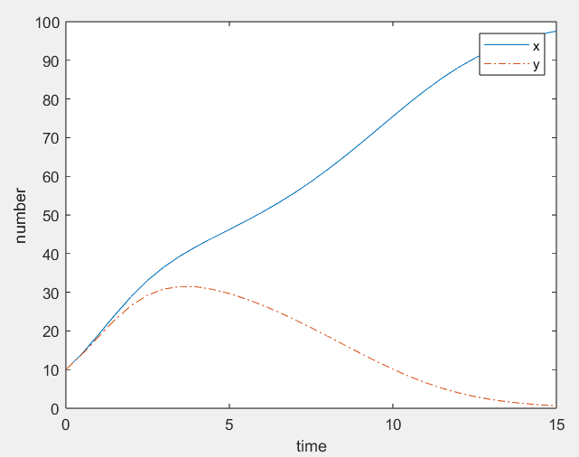

##### 结果分析与结论

通过数学建模与实验，我们对两种群竞争这一生物模型中各个变量的含义有了更深刻的理解，其中固有增长率 $r$ 代表了种群资源充足时增长速度的大小，最大容量 $n$ 代表了种群如果能在竞争中存活，资源充足（不存在竞争对手）时可以到达的最大容量，初始值 $x$ 则会影响种群的增长趋势。但这些因素都不足以决定种群数量到达稳定后的最终状态，而决定因素为对方种群消耗本种群资源的相对能力 $s$。在双方 $s$ 都小于 0 时，两种群可以共存。在一方 $s$ 大于 0 时，该种群的资源会被对方耗尽，最终灭亡。而在双方 $s$ 都大于 0 时，$s$ 更小的一方更有竞争优势，$s$ 大的一方则会灭亡。

