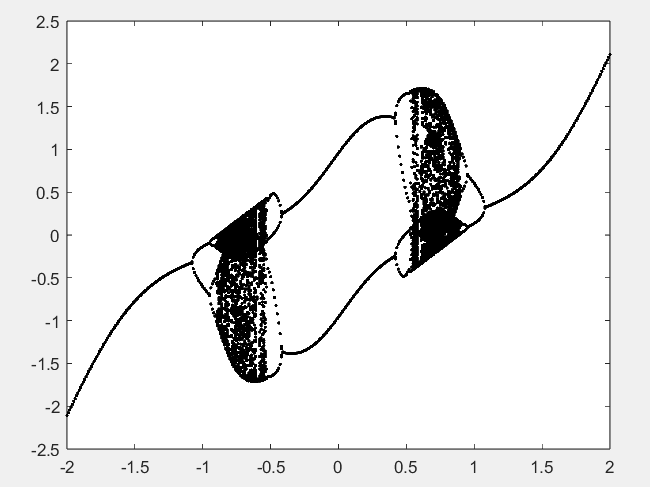
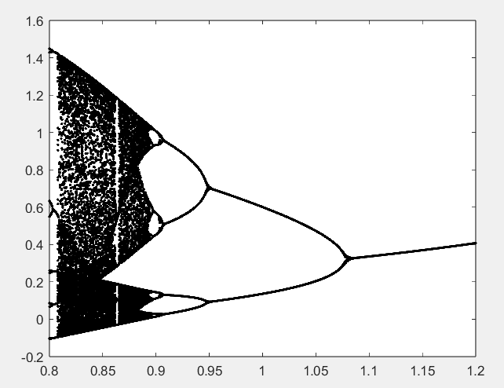

#### 实验六

张一可 2021010793 计15

#### 6.3

##### 算法分析

假设月利率为 $r$，总共还贷款所需月份数为 $n$，第 $k$ 月换完房贷后的欠款为 $x^k$（$0\le k\le n$），每月还款金额为 $m$，则第 $k$ 月的贷款满足递推关系：
$$
x^k = (1+r)x^{k-1} - a
$$
并满足总贷款金额 $x^0=A$，还清所有贷款后 $x^n = 0$ .

根据递推关系，得到：
$$
x^n = (1+r)^nA - \frac{(1+r)^n-1}{r}a = 0
$$
求解该方程组，即可得到月利率 $r$ 的值。

第二问与之类似，已知贷款总额 $A$，每期还款金额 $m$，还款次数 $n$，分别解出两家银行的年利率、月利率，作比较即可。

##### 计算程序

```matlab
clc;
a1=0.1;
A1=15;
n1=180;
r1=fsolve(@(r)loan(r,A1,a1,n1),0.003);

a2=0.45;
A2=50;
n2=180;
r2=fsolve(@(r)loan(r,A2,a2,n2),0.008);

a3=4.5;
A3=50;
n3=20;
r3=fsolve(@(r)loan(r,A3,a3,n3),0.08)/12; % 年利率/12=月利率

function f=loan(r,A,a,n)
    f = ((1+r)^n)*A-(((1+r)^n)-1)*a/r;
end
```

##### 计算结果与结论

(1) 计算可得贷款的月利率为 $0.208\%$

(2) 第一家银行的月利率为 $0.585\%$，第二家银行的月利率为 $0.533\%$ ，因此从贷款利率的角度来看，第二家银行较为优惠。

#### 6.6

##### 算法分析

同课本 6.1.2 节的分析，对于每个组分 $i$（$i=1,2,3,4$）满足：
$$
x_i(\frac{b_i}{T+c_i} + ln(\sum_{j=1}^{n}x_jq_{ij}) + \sum_{j=1}^n(\frac{x_jq_{ji}}{\sum_{k=1}^nx_kq_{jk}}) -1 -a_i+\ln P) = 0
$$
可以得到 $n$ 个非线性方程，根据给定参数求解 ${x_1,x_2,...,x_{n-1},T}$ 这 $n$ 个变量，再得到 $x_n = 1-\sum_{i=1}^{n-1}x_i$ .

##### 计算程序

编写函数文件 zerofun.m：

```matlab
function f=azeofun(XT,n,P,a,b,c,Q)
x(n)=1;
for i=1:n-1
    x(i)=XT(i);
    x(n)=x(n)-x(i);
end

T=XT(n);
p=log(P);
for i=1:n
   d(i) = x * Q(i,1:n)';
   dd(i)=x(i)/d(i);
end
for i=1:n
    f(i)=x(i)*(b(i)/(T+c(i)) + log(x*Q(i,1:n)') + dd*Q(1:n,i) - a(i) - 1 + p);
end
```

代入数据并求解：

```matlab
clc; clear;
n=4;
P=760;
a=[18.607,15.841,20.443,19.293]';
b=[3643.31,2755.64,4628.96,4117.07]';
c=[239.73,219.16,252.64,227.44]';
Q=[1.0    0.192   2.169  1.611
   0.316   1.0    0.477  0.524
   0.377  0.360   1.0    0.296
   0.524  0.282   2.065  1.0];
XT0=[0,0.5,0,77]; % 初始条件
[XT,Y]=fsolve(@azeofun,XT0,[],n,P,a,b,c,Q);
X=[XT(1:n-1),1-sum(XT(1:n-1)),XT(n)];
```

##### 计算结果与结论

采用不同初始条件求解如下：

初始条件为 $XT0 = [0, 0,0,70]$ 时：
$$
x_0 = 0\%, \ x_1 = 59\%, \ x_2 = 41\%,\  x_3 = 0\%,\ T = 72 ^{\circ}C
$$
初始条件为 $XT0=[0.5,0,0,70]$ 时：
$$
x_0 = 100\%, \ x_1 = 0\%, \ x_2 = 0\%,\  x_3 = 0\%,\ T = 65 ^{\circ}C
$$
初始条件为 $XT0=[0,0,0.5,70]$ 时：
$$
x_0 = 0\%, \ x_1 = 0\%, \ x_2 = 100\%,\  x_3 = 0\%,\ T = 83 ^{\circ}C
$$
初始条件为 $XT0=[0.25,0.25,0.25,100]$ 时：
$$
x_0 = 0\%, \ x_1 = 0\%, \ x_2 = 0\%,\  x_3 = 100\%,\ T = 98 ^{\circ}C
$$
初始条件为 $XT0=[0.25,0.25,0.25,50]$ 时：
$$
x_0 = 62\%, \ x_1 = 38\%, \ x_2 = 0\%,\  x_3 = 0\%,\ T = 58 ^{\circ}C
$$
初始条件为 $XT0=[0,0.5,0,80]$ 时：
$$
x_0 = 0\%, \ x_1 = 78\%, \ x_2 = 0\%,\  x_3 = 22\%,\ T = 77 ^{\circ}C
$$
初始条件为 $XT0=[0,0.75,0,90]$ 时：
$$
x_0 = 0\%, \ x_1 = 100\%, \ x_2 = 0\%,\  x_3 = 0\%,\ T = 80 ^{\circ}C
$$
因此，所有存在两种以上物质稳定共存的均相共沸混合物的可能解为：

1. $ 58 ^{\circ}C$ 下，$x_0 = 62\%, \ x_1 = 38\%, \ x_2 = 0\%,\  x_3 = 0\%$
2. $ 72 ^{\circ}C$ 下，$x_0 = 0\%, \ x_1 = 59\%, \ x_2 = 41\%,\  x_3 = 0\%$
3. $77^{\circ}C$ 下，$x_0 = 0\%, \ x_1 = 78\%, \ x_2 = 0\%,\  x_3 = 22\%$

#### 6.8

##### 算法分析

根据题目要求，带入可得 
$$
q(t+1) = r\big[\frac{c-S(q(t))}{d}-q(t)\big] + q(t)
$$
利用课本中提供的 chaos 函数可以观察分叉点的大致区间，之后可以通过二分法确定分叉点的位置。

##### 计算程序

首先编写 $q(t)$ 的迭代函数 market.m：

```matlab
function y=market(x,c)
u=4.8;d=0.25;r=0.3;
y=r*(c-atan(u*x))/d+(1-r)*x;
```

利用 chaos 函数观察采取不同 $c$ 取值时的收敛趋势：

```matlab
function chaos(iter_fun,x0,r,n)
kr=0;                     
for rr=r(1):r(3):r(2) 
    kr=kr+1;
    y(kr,1)=feval(iter_fun,x0,rr);
    for i=2:n(2)
        y(kr,i)=feval(iter_fun,y(kr,i-1),rr);    
    end
end
plot([r(1):r(3):r(2)],y(:,n(1)+1:n(2)),'k.');  
```

采取不同的 $c$ 区间，寻找分叉点：

```matlab
chaos(@market,0.5,[-2,2,0.01],[100,200])
```

##### 计算结果与结论

在区间 $c\in [-2, 2]$ 上函数存在分叉和混沌现象：



选取 $c\in [0.8,1.2]$ 的区间进一步做图，可以通过观察得到分叉点的大致区间：



又已知分叉点处满足隔代收敛条件，因此可以根据分叉点所在大致区间，利用二分法求解各个分叉点。

二分法求解分叉点函数 find_fork 如下：

```matlab
function p=find_fork(iter_func,init_val,level,converge_iter,r_range,r_tol,tol)
    r_lo=r_range(0);
    r_hi=r_range(1);
    hi_fork = test_fork(iter_func,init_val,level,converge_iter,r_hi,tol);
    while r_hi-r_lo>r_tol
        mid=(r_hi+r_lo)/2;
        mid_fork=test_fork(iter_func,init_val,level,converge_iter,mid,tol);
        if (mid_fork==hi_fork)
            r_hi=mid;
        else
            r_lo=mid;
        end
    end
    p=r_hi;
end
```

判断某个参数 r 下是否满足以 level 为周期隔代收敛的函数 test_fork 为：

```matlab
function res=test_fork(iter_func,init_val,level,converge_iter,r,tol)
    iter_conv=init_val;
    for i=1:converge_iter
        iter_conv=feval(iter_func,iter_conv,r);
    end
    n=2^(level+1);
    samples=zeros(n,1);
    for i=1:n
        samples(i)=feval(iter_func,iter_conv,r);
        iter_conv=samples(i);
    end

    res=reshape(samples,[],2);
    split=abs(res(:,1)-res(:,2));
    discrep=abs(res(1:2^(level-1),1) - res(2^(level-1)+1:2^level,1));
    res = (all(split<tol) && all(discrep>tol));

end
```

二分求解各个分叉点：

```
b1=find_fork(@market,0.5,1,1000,[1.07,1.08],1e-6,1e-7);
b2=find_fork(@market,0.5,2,1000,[0.95,0.95],1e-6,1e-7);
b3=find_fork(@market,0.5,3,1000,[0.9,0.91],1e-6,1e-7);
b4=find_fork(@market,0.5,4,1000,[0.895,0.9],1e-6,1e-7);
b5=find_fork(@market,0.5,5,1000,[0.89,0.895],1e-6,1e-7);
```

解得前 5 个分叉点为：
$$
b_1 = 1.0761,\ b_2 = 0.9463,\ b_3=0.9061,\ b_4=0.8967,\ b_5=0.8947
$$
得到：
$$
\frac{b_2-b_1}{b_3-b_2} = 3.229 \\
\frac{b_3-b_2}{b_4-b_3} = 4.227 \\
\frac{b_4-b_3}{b_5-b_4} = 4.699
$$
可以得到 $\frac{b_n-b_{n-1}}{b_{n+1}-b_n}$ 有趋近于 4.6692 的趋势，符合费根鲍姆定律。