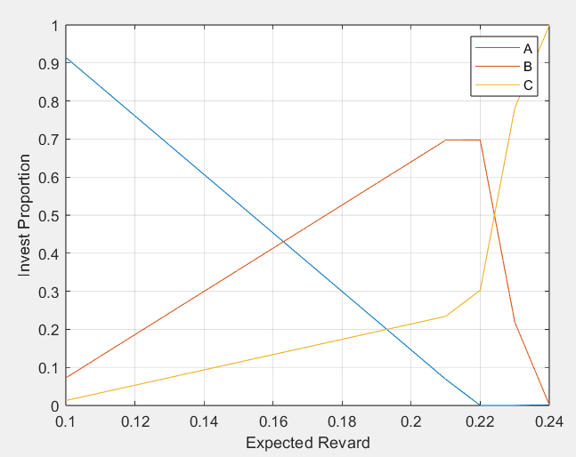
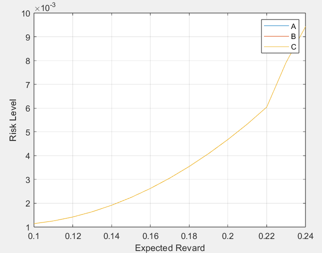

## 实验 8-9

张一可 计15 2021010793

### 实验目的

1. 掌握用 MATLAB 优化工具箱和 LINGO 解线性、非线性规划的方法
2. 练习建立实际问题的线性规划和非线性规划模型

### 实验 8-10 污水处理

#### 问题分析与模型建立

一般性地，假设共存在 $n$ 个工厂，每个工厂正对一个居民点，设工厂 $n$ 排放污水量为 $P_n$，工厂 $n$ 上游江水流量为 $I_n$，工厂下游江水流量 $O_n$ 等于居民点上游的江水流量，设工厂上游、下游污水浓度分别为 $a_n$, $b_n$，排放污水经处理站处理前后的浓度分别为 $c_n$, $d_n$，满足 $d_n \le c_n$

设工厂 $n$ 的处理系数为 $k_n$，污水从工厂 $n-1$ 到工厂 $n$ 的自净系数为 $t_n$

则由水流量守恒关系，可得：
$$
P_n + I_n = O_n
$$
且满足：
$$
I_n = O_{n-1}
$$
由污染物含量守恒关系，可得：
$$
P_nd_n + I_na_n= O_nb_n
$$
由污水的自净能力，$n>1$ 时，满足：
$$
a_n = t_n b_{n-1}
$$
综合上述公式，可得每个工厂下游处的污水浓度为：
$$
b_n = (P_n d_n + I_n t_n b_{n-1}) / O_n
$$
$I_1$, $a_1$ 和 $c_i$, $P_i$, $k_i$, $t_i$ 均已知，优化目标为最小化污水净化的总费用，即：
$$
min \ z = \sum_{i=1}^{n} k_n P_n(c_n - d_n)
$$
第一问的约束条件为每个工厂下游处污水浓度小于国家标准，即 $b_i \le e$，$i = 1,2,...,n$

第二问仅需满足每个工厂上游污水浓度小于国家标准，即 $a_i \le e$，$i = 1,2,...,n$

#### 代码实现

LINGO 求解第一问的代码为：

```matlab
model:
sets:
n/1..3/: b,c,d;
endsets
data:
c = 100 60 50;
enddata
[obj] min = 5 * @sum(n: c-d);
d(1) <= c(1);
d(2) <= c(2);
d(3) <= c(3);
b(1) = (1000 * 0.8 + 5 * d(1)) / 1005;
b(2) = (1005 * 0.9 * b(1) + 5 * d(2)) / 1010;
b(3) = (1010 * 0.6 * b(2) + 5 * d(3)) / 1015;
b(1) <= 1;
b(2) <= 1;
b(3) <= 1;
end
```

第二问只需把最后三行约束条件改为：

```matlab
b(1) * 0.9 <= 1;
b(2) * 0.9 <= 1;
```

#### 实验结果与讨论

(1) 解得优化目标 $z = 489.5$，此时各变量的值为 $d(1) = 41.0$，$d(2) = 21.1$，$d(3)=50.0$

它们的 Reduced cost 均为 0，说明它们均为基变量。约束条件中，条件 $d(3) \le c(3)$，$d(3)\le 1$，$d(2)\le1$ 的松弛变量为 0，说明它们在取最优解时起作用

(2) 解得优化目标 $z = 183.33$ ，此时各变量的值为 $d(1) = 63.3$，$d(2) = 60.0$，$d(3)=50.0$

类似地，它们的 Reduced cost 均为 0，说明它们均为基变量。约束条件中，条件 $d(2)\le c(2)$，$d(3)\le c(3)$，$a(2)\le 1$ 的松弛变量为 0，说明它们在取最优解时起作用。

#### 结论与分析

江面所有地段水污染均需达到国家标准时，最少需要花费 489.5 万元，只要求居民点上游的水污染达到国家标准时，最少需要花费 183.33 万元。

对比两种情况，可以发现只考虑居民点上游水质时，总处理费用明显减少。这种方案充分受益于江水的自净机制，如果江水不存在自净能力，则二者的差距将减小。考虑极端情况，自净系数 $t_i = 1$，则限制居民点上游污水浓度等效于限制所有河段污水浓度，二者的差别将不复存在。

### 实验 9-4 液体混合

#### 问题分析与模型建立

假设原料甲、乙、丙的用量分别为 $a$，$b$，$c$ 吨。甲、乙混合后，用于生产 A，B 的量分别为 $u$，$v$ 吨；原料丙用于生产 A，B 的量分别为 $x$，$y$ 吨，则满足
$$
a + b = u + v \\
c = x + y
$$
且 A、B 的最终产量分别为 $u+x$，$v+y$ 吨

甲乙混合后的硫含量设为 
$$
k = \frac{0.03a + 0.01b}{a+b}
$$
对产品 A、B 硫含量的约束条件为
$$
\frac{k u + 0.02 x }{u+x} \le 0.025 \\
\frac{k v + 0.02 y }{v+y} \le 0.015 \\
$$
原料供应量约束为
$$
a, b, c \le 500
$$
产品最大需求量约束为
$$
u+x \le 100 \\
v+y \le 200
$$
优化目标为最大化净利润，即
$$
max\ z = 9 (u+x) + 15(v+y) - 6a - 16b - 10c
$$

#### 代码实现

LINGO 解题代码如下：

```matlab
model:
a<=500;
b<=500;
c<=500;
a+b=u+v;
c=x+y;
k=(0.03*a+0.01*b)/(a+b);
(k*u+0.02*x)<=0.025*(u+x);
(k*v+0.02*y)<=0.015*(v+y);
u+x<=100;
v+y<=200;
[obj] max = 9*(u+x)+15*(v+y)-6*a-16*b-10*c;
end
```

第二问只需要求改约束为：

```matlab
u+x<=600;
```

第三问在前两问的基础上，修改约束条件中乙的进货价格即可：

```matlab
[obj] max = 9*(u+x)+15*(v+y)-6*a-13*b-10*c;
```

#### 实验结果与讨论

(1) 解得优化目标的最优值为 $z = 400$，此时各个变量的值为：
$$
a = 0,\ b = 100,\ c = 100 \\
u = 0,\ v = 100,\ x = 0,\ y = 100,\ k = 0.01
$$
(2) 解得优化目标的最优值为 $z = 600$，此时各个变量的值为：
$$
a = 300,\ b = 0,\ c = 300 \\
u = 300,\ v = 0,\ x = 300,\ y = 0,\ k = 0.03
$$
(3) 对于 (1) 和 (2) 中的情况，最优解均为 $z = 750$，各个变量的值为：
$$
a = 50,\ b = 150,\ c = 0 \\
u = 0,\ v = 200,\ x = 0,\ y = 0,\ k = 0.015
$$

#### 结论与分析

1. 第 (1) 问条件下，采购 100 吨原料乙、100 吨原料丙，生产 200 吨产品 B，可以获得最大利润 40 万元
2. 第 (2) 问条件下，采购 300 吨原料甲、300 吨原料丙，生产 600 吨产品 A，可以获得最大利润 60 万元
3. 乙原料的进价下降后，在 (1)、(2) 问的条件下，采购 50 吨原料甲、150 吨原料乙，生产 200 吨 产品B，可以获得最大利润 75 万元

分析实验结果可知，产品 A 的售价低于 B，当市场需求量较小时，如第 (1) 问的情况，不生产 A 是更好的选择，但当需求增大时，如第 (2) 问的情况，生产它则能获取更高利润。

对于三种原料，乙的含硫量最低，但进价最高，当它的进价降低时，使用更多的乙可能对利润更有帮助。

### 实验 9-8 股票投资

#### 问题分析与模型建立

设 A, B, C 三种股票的投资占比分别为 $x_1$, $x_2$, $x_3$，满足 $x_1+x_2+x_3=1$，记股票 A, B, C 的收益分别为 $S_1$, $S_2$, $S_3$，则投资总收益为
$$
Z_1 = x_1ES_1 + x_2ES_2 + x_3ES_3
$$
用总收益的方差衡量投资风险，为
$$
\begin{align}

Z_2 &= D(x_1S_1 + x_2S_2 + x_3S_3) \\
&= x_1^2 DS_1 + x_2^2 DS_2 + x_3^2 DS_3 + 2x_1x_2 cov(x_1S_1, x_2S_2) \\
&\ \ \ \ \ + 2x_1x_3 cov(x_1S_1, x_3S_3) + + 2x_2x_3 cov(x_2S_2, x_3S_3)
\end{align}
$$
约束条件为投资收益率 $Z_1 \ge 1.15$，优化目标为最小化风险，即
$$
min\ Z_2
$$
(1) 中，只需要改变约束条件为 $1.1 \le Z_1 \le 2$，可在 $1.1$ 至 $2$ 之间等间距取点，计算投资组合和收益的值

(2) 中，设无风险投资方式的投资占比为 $x_4$，约束条件变为 
$$
x_1 + x_2 + x_3 + x_4 = 1\\
Z_1 = x_1ES_1 + x_2ES_2 + x_3ES_3 + x_4ES_4
$$
由于该新增方式没有投资风险即 $DS_4 = 0$，作为优化目标的投资风险值 $Z_2$ 不变

(3) 中，设三种股票的买入、卖出量分别为 $a_i$, $b_i$，则满足
$$
x_1 = 0.5 + a_1 - b_1 \\
x_2 = 0.35 + a_2 - b_2 \\
x_3 = 0.15 + a_3 - b_3 \\
$$
按照股票的买入卖出都收取 $0.01$ 的交易费，约束条件变为
$$
x_1 + x_2 + x_3 + 0.01(\sum_{i=1}^{3}a_i + b_i) = 1
$$
作为优化目标的投资风险值 $Z_2$ 同样保持不变

#### 代码实现

LINGO 求解最优投资组合的代码如下：

```matlab
model:
sets:
stock/1..3/:x,mean;
year/1..12/:;
link(stock,year):A,R;
matrix(stock,stock):cov;
endsets

data:
A=1.300 1.103 1.216 0.954 0.929 1.056 1.038 1.089 1.090 1.083 1.035 1.176
1.225 1.290 1.216 0.728 1.144 1.107 1.321 1.305 1.195 1.390 0.928 1.715
1.149 1.260 1.419 0.922 1.169 0.965 1.133 1.732 1.021 1.131 1.006 1.908;
enddata

@for(link(i,j): @free(R(i,j)));
@for(link(i,j): R(i,j)=A(i,j)-1);
@for(stock(i): mean(i)=@sum(year(j):R(i,j))/@size(year));
@for(matrix(i,j): cov(i,j)=@sum(year(k):(R(i,k)-mean(i))*(R(j,k)-mean(j)))/(@size(year)-1));
[obj] min = @sum(matrix(i,j):x(j)*x(i)*cov(i,j));
@sum(stock(i):x(i)*mean(i))>=0.15;
@sum(stock(i):x(i))=1;
end
```

(1) 中，为了更方便的作图，将原问题化为二次规划问题，编写 MATLAB 程序如下：

```matlab
data = [1.300 1.103 1.216 0.954 0.929 1.056 1.038 1.089 1.090 1.083 1.035 1.176
1.225 1.290 1.216 0.728 1.144 1.107 1.321 1.305 1.195 1.390 0.928 1.715
1.149 1.260 1.419 0.922 1.169 0.965 1.133 1.732 1.021 1.131 1.006 1.908]';

H=2*cov(data);
A=-mean(data);

interval=0.01;
st=0.1;
ed=0.24;
rev=zeros(15,3);
std=zeros(15,3);
i=1;

for b=1+st:interval:1+ed
    b_prime=-b;
    x=quadprog(H,zeros(1,3),A,b_prime,ones(1,3),1,zeros(1,3),ones(1,3));
    d=0.05*x'*H*x;
    rev(i,:)=x;
    std(i,:)=d;
    i=i+1;
end

x=st:interval:ed;
plot(x,rev);
xlabel('Expected Revard'),ylabel('Invest Proportion'),grid on,
legend('A','B','C');

plot(x,std);
xlabel('Expected Revard'),ylabel('Risk Level'),grid on,
legend('A','B','C');
```

(2) 中，加设无风险投资数据，修改 LINGO 程序如下：

```matlab
model:
sets:
stock/1..4/:x,mean;
year/1..12/:;
link(stock,year):A,R;
matrix(stock,stock):cov;
endsets
 
data:
A=1.300 1.103 1.216 0.954 0.929 1.056 1.038 1.089 1.090 1.083 1.035 1.176
1.225 1.290 1.216 0.728 1.144 1.107 1.321 1.305 1.195 1.390 0.928 1.715
1.149 1.260 1.419 0.922 1.169 0.965 1.133 1.732 1.021 1.131 1.006 1.908
1.050 1.050 1.050 1.050 1.050 1.050 1.050 1.050 1.050 1.050 1.050 1.050;
enddata
 
@for(link(i,j): @free(R(i,j)));
@for(link(i,j): R(i,j)=A(i,j)-1);
@for(stock(i): mean(i)=@sum(year(j):R(i,j))/@size(year));
@for(matrix(i,j): cov(i,j)=@sum(year(k):(R(i,k)-mean(i))*(R(j,k)-mean(j)))/(@size(year)-1));
[obj] min = @sum(matrix(i,j):x(j)*x(i)*cov(i,j));
@sum(stock(i):x(i)*mean(i))>=0.15;
@sum(stock(i):x(i))=1;
end
```

(3) 中，增加转手操作，修改程序代码如下：

```matlab
model:
sets:
stock/1..3/:x,mean,c,b,original;
year/1..12/:;
link(stock,year):A,R;
matrix(stock,stock):cov;
endsets
 
data:
A=1.300 1.103 1.216 0.954 0.929 1.056 1.038 1.089 1.090 1.083 1.035 1.176
1.225 1.290 1.216 0.728 1.144 1.107 1.321 1.305 1.195 1.390 0.928 1.715
1.149 1.260 1.419 0.922 1.169 0.965 1.133 1.732 1.021 1.131 1.006 1.908;
original=0.5 0.35 0.15;
enddata
 
@for(link(i,j): @free(R(i,j)));
@for(link(i,j): R(i,j)=A(i,j)-1);
@for(stock(i): mean(i)=@sum(year(j):R(i,j))/@size(year));
@for(matrix(i,j): cov(i,j)=@sum(year(k):(R(i,k)-mean(i))*(R(j,k)-mean(j)))/(@size(year)-1));
[obj] min = @sum(matrix(i,j):x(j)*x(i)*cov(i,j));
[constraint]@sum(stock(i):x(i)*mean(i))>=0.15;
@sum(stock(i):x(i)+0.01*c(i)+0.01*b(i))=1;
@for(stock(i):x(i)=original(i)+c(i)-b(i));
end
```

#### 实验结果与讨论

在初始条件下，求解得到最优的投资组合为 
$$
x_1 = 0.530, \ x_2 = 0.357,\ x_3 = 0.113
$$
投资回报率的期望为
$$
mean = [1.0891 \ \ 1.2136\ \ 1.2346]
$$
协方差矩阵为 
$$
cov = \left[\begin{array}{c}
0.0108 & 0.0124 & 0.0130 \\
0.0124 & 0.0584 & 0.0554 \\
0.0131 & 0.0554 & 0.0942
\end{array}\right]
$$
最小风险值为 $z = 0.0224$

(1) 中，通过 MATLAB 程序作图如下，投资组合随期望收益的变化趋势为：



风险随期望收益的变化趋势为：



可以看到由于三种股票满足期望收益 A < B < C，相应风险系数 A < B < C，随着期望收益值增加，会减少对 A 的购买，增加对 B, C 的购买。在期望收益高于某阈值（0.22）后，投资者应选择完全不购买 A，并开始降低对 B 的购买，而选择大量购入风险最高但同样收益最高的股票 C 。在该临界值前后，风险的增加速度也有所提高。

(2) 中，最优的投资组合为 
$$
x_1 = 0.087, \ x_2 = 0.429,\ x_3 = 0.143,\ x_4=0.341
$$
最小风险为 $z=0.0208$，可以看到新增投资方式的投资使风险得到了降低。

(3) 中，最优的投资组合为 
$$
x_1 = 0.529, \ x_2 = 0.354,\ x_3 = 0.115
$$
最小风险为 $z=0.0224$，与 15% 期望收益率时的初始结果相接近。此时应该买入 A 股票 $2.9\%$，买入 B 股票 $0.4\%$，卖出 C 股票 $3.5\%$（相对初始总投资额）

#### 结论与分析

1. 当期望收益率为 $15\%$ 时，投资股票 A、B、C 的比例分别为 $53.0\%$, $35.7\%$, $11.3\%$ 能最小化风险
2. 当期望收益率在 $10\%$ - $100\%$ 变化时，投资变化趋势如上图所示。如果投资为保守型，应控制收益率在 22% 以内

3. 如果存在无风险投资，应投资 A、B、C 以及无风险投资的比例分别为 $8.7\%$, $42.9\%$, $14.3\%$, $34.1\%$ 
4. 初始持仓为 $50\%$, $35\%$, $15\%$ 时，如果需要进行换手操作，应相对原来的投资额买入 A 股票 $2.9\%$，买入 B 股票 $0.4\%$，卖出 C 股票 $5.0\%$

由上述计算和分析可知，投资的风险随着收益的增加而增加，因此投资时需要谨慎考虑，结合历史数据，使用数学模型进行分析，从而得出最好的投资方案，最大化收益的同时减小风险。

### 收获与总结

通过实验，我掌握了利用 LINGO 软件编程解决线性和非线性规划的方法，并提升了从实际问题中提取数学关系，建立数学模型的能力，对于课上介绍的算法内容起到了有意义的补充作用。
