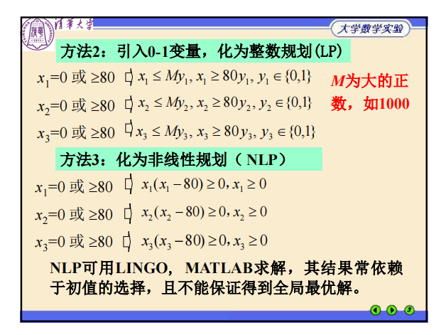


### ch03 插值与数值积分

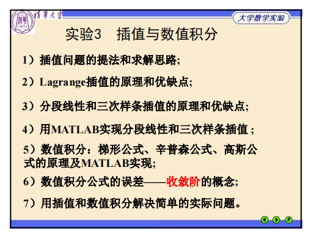

1. 插值问题

   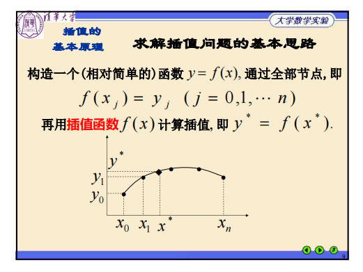

2. 拉格朗日多项式插值

   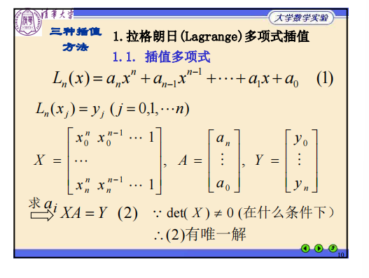

   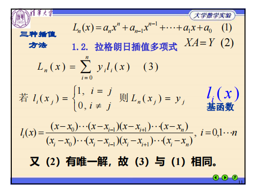

   缺点：龙格现象，震荡，不收敛

   误差估计

   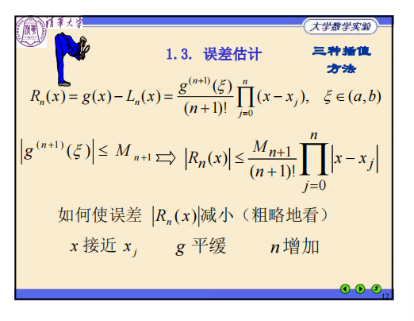

3. 分段线性插值

   

   三次样条插值

   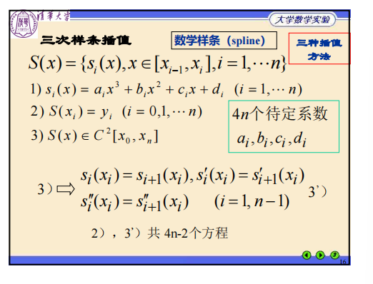

   对比

   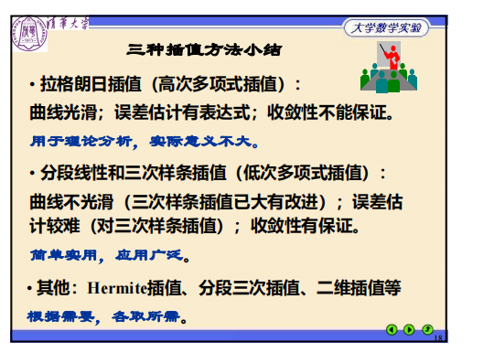

4. lagrange 编写函数，interp1，spline

5. 梯形公式 2 阶收敛（误差是 $h^2$ 阶的），辛普森公式 4 阶收敛

   梯形公式 代数精度 1，辛普森公式代数精度 3

   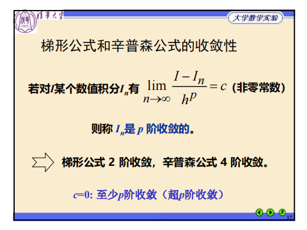

6. trapz(x,y) 梯形公式，integral(fun, xmin, xmax) 自适应辛普森公式

   AbsTol, 1e-6 精确到小数点后 6 位

   RelTol, 1e-10 计算结果 10 位有效数字


### ch04 常微分方程数值解

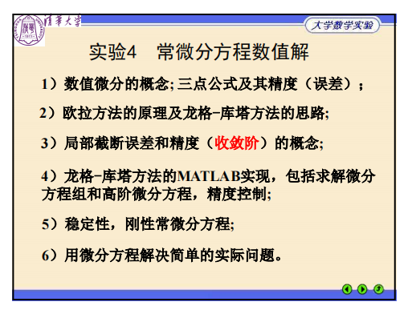

1. 导数：前差/后差公式误差是 $h$ 阶的，中点公式误差是 $h^2$ 阶的

2. 欧拉公式：向前/向后欧拉公式是 1 阶的，梯形/修正欧拉公式是 1 阶的，龙格-库塔公式是 4 阶的

   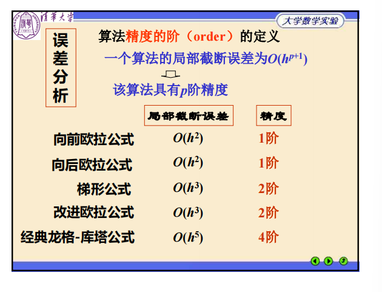

3. 算法稳定的条件

   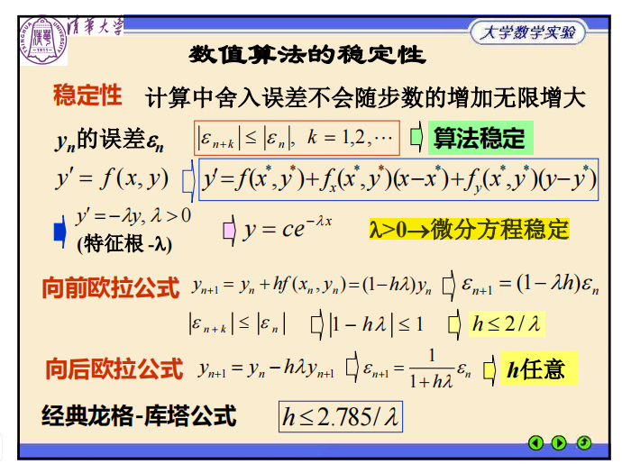

   1. 向前欧拉公式：步长 $h\le 2/\lambda$
   2. 龙格-库塔公式：步长 $h\le 2.785/\lambda$


### ch05 线性代数方程组的数值解法

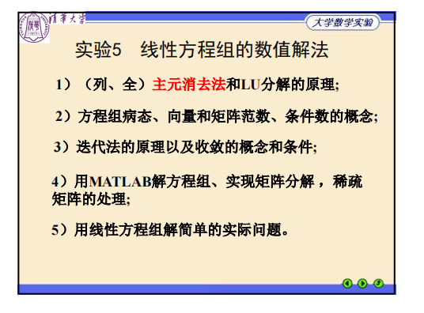

1. 直接法（主元消去法）

   高斯消元法：复杂度 $O(n^3)$

   列主元消去法：增加稳定性，提升精度

   1. A 可逆且顺序主子式 $\ne$ 0：直接法可解，$A = LU$ 

      高斯消元法和 LU 分解的等价性：消元相当于左乘单位下三角阵

      ```matlab
      x=A\b,
      [L,U]=lu(A); % A=L*U
      ```

   2. A 可逆：列主元消去法可解，$PA = LU$（P 为行置换阵）

      ```matlab
      [L,U,P]=lu(A);  % A=inv(P)*L*U
      ```

   3. A 正交对称：$A = LL^T = U^TU$

      ```matlab
      U=chol(A);
      ```

2. 迭代法

   1. Jaccobi 迭代 & Gauss-Sedeil 迭代：

      ```matlab
      A=[10 3 1;2 -10 3;1 3 10]
      b=[14 -5 14]';
      L=-tril(A,-1);
      U=-triu(A,1);
      D=diag(diag(A));
      
      % Jaccobi迭代
      B1=D\(L+U);
      f3=norm(B1), % 范数，谱半径小于范数
      f31=max(abs(eig(B1))), % 谱半径小于1，收敛
      f1=D\b;
      x=zeros(3,1)
      for i=1:5 % 迭代5次
         x=B1*x+f1;
      end
      x
      
      % Gauss-Sedeil迭代
      B2=(D-L)\U;
      f4=norm(B2), % 范数
      f41=max(abs(eig(B2))), % 谱半径
      f2=(D-L)\b;
      y=zeros(3,1);
      for i=1:5
         y=B2*y+f2;
      end
      y
      ```

   2. 收敛条件：

      1. 充要条件：谱半径（最大的特征值的绝对值）< 1

         ```matlab
         f1=max(abs(eig(B1)));   % 矩阵B1的谱半径
         f2=norm(B2);  % 谱半径<范数，2-范数<1是收敛的充分条件
         ```

      2. A 严格对角占优：Jaccobi 和 Gauss-Sedeil 迭代均收敛

      3. A 对称正定：Gauss-Sedeil 迭代收敛

   3. SOR 超松弛迭代：A 对称正定，$0<\omega<2$ 时收敛

      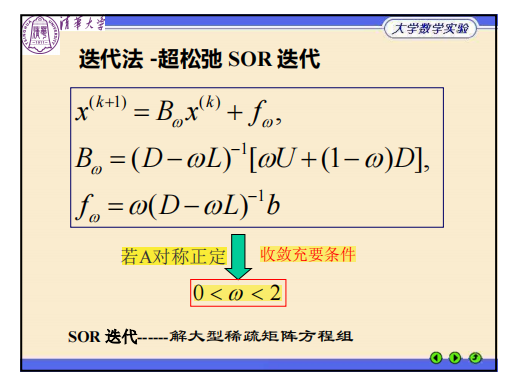

3. 病态：条件数大的矩阵

   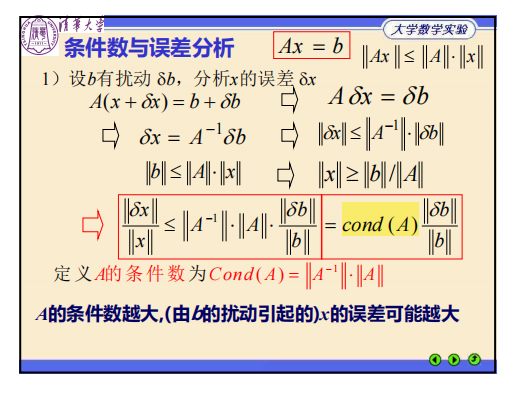

   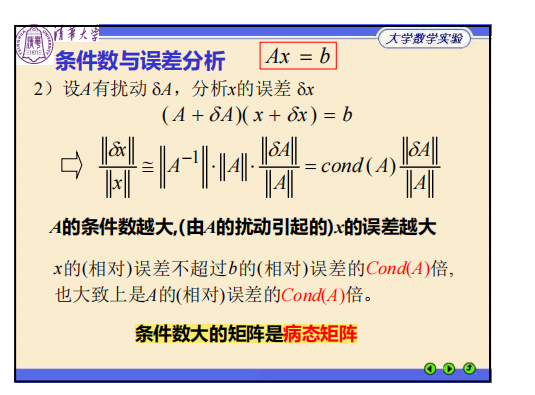

   ```matlab
   n1=cond(H);  % 矩阵H的条件数
   n2=rcond(H);  % 条件数的倒数
   ```

4. 稀疏矩阵

   ```matlab
   a1=sparse(1:n,1:n,4,n,n);
   a2=sparse(2:n,1:n-1,1,n,n);
   a=a1+a2+a2';
   aa=full(a);
   ```


### ch06 非线性方程组的解

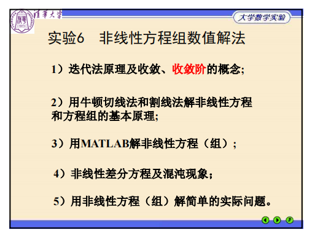

1. 迭代法

   全局收敛性：

   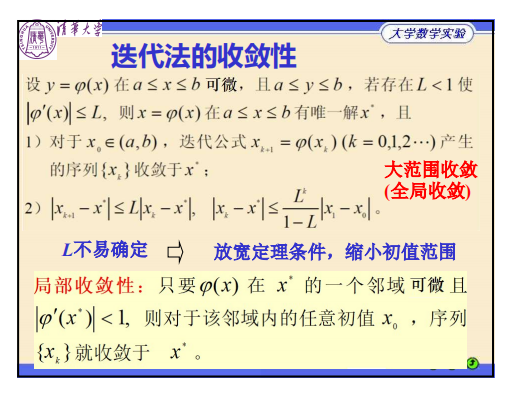

   局部收敛性 & 收敛阶：

   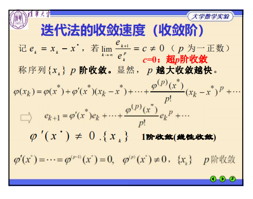

   - 收敛阶越高，收敛越快

2. 牛顿切线法：

   - $x^*$ 为单根时，2 阶收敛
   - $x^*$ 为重根时，1 阶收敛（重数越高，收敛越慢）

3. 牛顿割线法：收敛阶为 1.618


### ch07 无约束优化


### ch08 线性规划

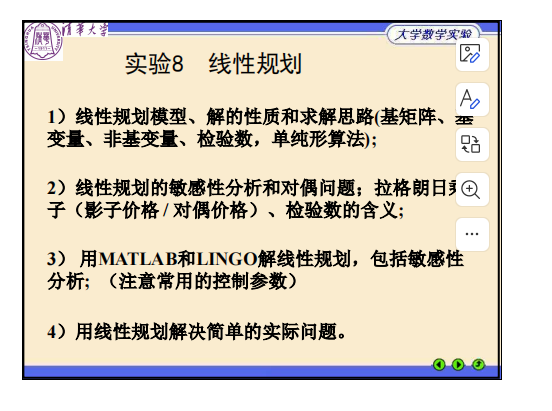

1. 可行解，最优解，可行域

   - 可行域是凸多面体
   - 若最优解存在，一定存在可行域顶点为最优解
   - 基可行解，基变量，非基变量

2. 单纯形法

   1. 检验数 r = [$0$, $c_N^T-c_B^TA_B^{-1}A_N$]

      $r < 0$：非最优解，$r \ge 0$：最优解

   2. 选择出基变量

      梯度 $d$ = [$-A_B^{-1}p_q$,  $e_q$]

   3. 选择进基变量

      步长 $\alpha$ = min$\{-\frac{x_j}{d_j}, d_j < 0\}$

3. 拉格朗日乘子 $\lambda$ = $c_B^TA_B^{-1}$

   $\Delta z$ = $\lambda ^T\Delta b$

4. 对偶问题

   - 弱对偶定理：
     1. 对偶问题可行解 $\lambda$，原问题可行解 $x$，则满足 $b^T\lambda \le c^Tx$
     2. 对偶问题可行解 $\lambda$，原问题可行解 $x$ 满足 $b^T\lambda = c^Tx$，则为最优解
   - 强对偶定理
   - 互补松弛条件


### ch09 非线性规划

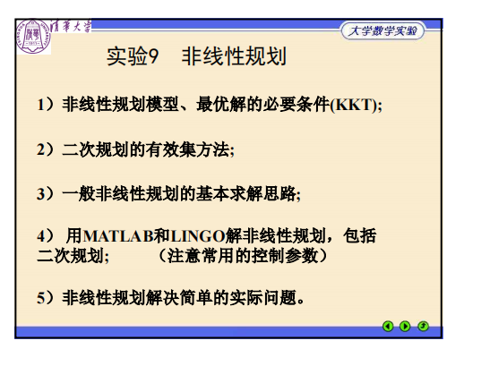

1. KKT  条件（最优解的必要条件）

   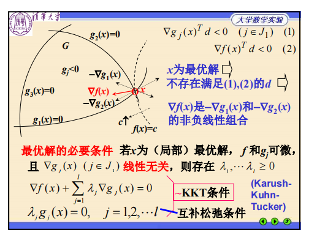

   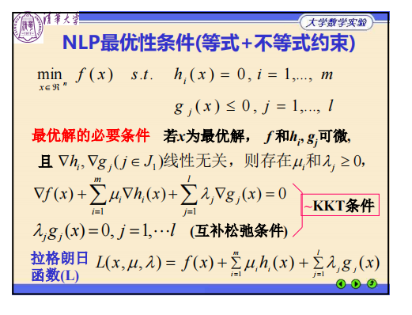

   最优解处，拉格朗日函数的导数为 0

2. 二次规划的有效集方法

   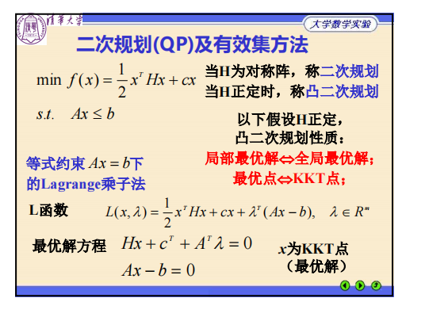

   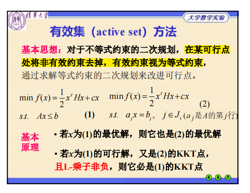


### ch10 整数规划

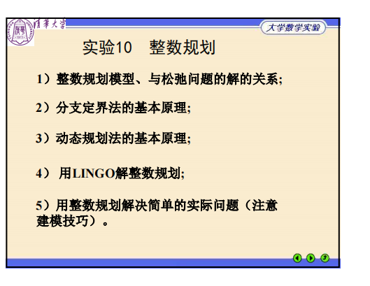


### ch11 数据统计与分析

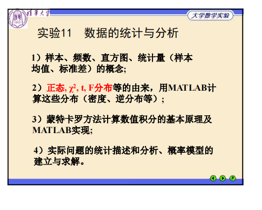

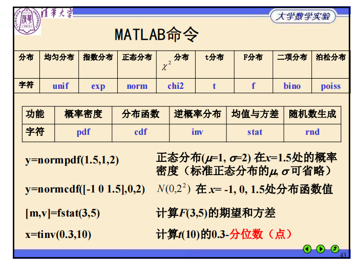


蒙特卡罗方法计算数值积分：

1. 随机投点法

2. 均值估计法

   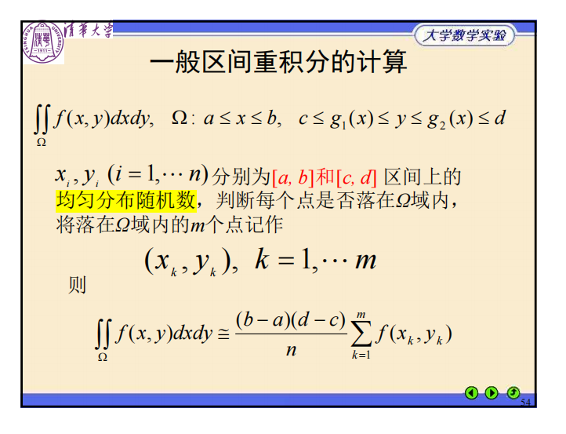

   


### ch12 统计推断

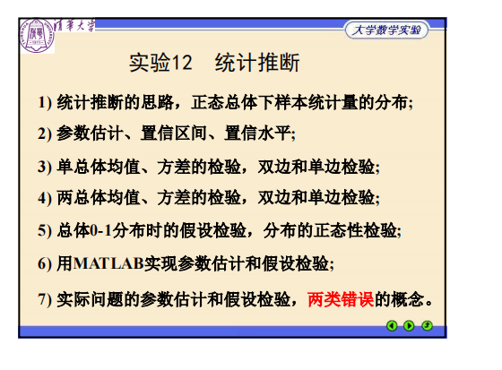

1. 显著性水平 $\alpha$ = 第一类错误（错误地拒绝）的概率
2. 第二类错误（错误地接受）的概率 $\beta$ 


### ch13 回归分析

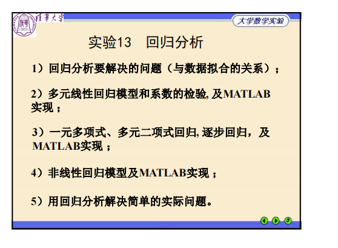


