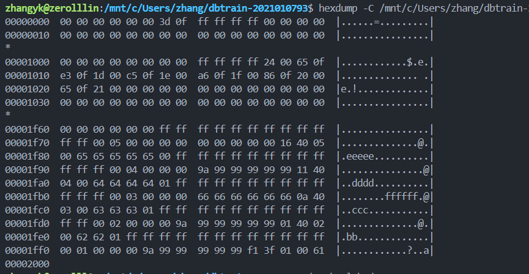
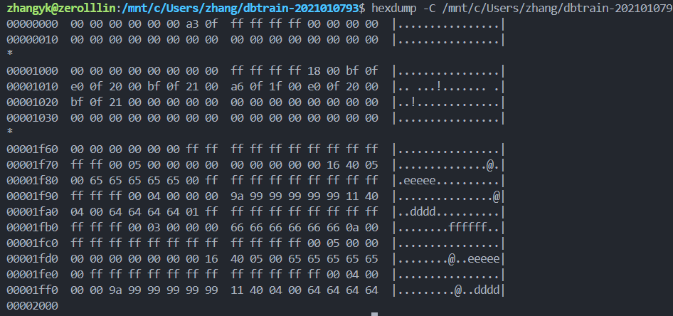
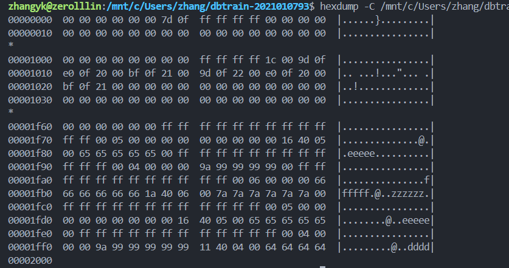
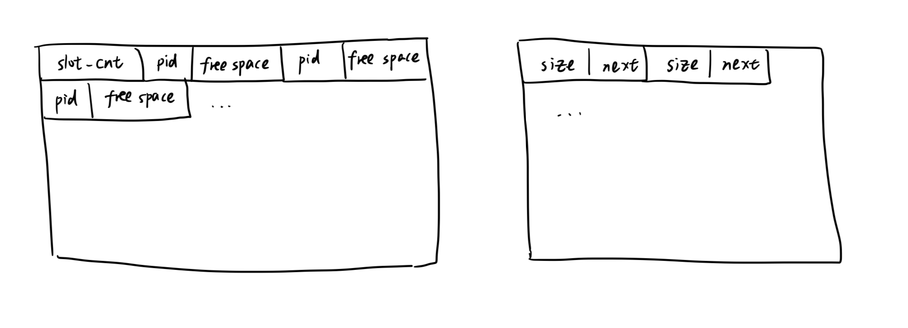

### lab1实验报告

张一可 2021010793 计15

#### 基础功能实现思路与难点总结

基础功能对应的 commit id 为 4d03e85b9304278700c1bc4d2649234dfba72b9c

##### 如何寻找记录插入的页面

在 `Table::InsertRecord` 函数中，通过 `first_page_id_` 以及每个页面头部存储的 `next_page_id_` 遍历表中所有页面，通过 `TablePage::GetFreeSpaceSize` 方法得到页面的空闲空间大小，若页面空闲空间大于 **插入记录大小 + 一个 `Slot` 结构的大小**，则说明页面中可以插入这条记录。在页面中插入记录，并返回由页面 `page_id` 和插入记录位置 `slot_id` 组成的 `Rid` 标识。

若遍历所有页面后，都无法找到可以插入记录的页面，则通过 `BufferPool::NewPage` 申请新页面，初始化 `TablePage` 对象记录页面信息，并在该页面中插入记录。

##### 页面内部记录的管理

数据表中每个页面的构成如下图所示：


其中，定长的页面头包含记录的操作序列号 `page_lsn_`，下一页面的 id` next_page_id_`，页面 Slot 部分结束位置的偏移量 `lower_`，页面数据部分开始位置的偏移量 `upper_` 四个变量，`lower_` 和 `upper_` 之间为页面的空闲部分。

对于每条插入的记录，采用”两头挤“的方式，在页面头部插入记录记录偏移量和大小的 `Slot` 结构，在页面尾部插入记录的数据部分。上图中即为依次插入 `Record[0]`，`Record[1]`，`Record[2]` 三条记录后的结果。

##### 记录的读取策略

`TableScan::GetNextRecord` 实现了以流水线方式读取数据表中的所有记录。在读取记录时，依次遍历数据表中的每个页面，在每个页面中遍历其中的所有 slot，并在 `TableScan` 中的 `Rid` 成员变量 `rid` 记录并更新当前遍历到的位置。根据遍历到的位置和记录的状态，进行相应处理：

1. 遍历到页面中的最后一条记录，将 `rid.page_id` 更新为当前页面的下一页面，即页面头存储的 `next_page_id_`，将 `rid.slot_id_` 更新为 0
2. 遍历到数据表中的最后一个页面，即 `rid.page_id == NULL_PAGE_ID` 时，返回 `nullptr`
3. 当前记录已被删除，递归调用 `GetNextRecord`，忽视当前 slot 的无效记录

##### LRU 缓存替换算法的实现

```c++
class LRUBufferStrategy : public BufferStrategy {
 private:
  size_t capacity;
  std::list<size_t> lru_list;
  std::unordered_map<int, std::list<size_t>::iterator> lru_map;
};
```

如上代码所示，采用一个 `std::list<size_t>` 结构存储 buffer 中的所有页面列表，采用 `std::unordered_map<int, std::list::iterator>` 结构存储页面 id 到其在页面列表中位置的映射。

更新 buffer 中页面时，如果新访问的页面在 buffer 中，则将其从 `lru_list` 访问列表中移除，并在列表的首部插入，并更新 `lru_map` 的映射关。如页面不在 buffer 中，也在列表首部插入该页面，更新 `lru_map` 的映射关系。

需要从 buffer 中移除一个页面时，移除 `lru_list` 列表末尾的页面，即访问时间据当前最远的页面，并移除 `lru_map ` 中该页面对应的映射关系。

```c++
void LRUBufferStrategy::Access(size_t frame_no) {
  if (lru_map.find(frame_no) != lru_map.end()) {
    lru_list.erase(lru_map[frame_no]);
  }
  lru_list.push_front(frame_no);
  lru_map[frame_no] = lru_list.begin();
};

size_t LRUBufferStrategy::Evict() {
  size_t rst = lru_list.back();
  lru_list.pop_back();
  lru_map.erase(rst);
  return rst;
}
```

##### 遇到的难点及解决

GetRecord 的时候 record 的 rid 不是 deserialize 的，而需要手动设置，在这个上卡了一段时间。希望实验报告可以引导我们在完成实验前看一遍 Record 数据结构的成员变量和 Serialize，Deserialize 操作。

#### 垃圾回收功能的设计与实现

commid id 为 f60543a54917aa5a9cd45683fc04c83031fefff3

##### 设计思路与示意图

对于每个页面进行垃圾回收时，我从后往前扫面所有记录（即依次扫描 `sid` 从 slot_cnt -1 递减到 0 的所有记录）并标记已经被删除记录的 id 起始位置，以及对应记录所在位置的偏移量范围。对于每一段可以被回收的连续删除记录，根据回收带来的空间收益（删除记录的大小 `total_size` ）和回收所需的额外 IO（需要挪动记录的大小 `start_pos - *upper_` ）考虑是否进行该区间内的垃圾回收。

若进行回收，则向后移动删除区间前的记录，向前移动删除区间后的 slot，并更新区间后 slot 的 offset 。如下图所示，删除 `Record[1]` 和 `Record[2]` 后，需要向后移动 `Record[4]` 和 `Record[3]`，向前移动 `Slot[4]` 和 `Slot[3]`，并更新 `Slot[3]` 和 `Slot[4]` 的 offset 。


##### 核心代码实现

在 `DatabaseEngine::ExecuteSql ` 中扫描的 Vacuum 语句时，执行数据表的 Vacuum 操作，遍历所有表中页面，依次对每个页面进行垃圾回收，并在空闲空间存储页面中更新页面的空闲空间大小：

```c++
void Table::Vacuum() {
  auto pid = first_page_id_;
  pageid_t last_page = NULL_PAGE_ID;
  while (pid != NULL_PAGE_ID) {
    auto page = buffer_pool_.GetPage(db_oid_, oid_, pid);
    auto table_page = std::make_shared<TablePage>(page);
    table_page->Vacuum(); // 对每个页面依次清理空余空间
    // 由于后续改为采取空闲空间链表管理各页面的空闲空间大小，这里不再进行空页面的删除
    // 更新空闲空间链表中的值
    SetSize(pid, table_page->GetFreeSpaceSize());
    pid = GetNextPageId(pid);
  }
}
```

页面的 Vacuum 操作如下，依次扫描所有记录得到可以回收的记录范围。如果可以进行回收的记录空间总大小 `total_size` 大于阈值 `VACUUM_BOUNDARY` 且所需移动记录的大小 `move_size` 小于 `VACUUM_MOVE_UPPER_BOUND`，就移动数据，更新 Slot 完成垃圾回收操作。

```c++
void TablePage::Vacuum() {
  int slot_cnt = (*lower_ - RECORD_HEADER_SIZE)/sizeof(Slot);
  db_size_t total_size = 0, start_pos;
  int start_id;
  // 从后向前遍历记录，找到已删除记录的区间范围
  for(int sid = slot_cnt - 1; sid >= -1; sid--) {
    bool deleted = false;
    char* slot_pos = page_data_ + PAGE_HEADER_SIZE + sid * sizeof(Slot);
    if (sid >= 0) {
      Slot* slot = reinterpret_cast<Slot *>(slot_pos);
      char* pos = page_data_ + slot->offset_;
      auto rcd = std::make_shared<Record>();
      rcd->DeserializeHeaderFrom(pos);
      if (rcd->IsDeleted()) {
        if (total_size == 0) { // 标记删除的起始位置
          start_id = sid;
          start_pos = slot->offset_;
        }
        total_size += slot->size_; // 删除记录的总大小
        deleted = true;
      }
    }
    if (!deleted) { // 当前记录未被删除，或已经遍历到最后一条记录(sid=-1)
      auto move_size = start_pos - *upper_;
      if (total_size >= VACUUM_BOUNDARY /*删除记录的大小*/ && move_size <= VACUUM_MOVE_UPPER_BOUND /*所需挪动的范围大小*/) {
        memcpy(page_data_ + *upper_ + total_size, page_data_ + *upper_, move_size); // 挪动记录
        auto id = start_id;
        auto other_pos = page_data_ + PAGE_HEADER_SIZE + id * sizeof(Slot);
        while(++id < slot_cnt) { // 更新挪动位置后所有slot的offset
          other_pos += sizeof(Slot);
          Slot* other_slot = reinterpret_cast<Slot *>(other_pos);
          other_slot->offset_ += total_size;
        }
        auto start_slot = page_data_ + PAGE_HEADER_SIZE + (start_id + 1) * sizeof(Slot);
        memcpy(slot_pos + sizeof(Slot), start_slot, sizeof(Slot)*(slot_cnt - start_id - 1)); // 挪动slot
        slot_cnt -= (start_id - sid); 
        *upper_ += total_size; // 更新页面头部信息
        *lower_ -= sizeof(Slot) * (start_id - sid);
      }
      total_size = 0;
    }
  }
  page_->SetDirty();
}
```

##### 正确性演示

在 lab1/10-50.test 文件的任意位置插入 Vacuum 指令，都可以正确通过测试。额外设计 lab1/60-vacuum.test 测例，验证垃圾回收功能的正确性。首先在数据表中插入 5 条记录，并删除前 3 条：

```sql
statement ok
create table test_insert(id int, score double, info varchar(20));

query
insert into test_insert values(1, 1.1, 'a'), (2, 2.2, 'bb'), (3, 3.3, 'ccc'), (4, 4.4, 'dddd'), (5, 5.5, 'eeeee');
----
5

query
delete from test_insert where id <= 3;
----
3
```

利用 hexdump 看到我们插入记录的存储情况：



进行 Vacuum 操作，可以看到后 3 条记录被向后移动，说明垃圾回收成功，并可以成功读取记录：

```sql
query
vacuum;
----
Vacuum

query
select * from test_insert;
----
4 4.4 dddd 
5 5.5 eeeee 
```



再在表中插入新记录，看到插入记录的位置在页面中未删除记录前面，说明我们利用被回收的空间：

```sql
query
insert into test_insert values(6, 6.6, 'zzzzzz');
----
1
```



##### 垃圾回收效率

在数据表中插入 2000 条记录，然后删除其中的 1200 条，执行垃圾回收操作，设置不同的 `VACUUM_BOUNDARY` 和 `VACUUM_MOVE_UPPER_BOUND` 参数，查看执行 Vacuum 操作所需时间：

| VACUUM_BOUNDARY | VACUUM_MOVE_UPPER_BOUND | Vacuum time |
| --------------- | ----------------------- | ----------- |
| 64              | 256                     | 0.0039 秒   |
| 64              | 512                     | 0.0052 秒   |
| 32              | 512                     | 0.0083 秒   |
| 64              | 1024                    | 0.0054 秒   |

可以看到根据这两个阈值的设定会影响 IO 开销以及回收空间的大小。 `VACUUM_BOUNDARY` 越小或  `VACUUM_MOVE_UPPER_BOUND` 越大，Vacuum 操作回收空间越多，相应的 IO 开销越大。具体情况需要依数据表页面大小，操作数据特征等情况而定。

#### 空闲空间管理功能的设计与实现

commit id 为 f60543a54917aa5a9cd45683fc04c83031fefff3

##### 设计思路与示意图

在内存中存储空闲空间数组时，我采用 `std::unordered_map` 存储页面 id 到对应的空闲空间大小的映射，在插入记录时对其遍历找到空间足够的页面，并进行相应的更新维护，即下图左边所示的列表结构：



考虑把空闲空间数组存储到数据表页面中时，我将其实现为右边的链表结构。即某一页面的 Slot 存储位置由其下标决定，Slot 中存储了改页面的空闲空间大小 `size` 和下一页面的下表 `next`，由此便可依次遍历表中所有页面，找到插入记录时空间足够的页面。

我将空闲空间链表页面存储在数据表文件的第一页，而记录页面则相应后移。这样实现会导致 buffer pool 打开的页面数量增加，无法通过 lab1/50 测试。

##### 核心代码实现

为 `Table` 类增加新的成员变量：

```c++
class Table {
 private:
  std::shared_ptr<Page> free_space_;  // 将第一页作为空闲空间数组页面
  char* free_space_page_; // 第一页的页首位置
  pageid_t FindNextPid(); // 找到下一个可用的页面id
};
```

增加 `Table` 类的新方法，得到页面的空余空间大小值和链表中的下一页面。

```c++
pageid_t Table::GetNextPageId(pageid_t pid) { 
  return *reinterpret_cast<pageid_t*>(free_space_page_ + pid * FREE_SPACE_ITEM_SIZE + sizeof(db_size_t));
}

db_size_t Table::GetSize(pageid_t pid) {
  return *reinterpret_cast<db_size_t*>(free_space_page_ + pid * FREE_SPACE_ITEM_SIZE); 
}

void Table::SetNextPageId(pageid_t pid, pageid_t value) {
  auto pos = reinterpret_cast<pageid_t*>(free_space_page_ + pid * FREE_SPACE_ITEM_SIZE + sizeof(db_size_t));
  *pos = value;
  free_space_->SetDirty();
}

void Table::SetSize(pageid_t pid, db_size_t value) {
  auto pos = reinterpret_cast<db_size_t*>(free_space_page_ + pid * FREE_SPACE_ITEM_SIZE); 
  *pos = value;
  free_space_->SetDirty();
}
```

遍历表中页面，插入记录的过程变为：

```c++
Rid Table::InsertRecord(std::shared_ptr<Record> record, xid_t xid, cid_t cid, bool write_log) {
  if (record->GetSize() > MAX_RECORD_SIZE) {
    throw DbException("Record size too large: " + std::to_string(record->GetSize()));
  }
  pageid_t insert_page_id;
  bool find = false, need_init = false;
  if (first_page_id_ == NULL_PAGE_ID) { // 在表中插入第一条记录
    insert_page_id = first_page_id_ = 1;
    SetNextPageId(1, NULL_PAGE_ID);
    find = true;
    need_init = true;
  }
  pageid_t pid = 1;
  if (!find) {
    while(true) {
      if (GetSize(pid) >= record->GetSize() + sizeof(Slot)) { // 找到足够插入记录的页面
        insert_page_id = pid;
        find = true;
        break;
      }
      auto next_pid = GetNextPageId(pid); // 得到链表中的下一个页面id
      if (next_pid == NULL_PAGE_ID) 
        break;
      pid = next_pid;
    }
  }
  if (!find) { // 需要新页面
    insert_page_id = FindNextPid();
    SetNextPageId(pid, insert_page_id); // 更新链表
    SetNextPageId(insert_page_id, NULL_PAGE_ID);
    need_init = true;
  }
  std::shared_ptr<Page> page;
  if (need_init) 
    page = buffer_pool_.NewPage(db_oid_, oid_, insert_page_id);
  else
    page = buffer_pool_.GetPage(db_oid_, oid_, insert_page_id);
  auto table_page = std::make_shared<TablePage>(page);
  if (need_init)
    table_page->Init();
  auto sid = table_page->InsertRecord(record, xid, cid);
  SetSize(insert_page_id, table_page->GetFreeSpaceSize()); // 更新页面的空余空间大小
  return {insert_page_id, sid};
}
```

在删除和更新记录时，无需更新页面的空余空间大小。而在页面进行 Vacuum 清理操作后，需要调用上述 `SetSize` 方法更新页面的空闲空间大小。

##### 效果演示

实现该功能后，可以通过 lab1/10-40.test 所有测例。构造测例 lab1/70-insert_1000.test，并更改 `DatabaseEngine::ExecuteSql` 的实现，记录 page size = 4096 时，插入 1000, 2000, 3000, 4000 条记录所需的时间如下：

|                      | 插入1000条记录              | 插入2000条记录              | 插入3000条记录              | 插入4000条记录              |
| -------------------- | --------------------------- | --------------------------- | --------------------------- | --------------------------- |
| 采用基础功能实现     | 0.517 秒<br />0.052 秒/百条 | 1.694 秒<br />0.085 秒/百条 | 3.312 秒<br />0.110 秒/百条 | 5.271 秒<br />0.132 秒/百条 |
| 采用空闲空间链表页面 | 0.241 秒<br />0.024 秒/百条 | 0.564 秒<br />0.028 秒/百条 | 0.859 秒<br />0.028 秒/百条 | 1.135 秒<br />0.028 秒/百条 |

可以看到空闲空间管理页面的实现使得记录的插入过程更加高效了，因为我们无需将每个数据页都拿到内存中，就可以找到具有足够空闲空间的页面，完成记录插入。

#### 实验耗时

基础功能用时2小时左右，垃圾回收和空闲空间管理功能各用时4小时左右。报告用时3小时左右。

#### Honor Code

1. 我在完成作业的过程中没有抄袭他人代码，如果和他人进行过实现思路的讨论，或参考借鉴了他人的实现思路，我会在报告中写明。
2. 我没有使用 GitHub Copilot、ChatGPT 等工具进行代码自动补全。
3. 我不会将本人代码放于任何公开仓库。