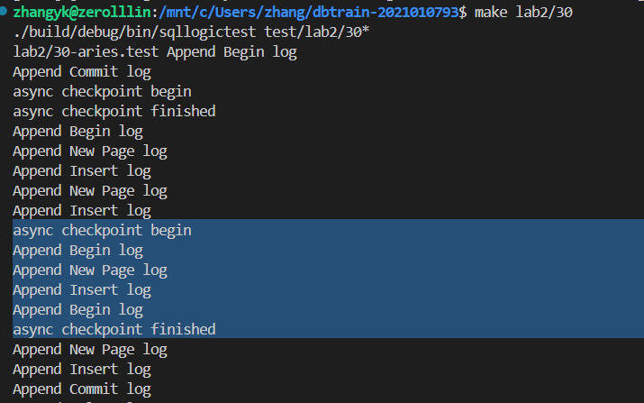

### lab2 实验报告

张一可 计15 2021010793

#### 基础功能设计与实现

commit id 为 0002a612ef0d26736298c8ab217fcfb47977433f

##### ARIES 算法实现

ARIES 算法的实现过程为：

1. Analyze 阶段，通过扫描日志重建活跃事务表 att\_ 和脏页表 dpt\_ ，脏页表记录了每个页面首次被修改的日志 lsn，用于决定 Redo 的起始 lsn 位置，活跃事务表记录了未提交 Commit 的事务 xid 集合，我们需要在 Undo 阶段撤回这些事务对数据表进行的操作。

   具体来说，根据扫描到的日志种类，做相应处理：

   - 扫描到 EndCheckpoint 日志，将 att\_，dpt\_ 恢复为 EndCheckpointLog 记录的值
   - 扫描到 Commit 日志，从活跃事务表 att_ 中删除对应的事务 id
   - 扫描到其它类型日志，更新 att_ 中事务 xid 对应的 lsn，从而找到事务 xid 对应的 LastLSN，从该记录开始沿 prev_lsn 依次执行事务的 Rollback
   - 扫描到对数据表进行操作的 InsertLog，DeleteLog 和 NewPageLog，若对应的数据表页面还不在 dpt_ 中，则增加 dpt_ 中对应数据表页面到相应操作 lsn 的映射

2. Redo 阶段，找到 dpt_ 集合中的最小 lsn，从此 lsn 开始依次扫描所有记录完成 Redo

3. Undo 阶段，从 att_ 集合中的每个事务的 last_lsn 向前依次 rollback

##### 难点与疑问

在高级功能一的实现过程中，我对于实验实现的 Redo 和 Undo 操作的幂等性、以及执行 Redo 和 Rollback 后的刷盘时机存在疑问。一方面，采用物理日志，Undo 和 Redo 操作都可以是幂等的，多执行几次 Undo 似乎也没有问题。另一方面，如果我直到事务的 Rollback 完全执行完成后再刷盘，即使 Undo 操作并不幂等，对应结果也不会被保留下来，再重新执行一遍 Redo 和 Undo 是不是也可以。

#### 高级功能一：利用 CLR 处理 Undo 过程中的 crash

commit id 为 8ba1c497c04c455ee6ef48b04802ce4e461dbf86

##### 功能设计与实现

设计 CLR 日志数据结构，继承自 LogRecord 类，记录事务 id，下一次 Undo 的开始位置 undo_next_lsn，在每条记录的 Undo 时调用 AppendCLRLog 将 CLR 日志写入磁盘。

在 Recover 过程中，根据可能发生故障的情况做相应处理：

1. 如果**在 Redo 中途 crash**，我们不管，因为 Redo 是幂等的
2. 如果 **Undo 进行到一半时 crash**，无需再次 Redo，根据 CLR 日志判断从何时继续 Undo

因此，可以增加 **std::set<xid_t> no_redo_** 结构记录**已经执行完 Undo 或者在执行 Undo 过程中发生故障的日志**，这些日志无需再次 Redo，而其 Undo 的位置可以通过 CLR 日志获取。在 Analyze 的扫描过程中，在重建 att_ 和 dpt_ 的同时，增加如下处理：

1. 若扫描到 CLR 日志，且之后不存在该 xid 对应的其他日志，则表明是在该事务已经完成 Undo 或在最后一次 Undo 的过程中发生故障，无需 Redo，将 att_[xid] 设为 CLR 日志的 undo_next_lsn，作为继续 Undo 的位置
2. 否则，若 CLR 之后还存在其他日志，说明不是在 Undo 的过程中发生故障，需要进行对应 xid 事物的 Redo，即需从 `no_redo_` 集合中移除事务 xid 

##### 关键代码

对应的 Analyze 部分代码如下：

```c++
while (lsn != next_lsn_) {
    disk_.ReadLog(lsn, MAX_LOG_SIZE, data);
    auto log = LogRecord::DeserializeFrom(lsn, data);
    auto log_xid = log->GetXid();
    // std::cout << log->ToString() << "\n";
    if (log_xid != NULL_XID && log_xid > nxt_xid) 
    // 记录最大的事务xid，恢复transaction_manager_的next_xid
      nxt_xid = log_xid;
    if (auto end_ckpt = std::dynamic_pointer_cast<EndCheckpointLog>(log)) { 
      // 从CheckpointLog恢复att_和dpt_
      att_ = end_ckpt->GetATT();
      dpt_ = end_ckpt->GetDPT();
    }
    else if (auto commit_log = std::dynamic_pointer_cast<CommitLog>(log)) { 
        // 已经Commit的事务无需Undo
        if (att_.find(log_xid) != att_.end())
            att_.erase(log_xid);
    }
    else if (auto clr = std::dynamic_pointer_cast<CLR>(log)) {
        if (clr->GetUndoNextLSN() != NULL_LSN)
            // 从CLR恢复Undo的起始位置
            att_[log_xid] = clr->GetUndoNextLSN();
        else
            // 已经完成事务的全部Undo
            att_.erase(log_xid);
        // 标记对应事务无需Redo
        no_redo_.insert(log_xid);
    }
    else if (log_xid != NULL_XID)
        // 将att_中的值设为事务的LastLSN
        att_[log_xid] = log->GetLSN();
    if (auto insert_log = std::dynamic_pointer_cast<InsertLog>(log)) {
        TablePageid table{insert_log->GetOid(), insert_log->GetPageId()};
        if (dpt_.find(table) == dpt_.end())
            // 在脏页表中标记最先对页面执行处理的lsn
            dpt_[table] = lsn;
        if (no_redo_.find(log_xid) != no_redo_.end())
            // 在CLR后还有对数据表的操作,需要Redo
            no_redo_.erase(log_xid);
    }
    else if (auto delete_log = std::dynamic_pointer_cast<DeleteLog>(log)) {
        TablePageid table{delete_log->GetOid(), delete_log->GetPageId()};
        if (dpt_.find(table) == dpt_.end())
            dpt_[table] = lsn;
        if (no_redo_.find(log_xid) != no_redo_.end())
            no_redo_.erase(log_xid);
    }
    else if (auto new_page_log = std::dynamic_pointer_cast<NewPageLog>(log)) {
        TablePageid table{new_page_log->GetOid(), new_page_log->GetPageId()};
        if (dpt_.find(table) == dpt_.end())
            dpt_[table] = lsn;
        if (no_redo_.find(log_xid) != no_redo_.end())
            no_redo_.erase(log_xid);
    }
    lsn += log->GetSize();
}
transaction_manager_.SetNextXid(nxt_xid+1);
```

##### 测例设计与正确性说明

利用 30-aries 测例，在 xid = 3 的事务 Rollback 过程中的两次 Undo 之间使系统崩溃，通过打印 Analyze 得到的所有日志和 Undo 的事务 lsn，可以观察到我们正确记录了 CLR 日志，跳过了 xid = 3 事物的 Redo，并从 CLR 日志的 undo_next_lsn 处继续完成该事务的 Undo，成功地完成了 Undo 过程中的故障恢复。

```
----1st time of crash----
BeginCheckpointLog      [lsn: 595       size: 13        xid: 4294967295 prev_lsn: 18446744073709551615]
EndCheckpointLog        [lsn: 608       size: 73        xid: 2  prev_lsn: 18446744073709551615 att: {(2: 363) } dpt: {(10001, 0: 81) (10001, 1: 338) }]
BeginLog                [lsn: 681       size: 13        xid: 3  prev_lsn: 18446744073709551615]
NewPageLog              [lsn: 694       size: 25        xid: 2  prev_lsn: 363   oid: 10001      prev_page_id: 1 page_id: 2]
InsertLog               [lsn: 719       size: 232       xid: 2  prev_lsn: 694   oid: 10001      page_id: 2      slot_id: 0      page_offset: 51 record_size: 205]
BeginLog                [lsn: 951       size: 13        xid: 4  prev_lsn: 18446744073709551615]
NewPageLog              [lsn: 964       size: 25        xid: 4  prev_lsn: 951   oid: 10001      prev_page_id: 2 page_id: 3]
InsertLog               [lsn: 989       size: 232       xid: 4  prev_lsn: 964   oid: 10001      page_id: 3      slot_id: 0      page_offset: 51 record_size: 205]
CommitLog               [lsn: 1221      size: 13        xid: 2  prev_lsn: 719]
DeleteLog               [lsn: 1234      size: 23        xid: 3  prev_lsn: 681 oid: 10001        page_id: 1      slot_id: 0]
DeleteLog               [lsn: 1257      size: 23        xid: 4  prev_lsn: 989 oid: 10001        page_id: 0      slot_id: 0]
CommitLog               [lsn: 1280      size: 13        xid: 4  prev_lsn: 1257]
--<< Rollback lsn 1234 >>--
----2nd time of crash----
BeginCheckpointLog      [lsn: 595       size: 13        xid: 4294967295 prev_lsn: 18446744073709551615]
EndCheckpointLog        [lsn: 608       size: 73        xid: 2  prev_lsn: 18446744073709551615 att: {(2: 363) } dpt: {(10001, 0: 81) (10001, 1: 338) }]
BeginLog                [lsn: 681       size: 13        xid: 3  prev_lsn: 18446744073709551615]
NewPageLog              [lsn: 694       size: 25        xid: 2  prev_lsn: 363   oid: 10001      prev_page_id: 1 page_id: 2]
InsertLog               [lsn: 719       size: 232       xid: 2  prev_lsn: 694   oid: 10001      page_id: 2      slot_id: 0      page_offset: 51 record_size: 205]
BeginLog                [lsn: 951       size: 13        xid: 4  prev_lsn: 18446744073709551615]
NewPageLog              [lsn: 964       size: 25        xid: 4  prev_lsn: 951   oid: 10001      prev_page_id: 2 page_id: 3]
InsertLog               [lsn: 989       size: 232       xid: 4  prev_lsn: 964   oid: 10001      page_id: 3      slot_id: 0      page_offset: 51 record_size: 205]
CommitLog               [lsn: 1221      size: 13        xid: 2  prev_lsn: 719]
DeleteLog               [lsn: 1234      size: 23        xid: 3  prev_lsn: 681 oid: 10001        page_id: 1      slot_id: 0]
DeleteLog               [lsn: 1257      size: 23        xid: 4  prev_lsn: 989 oid: 10001        page_id: 0      slot_id: 0]
CommitLog               [lsn: 1280      size: 13        xid: 4  prev_lsn: 1257]
CLRlog          [lsn: 1293      size: 21        xid: 3  prev_lsn: 1234  undo_next_lsn: 681]
--<< Rollback lsn 681 >>--
```

在第一次执行到 Rollback 的中途发生故障后，可以看到我们保存了一条 Undo 的 CLR 记录，对应的 undo_next_lsn 为 681，在第二次故障恢复的 Restart 过程中，att_[3] 的值被成功恢复为 681，并将 xid = 3 加入 no\_redo\_ 集合中，跳过了该事务的 Redo，接着上次故障处理的位置继续执行 Undo。

#### 高级功能二：异步 Checkpoint

commit id 为 8ba1c497c04c455ee6ef48b04802ce4e461dbf86

##### 功能设计与实现

修改 log_manager::Checkpoint() 函数，在 async 参数为 true 时，使用线程异步将 EndCheckpointLog 写入磁盘：

```c++
if (async) {
    std::thread thread([](LogManager* manager, lsn_t end_lsn) {
        std::cout << "async checkpoint begin\n";
        manager->Flush(end_lsn);
        std::cout << "async checkpoint finished\n";
    }, this, end_lsn);
    thread.detach();
}
```

##### 测例设计与正确性说明

将 log_manager::Checkpoint() 函数的 asycn 参数默认值改为 true，使用 30-aries 测例进行测试，在每次进行事务处理后，打印 append log 的信息，可以看到我们的 checkpoint 已经能在进行其他事务处理的同时异步完成：



由于日志文件写入磁盘时会上互斥锁，异步 checkpoint 机制无需我们改变 Analyze 的处理逻辑，日志的写入顺序并不会发生改变。

#### 实验用时

基础功能用时 4 小时左右，高级功能用时 4 小时左右。

#### Honor Code

1. 我在完成作业的过程中没有抄袭他人代码，如果和他人进行过实现思路的讨论，或参考借鉴了他人的实现思路，我会在报告中写明。
2. 我没有使用 GitHub Copilot、ChatGPT 等工具进行代码自动补全。
3. 我不会将本人代码放于任何公开仓库。