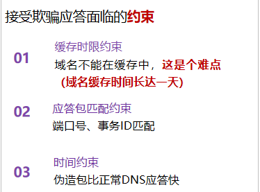
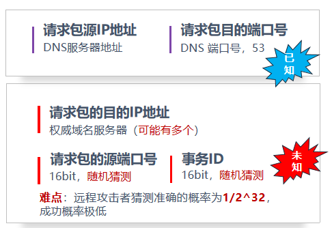

### DNS 缓存攻击

#### 本地缓存攻击

UDP包没有加密，攻击者可以在局域网直接捕获并解析请求，破译其中的 UDP 源端口号、请求事务 ID、请求问题等

#### 远程缓存攻击

**包头参数猜测**：

- 需要猜测 16bit 请求包的源端口号，16bit 事务 ID

**回复包负载构建**：

- 问题记录和回复记录的**名字应该与请求包相匹配**，否则记录不会被接受
- 授权记录，**域名必须和回复记录中的域名相关联**，否则授权记录会被忽视

利用数据包分片重组技术注入虚假分片（**基于 IPID 的攻击**）

- 攻击成功的前提是受害者接受该 IPID，即伪造的第二个分片与真实的第一个分片具有相同 IPID 值，攻击者可以采取不同的操作实现

**基于交易ID的攻击**

- 通过侧信道实现 UDP 端口扫描，可以破译源端口号，再猜测交易 ID

