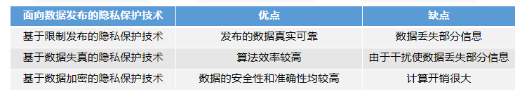

## 第五章 隐私保护

#### 隐私保护技术初探

- 网络空间中的隐私

  - 包括三类：个人数据，网络行为数据，通信内容

- 隐私泄漏的危害

  - 用户人身财产安全受到威胁
  - 用户思想被操控
  - 威胁国家、企业安全

- 隐私保护技术介绍

  - 面向数据发布：

    - 限制发布（匿名化）
      - 有选择的发布原始数据、不发布或者发布精度较低的敏感数据
    - 数据失真 （差分隐私，随机化，数据交换）
      - 对原始数据进行扰动，目的是隐藏真实数据，只呈现出数据的统计学特征
    - 数据加密（安全多方计算，同态加密，数字信封，秘密共享）
      - 对原始数据进行加密，通过密码机制实现其他参与方对原始数据的不可见性以及数据的无损失性
      - 分布式计算的两种数据存储模式：垂直划分，水平划分

    

  - 面向数据挖掘：

    - 在隐私保护的条件下，分别针对关联规则、分类、聚类等，研究高效的挖掘算法
    - 关联规则挖掘
      - 变换：修改支持敏感规则的数据，使得规则的置信度和支持度小于一定的阈值而实现规则的隐藏
      - 隐藏：不修改数据，而是隐藏生成敏感规则的频繁项集，尽可能降低敏感规则的置信度或者支持度
    - 分类挖掘
      - 如对原始数据进行随机扰动
    - 聚类挖掘
      - 如对原始数据进行几何变换

#### 匿名化

- 匿名化隐私保护模型

  - 传统的匿名化方法（删去敏感字段，或将姓名替换为假名）无法抵抗链接攻击
  - k-anonymity 模型：任意一条记录必须与等价类中的与其他至少 k-1 条记录不可区分
    - 问题：无法应对同质性攻击，背景知识攻击
  - l-diversity 模型：保证每一个等价类的敏感属性至少有 l 个不同的值
    - 攻击者最多只能以 1/l 的概率确认某个用户的敏感信息
    - 问题：
      - 等价类中敏感值的分布与整个数据集中敏感值的分布具有明显的差别，攻击者可以以一定概率猜测目标用户的敏感属性值
      - l-diversity 并没有考虑语义信息也会为隐私信息带来泄露的风险
  - t-closeness 模型：考虑敏感属性的分布问题，要求所有等价类中的敏感属性的分布尽量接近该敏感属性的全局分布，差异不能超过阈值 t

  - k-anonymity，l-diversity 和 t-closeness 不能够完全保护隐私不被泄露
    - 造成较大的信息损失，信息损失可能会使数据使用者们做出误判
    - 对所有敏感属性提供了相同程度的保护，并且没有考虑语义关系，造成了不必要的信息损失
  - 针对不同的问题，提出不同的匿名技术
    - 个性化匿名技术：不同的用户对于隐私信息有着程度不同的隐私保护要求
    - 带权重的匿名策略：属性与属性之间的重要程度并不相同
    - 动态数据匿名化：考虑数据动态更新后重发布的隐私保护问题

- 数据匿名化方法

  - 泛化：用更抽象、概括的值或区间代替精确值
    - 数值型/分类型
    - 全局泛化，局部泛化
  - 抑制：将数据表中的数据直接删除或隐藏

#### 差分隐私

- 差分隐私基础
  - 为抵抗差分攻击，差分隐私要求保证任意一个个体在数据集中或者不在数据集中时，对最终发布的查询结果几乎没有影响
  - 对于两个只有一个记录不同，除此以外几乎完全相同的数据集来说，分别对这两个数据集进行查询访问，同一查询在两个数据集上产生相同结果的概论的比值接近于1，从而实现对数据集中的每个个体的隐私进行保护
  - 邻近数据集 $|D\Delta D'| = 1$
  - 隐私保护预算 $\epsilon$： $P(D) \le P(D') \times exp(\epsilon)$
    - $\epsilon$ 增加，可用性增加，隐私保护降低
  - 全局敏感度（对任意的邻近数据集 $D$ 和 $D'$，只由查询函数决定）
  - 局部敏感度（对给定的数据集 $D$ 和它的任意邻近数据集 $D'$，由查询函数和给定的数据集中的数据共同决定）
- 数值型 DP
  - 一般采用拉普拉斯机制或者高斯机制，对得到的数值结果加入随机噪声
  - 拉普拉斯机制 $Lap(\frac{\Delta f}{\epsilon})$
- 非数值型 DP
  - 一般采用指数机制引入打分函数，对每一种可能的输出进行打分，归一化之后作为查询返回的概率值

#### 同态加密

- 同态加密基础
  - 应用场景：数据外包，电子投票
  - 思想：对密文直接进行操作，且计算结果的解密值与对应明文的计算结果相同
  - 算法由四部分组成：KeyGen 密钥生成算法，Encrypt 加密算法，Decrypt 解密算法，Evaluate 密文计算算法
  - 优势：
    - 对多个密文进行同态计算之后再解密，不必对每个密文解密而花费高昂的计算代价
    - 可以实现无密钥方对密文的计算，既可以降低通信代价，又可以转移计算任务，由此可平衡各方的计算代价
    - 可以实现让解密方只能获知最后的结果，而无法获得每个密文的消息与同态计算方式，可以提高信息的安全性
  - 挑战：只能实现单比特加密，因当前算法复杂度问题，离实用仍有距离
  - 分类：
    - 半同态加密：仅支持加法同态（或乘法同态）
    - 浅同态加密：同时满足加同态和乘同态性质，只能进行有限次的加和乘运算
    - 全同态加密：同时满足加同态和乘同态性质，可以进行任意多次加和乘运算
- 半同态加密
  - $Dec(Enc(a)⊗Enc(b))=a⊕b$
  - 当 $⊕$ 表示乘法时，称该加密为乘法同态加密（RSA，ElGamal 加密）
  - 当 $⊕$ 表示加法时，称该加密为加法同态加密（Paillier 加密）
- 全同态加密
  - 2009 年，Gentry 才提出首个全同态加密方案
  - 功能强大，算法复杂，效率低，开销大

#### 安全多方计算

- 安全多方计算基础
  - 场景：合作使用数据，相互不信任的多方参与者如何在保护己方数据的前提下进行合作
    - 数据脱敏后授权 $\to$ 数据可用性降低
    - 将数据发送给可信第三方处理 $\to$ 很难找到可信第三方
    - 签订合约 $\to$ 可能出现某一方违反合约
  - 安全多方计算：解决了一组互不信任的参与方之间保护隐私的协同计算问题
    - 问题定义：参与方 $P_1$, $P_2$, ..., $P_m$ 拥有数据集 $d_1$, $d_2$, ..., $d_m$，寻找约定函数 $y=f(d_1,d_2,...,d_m)$，同时要求每个参与方除了计算结果外不能得到其他参与方的信息
    - 性质：输入独立性，计算正确性，去中心化性
    - 威胁模型：诚实模型，半诚实模型，恶意模型
    - 计算模型：基于可信第三方的计算模型，交互计算模型，外包计算模型
    - 基本密码协议：
      - 茫然传输协议：接收方获得发送方发送的部分消息但不知道其他消息的内容，而发送方不知道哪些消息被接收
      - 混淆电路协议：两方能在互相不知晓对方数据的情况下计算某一能被逻辑电路表示的函数
      - 秘密共享协议：将秘密以适当形式拆分并将拆分后的每一份交给不同的参与者管理，只有若干参与者相互协作才能恢复秘密
    - 应用：
      - 分布式机器学习，梯度更新
      - 门限签名
      - 电子拍卖
      - 联合数据查询
- 百万富翁协议

#### 联邦学习

- 联邦学习基础
  - 背景：机器学习中的数据的隐私和隔离，数据孤岛现象
  - 定义：联邦学习是一种分布式机器学习方法。在每轮迭代中，联邦学习允许多个客户端节点独立地根据本地数据更新模型参数，随后将本地模型更新通过加密方式发送到中央服务器。中央服务器使用聚合算法将这些更新用来改进全局模型，然后再将改进后的模型发送回各个客户端
  - 优势：
    - 本地训练，保障用户数据隐私
    - 解决数据孤岛问题，促进数据的可用性
    - 扩展性、灵活性强，可纳入新节点而无须重新训练
    - 减少数据中心需求，降低成本
- 联邦学习分类
  - 横向联邦学习：适用于样本重叠较少而特征重叠较多的场景
    - 一般情况下，会取出参与方数据中特征重叠的部分进行训练
  - 纵向联邦学习：适用于特征重叠较少而样本重叠较多的场景
    - 一般情况下，会取出参与方数据中样本重叠的部分进行训练
    - 由于数据的保密性，一般会使用安全多方计算等方式进行样本对齐
  - 联邦迁移学习：适用于样本和特征重叠均较少的场景
    - 不仅要在不同参与者之间共享知识，而且要将一个域的知识“搬运”到另一个域
      - 源模型训练：在一个数据丰富的源域上训练源模型
      - 模型分享：将源模型共享给其他目标域节点，可以引入知识蒸馏等方法传递模型信息