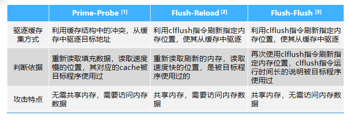

## 第六章 系统硬件安全

#### 网络空间的里程碑：震网漏洞

- 第一个以现实世界中的关键工业基础设施为目标的恶意代码
- 通过西门子的硬件设备漏洞，达到了预设的攻击目标
- 证实了通过网络空间手段进行攻击，可以达成与传统物理空间攻击的等效性

### 硬件攻击技术

- **漏洞攻击**：利用硬件设计中存在的缺陷

  - 指令集漏洞：**编码不规范**
  - **性能优化缺陷**：Meltdown 基于乱序执行，Spectre 基于分支预测

- **硬件木马**：被第三方故意植入，或设计者有意留下的特殊模块和电路

  - 一般由触发器和有效负载两部分组成
  - 潜伏在正常硬件中，仅在特定条件下被触发，实施恶意功能（窃取敏感信息，拒绝服务等）
  - 通常在芯片中植入，由不可信合作厂商引入
  - 木马 $\ne$ 电路故障
  - 硬件木马 v.s. 软件木马

- **硬件故障**

  - 故障注入技术最初用于系统可靠性检测，而后发展为故障注入攻击
  - 故障注入攻击：一般通过在密码设备中引入电路故障或运算错误来恢复密钥、窃取敏感数据
  - **基于硬件**的故障注入：
    - 光故障注入，电磁故障注入
    - 基于时序电路的约束条件，通过提高/降低处理器的频率/电压进行故障注入（VoltJockey 漏洞）

- **测信道攻击**

  - 利用硬件系统的旁路信息实施攻击

  - **物理测信道**：时间，功耗，电磁，声波

  - **微架构测信道**：Cache 测信道

    - Prime-Probe
    - Flush-Reload/Evict-Reload（Spectre）
    - Flush-flush
      - 无需读取内存，根据 cflush 时间判断
        - 如果数据没在 Cache 中则 clflush 指令执行时间会比较短，反之若有数据在 Cache 中则执行时间会比较长

    

### 硬件防护技术

- **木马检测**
  - **破坏性检测**
    - 模型对比，将芯片剖层拆分，扫描电子显微镜观察并于黄金模型对比
    - 费时耗力，不能逐个检测，实用性不强
  - **非破坏性检测**
    - **芯片测试**
      - **逻辑测试**：通过大量不同的输入组合，尝试激活硬件中可能存在的木马，观测是否出现设计说明中未曾描述的行为
      - **测信道分析**：分析硬件的侧信道信息（如静态电流、最高频率和处理延时等）与标准参数进行对比，因为木马的存在可能会影响这些标准参数
    - **实时监测**
- **隔离技术**
  - 一种访问控制手段，限制用户访问非授权的计算资源
  - 和软件隔离技术相比（如沙箱），硬件隔离技术能够取得更好的隔离性、安全性和性能
  - 存储器隔离
    - **存储器保护技术**：通过 IOMMU 实现，重定位寄存器和界地址寄存器
    - **EPT** **硬件虚拟化技术**：专用硬件模块完成地址翻译
    - **存储加密技术**
  - 高级的系统级隔离方案
    - **TrustZone**（ARM）
      - 将 CPU 内核隔离成**安全内核**和**普通内核**两个区域
      - 安全世界执行指纹识别、密码处理、数据加解密、安全认证等操作
      - 普通世界执行用户操作系统、应用程序
      - 通过 smc 指令或硬件异常机制切换安全核与非安全核
    - **SGX**（Intel）
      - Intel SGX 是一组 CPU 指令，可让应用程序创建**安全区**：应用程序地址空间中的受保护区域，即使存在特权恶意软件，也可提供机密性和完整性
      - Enclave 是一个**被保护的内容容器**, 用于存放应用程序敏感数据和代码
      - SGX 允许应用程序指定需要保护的代码和数据部分，当应用程序需要保护的部分加载到 Enclave 后，SGX 保护它们不被外部软件所访问
      - 特点
        - 机密性和完整性：即使在 OS、BIOS、VMM 或者 SMM 层存在特权恶意软件的情况下也能保证
        - 低学习曲线：和父应用程序类似的 OS 编程模型，并且在主 CPU 上执行
        - 远程认证：远程部分能够认证一个应用程序 enclave 的身份，并且安全地将密钥、凭据和敏感数据提供给 enclave
        - 最小可能的攻击面：CPU 边界成为攻击面外围，所有的数据、内存、外围之外的 I/O 都是加密的
- **密码技术**
  - 现代密码技术可以分为对称密钥与非对称密钥两种体系
  - 对称密钥常用于批量数据的加解密，非对称密钥更多用于密钥交换
  - **物理不可克隆函数**（PUF，Physical Unclonable Function）电路是一种新型密钥生成电路，**保证密钥的唯一性和不可克隆性**
    - 原理：利用了在半导体生产过程中自然发生的特定无序态和设备结构，身份、密钥由内建芯片指纹产生
    - 应用：身份认证，密钥生成，创建信任根
      - 例如：用于 IoT 物联网设备进身份认证
- **测信道防护**
  - 通过**增大噪声**或者**减小信号**来降低信噪比，增加攻击难度
  - **掩码技术**：从功能模块的中间节点入手，移除输入数据与旁路信道相关性，可基于门或基于模块实现
  - **芯片的模块划分**
  - **物理防护**

### 典型漏洞分析

- **MOLES**
  - 利用**木马**通过功率测信道泄露芯片内部信息（如密钥），再利用差分能量分析技术提取密钥
- **Meltdown**
  - 使用**乱序执行**，攻击者可以在任何地址读取数据
  - 泄漏内核内存，使低权限的进程无论是否获取特权，均可以获取受高权限保护的内存空间中的资料
  - 影响几乎所有的 Intel 处理器和 ARM Cortex-A75
- **Spectre**
  - 当 CPU 发现**分支预测**错误时会丢弃分支执行的结果，恢复 CPU 的状态，但是不会恢复 CPU Cache 的状态，利用这一点可以突破进程间的访问限制，从而获取其他进程的数据
- **VoltJockey**
  - 基于动态电源管理技术（DVFS），是一种针对处理器的**低电压故障**注入攻击方法
  - 攻击过程包括五个步骤：设置攻击环境，等待被攻击函数开始执行，等待被攻击代码开始执行，更改处理器电压，恢复处理器电压
  - 攻击者调用 AES 对称加密算法，然后使用电压故障攻击将错误引入中间状态矩阵，从而破解 AES 的加密密钥
