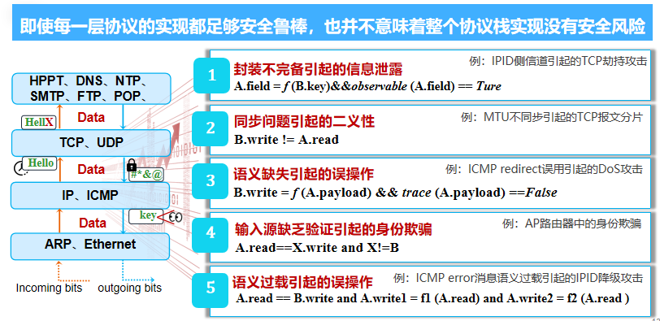

## TCP/IP 协议栈安全

#### TCP/IP 协议工作原理

- 协议栈中消息纵向传递
- 协议栈中消息横向传递
  1. DNS 请求与解析
     - 可能有 DNS 劫持攻击
  2. ARP 请求与应答
     - 可能有 ARP 污染攻击
  3. 帧转发
     - 可能有嗅探监听攻击
  4. 分组转发
     - 可能有地址伪造、路由劫持攻击
  5. 连接建立/数据响应
     - 可能有 TCP 连接劫持、Dos 攻击

#### 链路层安全

- ARP 欺骗与污染
  - 防御
    - 静态 ARP 绑定（手动配置）
    - ARP 实施监控
    - 划分虚拟局域网（将攻击者与被攻击设备隔离）
- 网络监听与嗅探
  - 嗅探：一种网络流量数据分析的手段
  - 洋葱网络 Tor

#### 网络层安全

- 源地址假冒攻击
- IP 分片攻击原理
  - 攻击效果：
    - 拒绝服务攻击：Ping of death，栈溢出
    - 污染攻击：DNS 劫持
    - 安全策略逃逸：防火墙和接收端主机往往存在重组策略不一致现象
  - 防御：
    - 路径 MTU 发现机制
- IPSec 协议
  - 两种安全机制
    - 认证，采用 IPSec 的 Authentication Headers，AH
      - 提供数据源认证、数据完整性校验和防报文重放功能
    - 加密，采用 IPSec 的 Encapsulating Security Payloads，ESP
      - 提供加密、数据源认证、数据完整性校验和防报文重放功能
    - 两种模式
      - 传输模式
      - 隧道模式
- 网络入侵检测 IDS
  - 基于特征匹配的 IDS
  - 基于异常检测的 IDS

#### 传输层安全

- 拒绝服务攻击
  - 计算机网络带宽攻击
    - SYN Flooding：TCP 三次握手阶段，发送大量微操的 SYN 数据包，消耗服务器资源
  - 连通性攻击
- TCP 劫持攻击
  - 攻击方将伪造 TCP 报文注入到 合法 TCP 连接的数据流中，阻断连接或污染数据流
  - 需要正确预测：32 位的随机序列号和确认号，16 位随机的源端口号
  - 三种攻击模型：In Path，On Path（MITM 中间人嗅探），Off Path
  - Challenge ACK 测信道漏洞
- TLS 协议
  - TLS  协议通常在 TCP 等传输层协议之上运行，提供以下三个安全功能：
    - 加密：阻止第三方对传输数据的窃听身份
    - 验证：确保交换信息的各方是他们声称的身份
    - 完整性：验证数据是否伪造而来或未遭篡改过
  - 客户端验证服务器端证书，交换密钥

#### 典型案例分析

- 交互信息泄露
  - IPID侧信道引起的TCP劫持攻击
    - IPID 降级到哈希分配方式时，攻击者可以通过 IPID 测信道信息，跨层推理目标 TCP 连接的随机化序列号等信息
- 帧长侧信道
  - 攻击者发送无线帧填充信息的正确与否、会触发 server 产生不同的 TCP 响应报文，对应的无线帧长大小也会不同，允许攻击者推理出 TCP 连接信息
- 交互二义性
  - PMUTD 路径 MTU 发现机制存在严重的二义性安全问题，导致 TCP 保温仍然可能会被分片
    - 中间节点分片
    - IP 和 TCP MTU 值不同步
- 交互语义缺失
  - ICMP error 消息的合法性审查机制存在语义缺失问题
  - 发送 ICMP redirect 消息逃逸主机检查，造成了路由黑洞、跨层 Dos 攻击
- 交互身份欺骗
  - AP 路由器中的网络处理芯片（NPU）存在设计缺陷，导致其不能有效拦截攻击者发送的伪造消息
- NAT 劫持
  - AP router 对接收到的 TCP RST 报文不会进行合法性检查，允许 Attacker 发送伪造的 RST 报文欺骗 AP router，操控和接管 NAT mappings，进而劫持 Victim 和 Server 之间的 TCP 连接

#### 网络安全共性分析

- 网络攻击的共性特征
  - 攻击者可以进行身份欺骗，伪装成网络通信的一端
  - 攻击者可以进行推理猜测，构造可被通信对端接受的数据报文 
- 协议栈设计缺陷和实现漏洞
  - 网络地址缺乏足够的真实性验证，可以被恶意伪造
  - 网络系统在实现和部署过程中，随机化程度不高，致使网络的状态信息可被恶意攻击者预测推理
- 协议栈安全的基本防御原理
  - 基于真实源地址的网络安全防御
    - 网络源地址验证
  - 增强协议栈随机化属性
    - 移动目标防御（Moving Target Defense，MTD）
    - 拟态防御