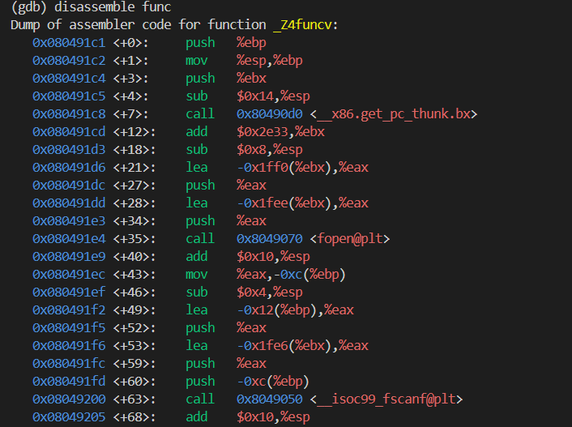
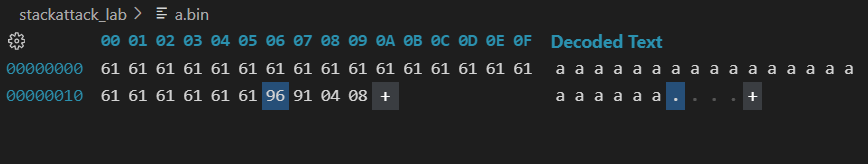

## 实验：简单栈溢出实验

张一可 计15 2021010793

### 实验目的

本实验将编写受害程序，在操作系统环境下完成一次简单的栈区溢出攻击。实验的主要步骤为：

1. 设计编写受害程序
2. 在关闭操作系统的防御机制的条件下编译受害程序
3. 对受害程序进行反汇编，观察变量与函数的地址
4. 构造恶意负载并输入程序

### 实验环境

wsl Linux 环境，准备受害函数 func() 和希望被调用的恶意函数 attack() 如下：

```c++
#include <stdio.h>
#include <string.h>
#include <stdlib.h>
void attack() {
	printf("Attack!\n");
}

void func() {
	char str[6];
	FILE *fp = fopen("./a.bin","r");
	fscanf(fp,"%s",str);
	printf("---\n");            
}

int main() {
	func();
    printf("Pass.\n");
	return 0;
}
```

### 实验步骤

1. **关闭操作系统的防御机制**

   关闭 ASLR 保护：

   ```shell
   su
   echo 0 > /proc/sys/kernel/randomize_va_space
   cat /proc/sys/kernel/randomize_va_space
   ```

   设置采用 32 位编译程序，并关闭 Stack Canary 和 PIE 保护：

   ```shell
   gcc -m32 -fno-stack-protector -no-pie -g -o attack attack.cpp
   ```

2. **反汇编受害程序**

   利用 gdb 对程序进行反汇编：

   ```
   gdb ./attack
   ```

   反汇编恶意攻击函数，得到攻击者希望调用的恶意函数地址为：0x08049186

   

   反汇编接受输入的 func 函数，得到调用 fscanf 时，接受输入的 str 数组的位置与栈帧中的 ebp 之间的距离为  0x12：

   

   ```assembly
   Dump of assembler code for function _Z4funcv:
      0x080491c1 <+0>:     push   %ebp
      0x080491c2 <+1>:     mov    %esp,%ebp
      0x080491c4 <+3>:     push   %ebx
      0x080491c5 <+4>:     sub    $0x14,%esp
      0x080491c8 <+7>:     call   0x80490d0 <__x86.get_pc_thunk.bx>
      0x080491cd <+12>:    add    $0x2e33,%ebx
      0x080491d3 <+18>:    sub    $0x8,%esp
      0x080491d6 <+21>:    lea    -0x1ff0(%ebx),%eax
      0x080491dc <+27>:    push   %eax
      0x080491dd <+28>:    lea    -0x1fee(%ebx),%eax
      0x080491e3 <+34>:    push   %eax
      0x080491e4 <+35>:    call   0x8049070 <fopen@plt>
      0x080491e9 <+40>:    add    $0x10,%esp
      0x080491ec <+43>:    mov    %eax,-0xc(%ebp)
      0x080491ef <+46>:    sub    $0x4,%esp
      0x080491f2 <+49>:    lea    -0x12(%ebp),%eax
      0x080491f5 <+52>:    push   %eax /* scanf的第一个参数，即局部变量数组str在栈中的位置 */
      0x080491f6 <+53>:    lea    -0x1fe6(%ebx),%eax
      0x080491fc <+59>:    push   %eax
      0x080491fd <+60>:    push   -0xc(%ebp)
      0x08049200 <+63>:    call   0x8049050 <__isoc99_fscanf@plt>
   ```

   由于 ebp 在栈中占用 4 个字节，因此接受输入的数组地址与栈帧中 func 函数的返回地址之间的距离为 0x16=22 字节，可以据此构造输入，覆盖栈帧中的返回地址，完成栈溢出攻击。

3. **构造恶意输入**

   

### 实验效果


利用构造的恶意输入，可以看到我们成功完成了程序的控制流劫持，调用了恶意攻击函数。

