## 实验：Web 攻击演示

张一可 计15 2021010793

### 实验目的

演示 Web 应用安全的 XSS 漏洞，体会漏洞发生的原因，寻找补救的方法。探索 SQL 注入攻击和 CSRF 攻击

### 实验环境

使用 Linux 环境，Python 的 Flask 框架进行试验

为了便于演示，使用环境变量 UNSAFE 来控制是否开启基础安全措施。若 UNSAFE 为 True，则关闭基础安全措施，否则开启

### XSS 攻击防御

1. **反射型 XSS 攻击**

   在查询框输入 `<script> alert(1); </script>` 可进行反射型 XSS 攻击，点击搜索后页面中出现弹窗，此时诱导用户点击这一查询结果链接，即可触发恶意脚本执行。

   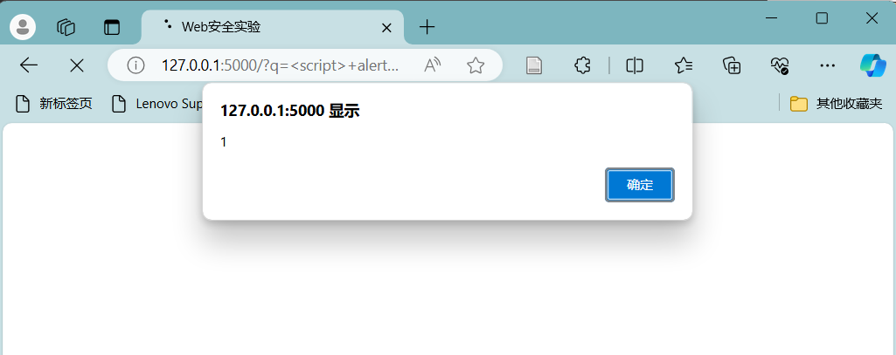

   

2. **持久型 XSS 攻击**

   在下方评论框添加新的评论 `<script> alert(1); </script>` 可进行持久型 XSS 攻击。恶意代码被写入了数据库中，所有用户在查看评论时都会触发恶意脚本执行。

   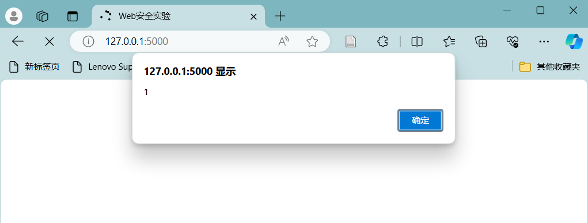

3. **XSS 攻击的防范**

   为了防范 XSS 攻击，我们将用户的查询和评论在渲染前使用 escape 函数进行转义：

   ```python
   if not UNSAFE:
       if search_query is not None:
           search_query = escape(search_query)
   
       comments = [
           [escape(comment), escape(username) if username is not None else None] 
           for comment, username in comments
       ]
   ```
   
   此时可以前端可以在转义后正常渲染包含可执行脚本的字符串：
   
   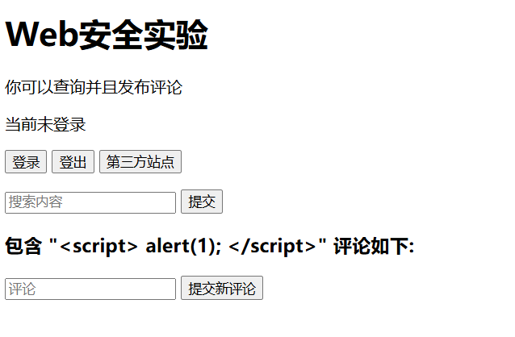
   
   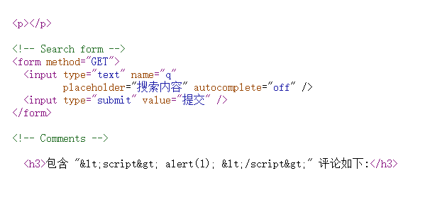
   
   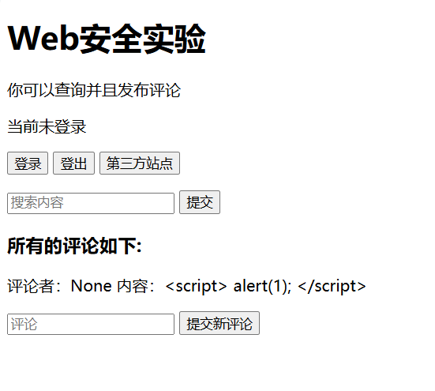

### SQL 注入攻击与防御

1. **SQL 注入攻击**

   为网站增加登录功能，通过验证用户名和密码进行登录，登陆后发布评论可以显示用户名。

   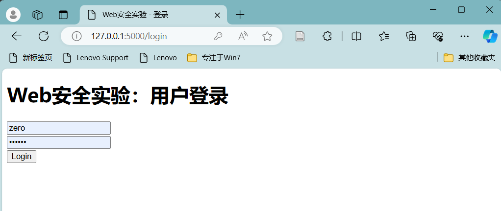

   利用在数据库中设置的用户名 "zero"，密码 "123456" 登录后，可以提交署名评论：

   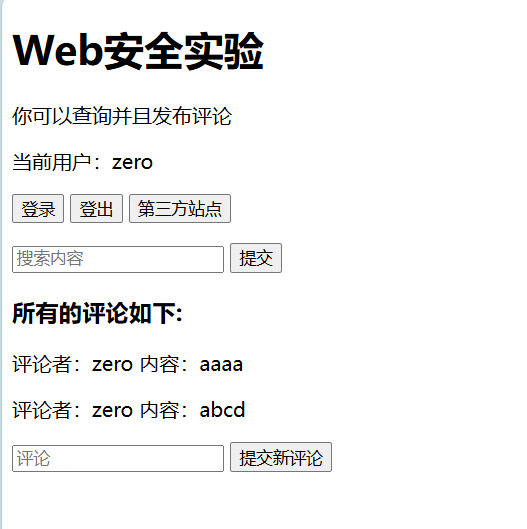

   登录时验证用户名和密码的 SQL 语句为如下形式：

   ```sqlite
   SELECT username FROM users WHERE username='zero' AND password='123456';
   ```

   退出登录，采用用户名 "zero';--" 和任意密码登录，此时 SQL 语句变成了如下形式：

   ```sqlite
   SELECT username FROM users WHERE username='zero';--' AND password='{any}'
   ```

   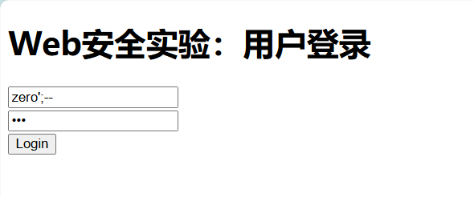

   由于输入的 `--` 使 SQL 语句对密码的检查部分变成了注释，此时查询的 SQL 语句仅检查用户名，因此可以使用任意密码正常登录，并发表署名评论：

   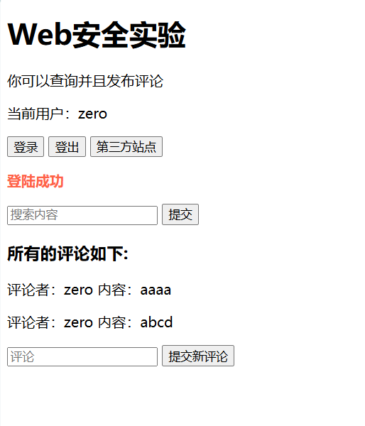

2. **防御**

   为了防御 SQL 注入攻击，应当参数化查询接口，而不要将用户输入变量嵌入到 SQL 语句中，如采用下面的第二种查询方式：

   ```python
   if UNSAFE:
       user = db.cursor().execute(f"SELECT username FROM users WHERE username='{username}' AND password='{password}'").fetchone()
   else:
       user = db.cursor().execute('SELECT username FROM users WHERE username=(?) AND password=(?)', (username, password)).fetchone()
   ```

   此时在 UNSAFE = False 模式下运行，这一攻击方式已经不再生效：

   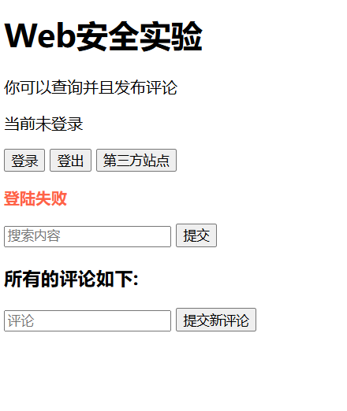


### CSRF 攻击与防御

1. **CSRF 攻击**

   为了便于演示跨站请求攻击，将 localhost 这一域名作为第三方网站。该网站含有隐藏表单，点击按钮时，会向 127.0.0.1 域名下的网站发送跨站请求添加新评论：

   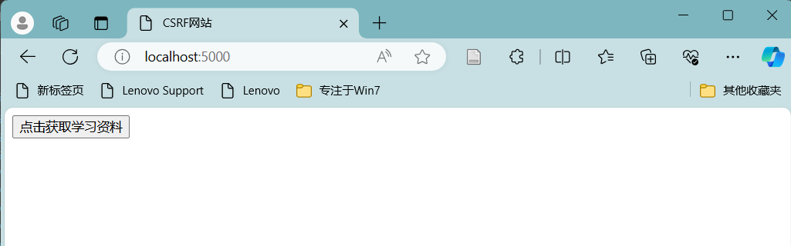

   ```html
   <!DOCTYPE html>
   
   <html>
     <head>
       <meta charset="utf-8">
       <title>CSRF网站</title>
     </head>
   
     <body>
       <form action="http://127.0.0.1:5000" method="POST">
         <input type="hidden" name="comment" value="CSRF 跨站攻击" />
         <input type="submit" value="点击获取学习资料" />
       </form>
     </body>
   </html>
   
   ```

   在 UNSAFE 模式下运行，可以看到在用户登录和非登录的情况下，跨站请求均被成功发送：

   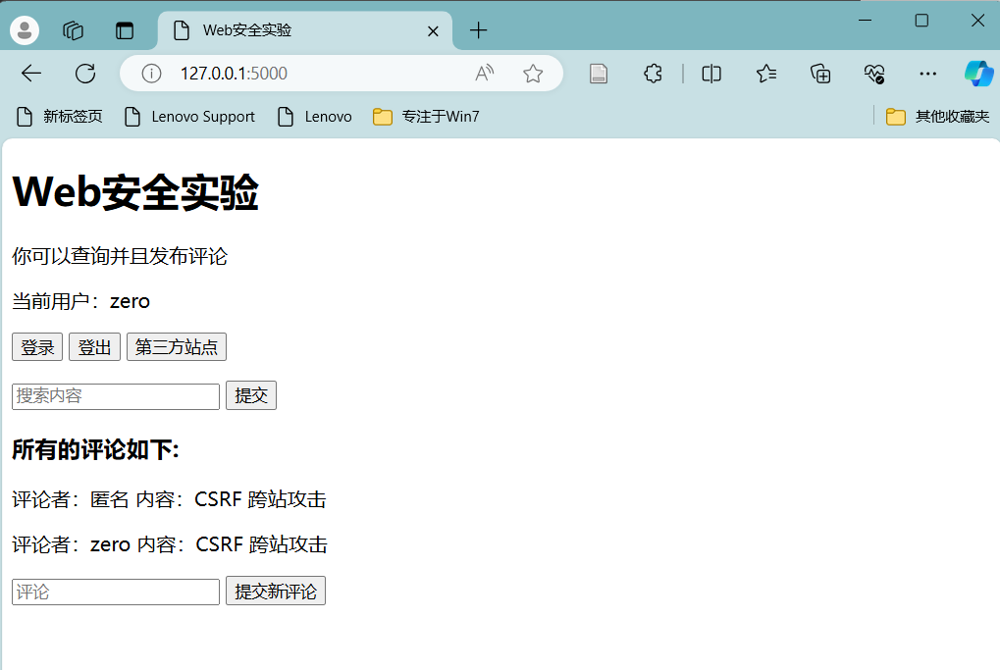

   

1. **防御**

   采用的防御方式是对请求增加对 Anti-CSRF-Token 的验证，Anti-CSRF-Token 是在用户登录时产生的随机字符串，在 HTTP 请求时携带此 Token，服务器收到请求时读取浏览器当前域 Cookie 中的这个 Token 值，和请求中的 Token 值进行比较，只有两者均存在且相等时才认为请求合法。

   用户登录时生成 Token：

   ```python
   if user is not None:
       session_id = os.urandom(16).hex()
       csrf_token = os.urandom(16).hex()
       db.cursor().execute('INSERT INTO sessions (username, session_id, csrf_token) VALUES (?, ?, ?)', (username, session_id, csrf_token))
       db.commit()
   
       res.set_cookie('session', session_id)
       res.set_cookie('message', "登陆成功")
   ```

   本站 HTTP 请求中通过表单的隐藏域携带 Token：

   ```html
   <!-- Write form -->
   <form action="/" method="POST">
     <input type="text" name="comment" 
            placeholder="评论" autocomplete="off" />
     
       <input type="hidden" name="csrf_token" value="{{ token }}" />
     
     <input type="submit" value="提交新评论" />
   </form>
   ```

   服务器收到发布评论的 POST 请求时验证 Token：

   ```python
   def add_comment(comment, request):
       db = connect_db()
   
       session_id = request.cookies.get('session')
       csrf_token = request.form.get('csrf_token')
       if session_id is None:
           user_token = None
       else:
           user_token = db.cursor().execute('SELECT username, csrf_token FROM sessions WHERE session_id=?', (session_id,)).fetchone()
       
       match = False
       username = None
       if user_token is not None:
           username, token = user_token
           if token == csrf_token:
               match = True
   
       if not UNSAFE:
           if username is not None and not match: # Token mismatch
               return True
   
       db.cursor().execute('INSERT INTO comments (username, comment) VALUES (?, ?)', (username, comment))
       db.commit()
       return False
   ```

   采用此防御机制后，再次从第三方站点发送跨站表单，可以看到此时对 CSRF Token 进行检查后，服务器成功阻止了此跨站请求：

   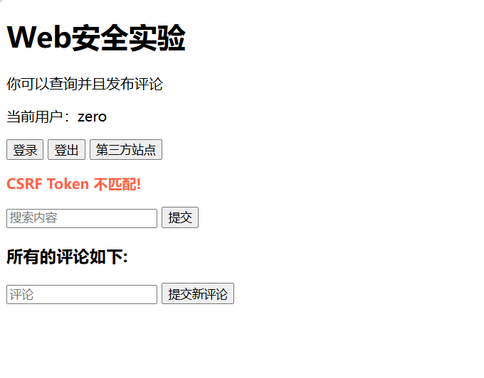
